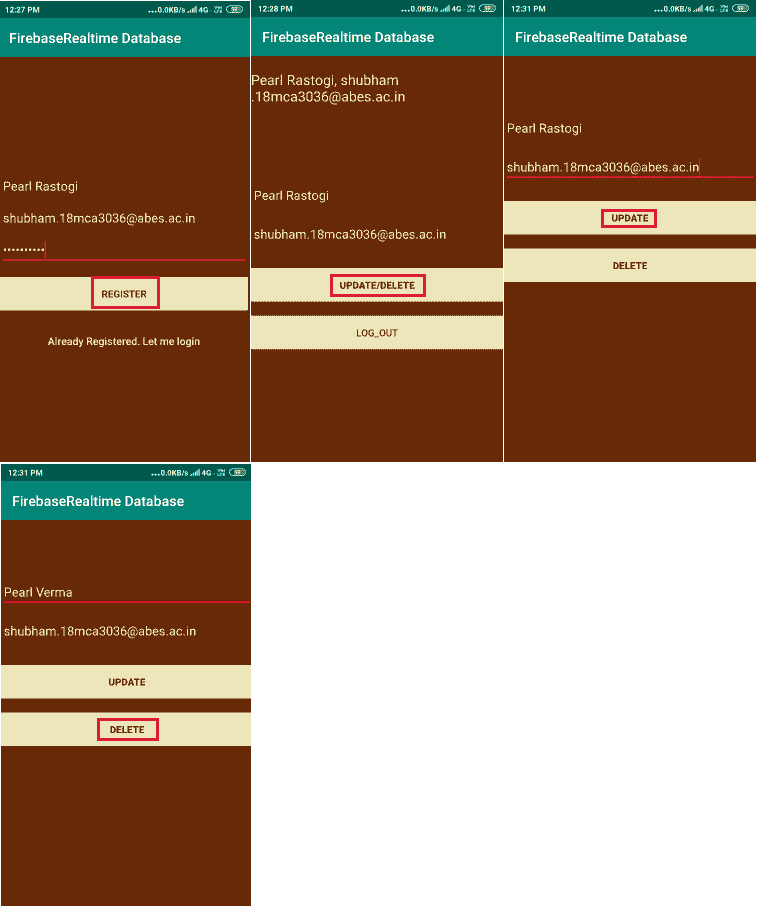
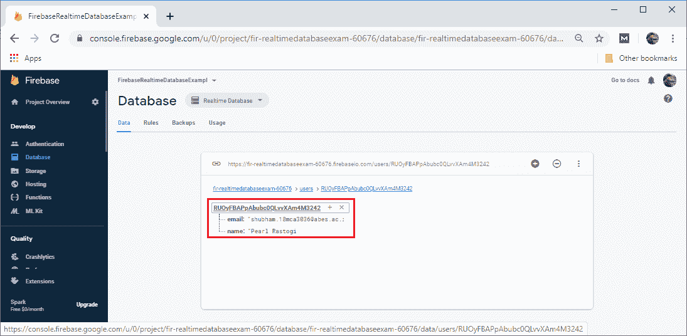
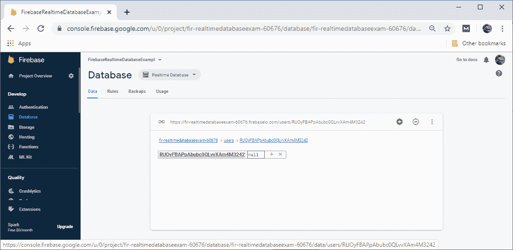

# Firebase:实时数据库更新和删除

> 原文：<https://www.javatpoint.com/firebase-realtime-database-update-and-delete>

在前一节中，我们学习了如何向数据库中读写数据。现在，我们将学习如何修改和删除数据库中的数据。

## 更新

为了更新我们的 JSON 数据库中的单个节点，我们只需在正确的子引用上使用 **setValue()** 。

```

correct child reference. 
myRef.setValue("Hello, World")
myRef.child("someChild").child("name").setValue(name)

```

如果我们想写入一个节点的特定子节点而不覆盖其他子节点，我们使用 **updateChildren()** 方法。当我们调用 **updateChildren()** 时，我们可以通过指定键的路径来更新较低级别的子值。

**例如**

```

//writeNewPost function for chat application
private fun Newpost(userId:String, username:String, title:String, body:String){
	//creating new post at /user-posts/$userid/$postid simultaneously
	//Using push key
	val key=database.child("posts").push().key
	//Checking it is null or not
if(key==null){
		Log.w(TAG,"Could not get push key for posts")
		return
	}
	//Creating Post object
	val post=Post(userId, username, title, body)
	//Push it to a map
val postValues=post.toMap()
	val childUpdates=HashMap<String,Any>()
	childUpdates["/posts/$key"]=postValues
	childUpdates["/user-posts/$userId/$key"]=postValues
	database.updateChildren(childUpdates)
}

```

**push()** 方法用于在包含帖子的节点中为所有用户 at /posts/$postid 创建帖子，同时使用 **getKey()** 方法检索密钥。然后使用该密钥在用户的帖子中创建第二个条目，位于**/用户帖子/$userid/$postid** 。使用**/user-post/$ userid/$ postid**路径，我们可以通过对 **updateChildren()** 的一次调用同时更新到 JSON 树中的多个位置。更新以原子方式进行，这意味着要么所有更新成功，要么所有更新失败。

## 添加完成回调

如果我们想知道数据何时提交，我们可以添加一个完成监听器。 **setValue()** 和 **updateChildren()** 都有一个可选的完成侦听器。当写入成功提交到数据库时，将调用它。如果调用不成功，将向侦听器传递一个错误对象。此错误对象指示失败发生的原因。

```

database.child("users").child(userId).setValue(user)
	.addOnSuccessListener{
		//Write was successful!
		//?.
	}
.addOnFailureListener{
		//Write failed
		//?
}

```

## 删除

删除数据最简单的方法是在引用数据位置时调用 **removeValue()** 。我们还可以通过指定 null 作为另一个写操作的值来删除数据，例如**设置值()**或**更新子对象()**。我们可以将这种技术与 **updateChildren()** 一起使用，在一次 API 调用中删除多个子对象。

**activity_upd_del.xml**

upd _ del . kt

```

package com.example.firebaserealtimedatabase

import androidx.appcompat.app.AppCompatActivity
import android.os.Bundle
import android.text.TextUtils
import android.util.Log
import android.view.View
import android.widget.Toast
import com.google.firebase.auth.FirebaseAuth
import com.google.firebase.database.*
import kotlinx.android.synthetic.main.activity_upd_del.*
import kotlinx.android.synthetic.main.activity_welcome.*
import kotlinx.android.synthetic.main.activity_welcome.email

class upd_del : AppCompatActivity() {

    private var mFirebaseDatabase: DatabaseReference? = null
        private var mFirebaseInstance: FirebaseDatabase? = null

        private var userId: String? = null

        override fun onCreate(savedInstanceState: Bundle?) {
            super.onCreate(savedInstanceState)
            setContentView(R.layout.activity_upd_del)

            mFirebaseInstance = FirebaseDatabase.getInstance()

            // get reference to 'users' node
            mFirebaseDatabase = mFirebaseInstance!!.getReference("users")

            val user = FirebaseAuth.getInstance().getCurrentUser()

            // add it only if it is not saved to database
            userId = user?.getUid()

        }

        private fun updateUser(name: String, email: String) {
            // updating the user via child nodes
            if (!TextUtils.isEmpty(name) && !TextUtils.isEmpty(email)) {
                mFirebaseDatabase!!.child(userId!!).child("name").setValue(name)
                mFirebaseDatabase!!.child(userId!!).child("email").setValue(email)
                Toast.makeText(applicationContext, "Successfully updated user", Toast.LENGTH_SHORT).show()
            }
            else
                Toast.makeText(applicationContext, "Unable to update user", Toast.LENGTH_SHORT).show()

        }

        fun onUpdateClicked(view: View) {
            val name = name.getText().toString()
            val email = email.getText().toString()

            //Calling updateUser function 
            updateUser(name, email)
        }

        fun onDeleteClicked(view: View) {
            //Remove value from child 
            mFirebaseDatabase!!.child(userId!!).removeValue()
            Toast.makeText(applicationContext, "Successfully deleted user", Toast.LENGTH_SHORT).show()

            // clear information
            txt_user.setText("")
            email.setText("")
            name.setText("")
        }

        companion object {
            private val TAG = upd_del::class.java.getSimpleName()
        }
    }

```

**输出**



**更新前**



**更新后**


**删除后**


[Click here to download project](https://static.javatpoint.com/tutorial/firebase/download/Del and Upd.zip)

* * *