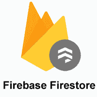
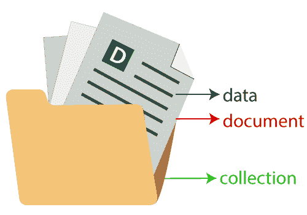
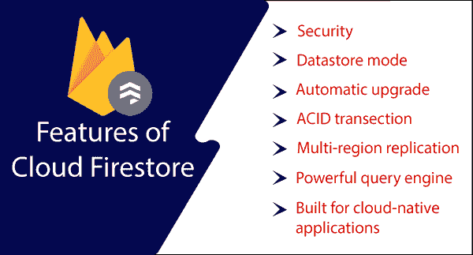

# 大爆发

> 原文：<https://www.javatpoint.com/firebase-firestore>

对于 Firebase，我们有两个选项，即 Firebase 实时数据库，这是我们在上一节和 Cloud Firestore 中学到的。Cloud Firestore 较新，但它并没有取代 Firebase 实时数据库。Cloud Firestore 是一个灵活且可扩展的 NoSQL 云数据库。它用于存储和同步客户端和服务器端开发的数据。它用于谷歌云平台和 Firebase 的移动、网络和服务器开发。像 Firebase 实时数据库一样，它通过实时监听器将我们的数据同步到客户端应用程序。它为移动和网络提供离线支持，因此我们可以创建响应迅速的应用程序，无论网络延迟或互联网连接如何都可以工作。

Cloud Firestore 还提供了与谷歌云平台产品和其他 Firebase 的无缝集成，包括云功能。

## 关键能力

**灵活性**

Firestore 数据模型支持灵活的分层数据结构。它将我们的数据存储在文档中，文档被组织成一个集合。在 Firestore 中，文档可以包含复杂的嵌套对象，而不是子集合。

**表达查询**

在 Firestore 中，我们可以使用查询来检索特定的单个文档，或者检索集合中与我们的查询参数匹配的所有文档。我们的查询结合了过滤和排序，可以包含多个链式过滤器。查询性能与结果集的大小成正比，因为默认情况下查询是索引的。

**实时更新**

Firestore 与 Firebase 实时数据库非常相似。Firestore 还使用数据同步来更新任何连接设备上的数据。它旨在高效地进行简单的一次性获取查询。

**离线支持**

Cloud Firestore 使我们能够缓存它正在积极使用的应用程序数据。这使得应用程序即使在设备离线时也能读取、写入、查询和收听数据。当设备进入在线模式时，Cloud Firestore 会将本地更改同步回设备。

**设计用于缩放**

Cloud Firestore 为我们提供了谷歌云平台最好的基础设施:自动化的多区域数据复制、原子批处理操作、强大的一致性保证以及真实的事务支持。我们设计了云 Firestore 来处理世界上最大的应用程序中最棘手的数据库工作负载。

## 它是如何工作的？

云 Firestore 是一个云托管的 NoSQL 数据库，我们的 iOS、安卓和网络应用程序可以通过本机 SDK 直接访问它。除了 REST 和 RPC APIs，Cloud Firestore 还提供了原生 Node.js、Java、Python 和 Go SDKs。

在 Cloud Firestore 的 NoSQL 数据模型之后，我们可以将数据存储在具有值的字段映射的文档中。文档存储在一个名为 collections 的容器中。这些容器用于组织我们的数据和创建查询。文档支持不同的数据类型，从简单的字符串和数字到复杂的嵌套对象。我们还可以在文档中创建子集合，并创建一个分层的数据结构来适应数据库的增长。Firestore 数据模型支持任何最适合我们应用的数据结构。

此外，Cloud Firestore 中的查询具有表现力、高效性和灵活性。创建浅层查询是为了在文档级别检索数据，而不需要检索整个集合或任何嵌套的细分。为我们的查询或游标添加排序、过滤和限制，以索引结果。在我们的应用程序中添加一个实时监听器，以保持数据运行。每次更新都没有恢复我们的整个数据库。

每当我们的客户应用程序更改数据时，向我们的应用程序添加实时监听器会用数据快照通知我们，但只会获得新的更改。

为了保护我们在云 Firestore 中的数据访问，Firebase 身份验证和云 Firestore 安全规则用于身份和访问管理(IAM)。

## 风暴的特征

Firestore 有以下特点:

**安全**

对于数据，Cloud Firestore 内置了安全访问控制。它支持通过配置语言进行简单的数据验证。

**数据存储模式**

云火石支持数据存储应用编程接口。我们不需要对现有的数据存储应用程序进行任何更改。我们可以期待类似的性能特征和定价，以及强大的稳定性带来的额外好处。

**自动升级**

云数据存储数据库将在云 Firestore 正式发布后不久进行本地升级。不需要修改代码，我们的应用程序也不会停机。

**ACID 交易**

Cloud Firestore 支持交易，因此如果交易中的任何操作失败(并且无法撤销)，那么整个交易都会失败。

**多区域复制**

借助自动多区域复制和强大的稳定性，即使在灾难来袭时，我们的数据也是安全可用的。

**强大的查询引擎**

Cloud Firestore 允许我们对 NoSQL 数据运行复杂的查询，而不会降低性能。这为我们构建数据提供了更大的灵活性。

**专为云原生应用打造**

移动和网络应用程序包含在典型工作负载中，这些工作负载与多用户、零售产品目录、物联网资产跟踪、社交用户配置文件和活动、通信和游戏排行榜协作。

* * *