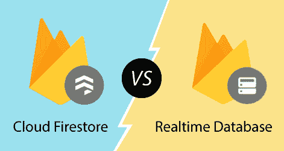
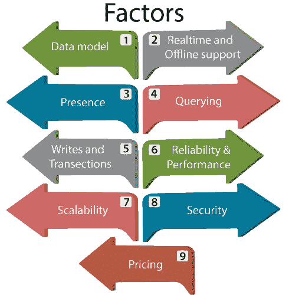

# Firestore 与实时数据库

> 原文：<https://www.javatpoint.com/firebase-firestore-vs-realtime-database>

对于任何应用的开发，如桌面、移动和网络，数据库是我们存储数据的先决条件。在我们可以存储和操作数据的地方需要存储，这样每个应用都可以访问相同的数据。Firebase 提供 Firestore 和 Firebase 实时数据库。这些数据库是基于云的、客户端可访问的数据库解决方案，支持实时数据同步。

## 云Storm

Firestore 是用于移动应用开发的最新数据库。Cloud Firestore 具有比实时数据库更丰富的功能、更快的查询速度和更大的扩展范围。Cloud Firestore 是一个灵活且可扩展的 NoSQL 云数据库。它用于存储和同步客户端和服务器端开发的数据。它用于谷歌云平台和 Firebase 的移动、网络和服务器开发。

## 实时数据库

这是 Firebase 的原始数据库。这是一个低延迟的解决方案，对于需要跨客户端实时同步状态的移动应用非常有效。Firebase 实时数据库是一个云托管的数据库，其中的数据存储为 JSON。数据实时同步到每个连接的客户端。

让我们了解一下 Firestore 和实时数据库的区别。

云火石是大多数开发人员开始新项目时推荐的数据库。Cloud Firestore 提供了额外的功能、性能和可扩展性，超过了为支持未来版本中更强大的功能而设计的基础架构。在云 Firestore 采用的高级功能中，期待看到更强大的安全规则、新的查询类型和性能改进。我们可以根据以下因素来比较这两种数据库解决方案:

### 数据模型

Firestore 和 Firebase 实时数据库是 NoSQL 数据库，这意味着不需要创建表和定义模式。

| 实时数据库 | 云Storm |
| 在实时数据库中，数据存储为一个大的 JSON 树。 | 在 Cloud Firestore 中，数据以文档集合的形式存储。 |
| 数据很简单，所以很容易存储。 | 在文档中，简单的数据非常容易存储。文档与 JSON 非常相似。 |
| 复杂的分层数据难以大规模组织。 | 通过使用子集合，复杂且分层的数据易于大规模组织。
需要非常少的去归一化和数据扁平化。 |

### 实时和离线支持

实时数据库和 Firestore 支持本地数据存储到离线就绪的应用，并具有实时 SDK。

| 实时数据库 | 云Storm |
| 安卓和 iOS 客户端的离线支持。 | 安卓和 iOS 客户端的离线支持。 |

### 出席

了解客户端何时在线或离线很有用。Firebase 实时数据库通过记录客户端连接状态，在客户端连接状态发生变化时提供更新。

| 实时数据库 | 云Storm |
| 实时数据库支持在线状态。 | Firestore 不支持本地存在。通过使用云功能同步 Cloud Firestore 和 Firebase 实时数据库，我们可以利用实时数据库的帮助。 |

### 询问

通过查询从实时数据库或云火石中检索、排序和过滤数据。

| 实时数据库 | 云Storm |
| 它允许我们使用有限的排序和过滤功能来执行深度查询。 | 它允许我们使用复合排序和过滤来执行索引查询。 |
| 查询可以对属性进行排序或筛选，但不能同时对两者进行排序或筛选。 | 在 Cloud Firestore 中，我们可以在一个查询中对一个属性进行链式过滤和组合过滤和排序。 |
| 默认情况下，它有深度查询，所以它总是返回整个子树。 | 它具有浅层查询，因此这些查询返回特定集合或集合组中的文档。这些查询不返回子集合数据。 |
| 实时数据库查询可以在任何点访问数据，一直到 JSON 树中的单个叶节点值。 | Cloud Firestore 查询总是返回整个文档。 |
| 这些查询不需要索引。但是，某些查询的性能会随着数据集的增长而下降。 | 默认情况下，云 Firestore 查询是索引的。查询的性能与结果集而不是数据集的大小成正比。 |

### 写和交易

| 实时数据库 | 云Storm |
| 只能执行基本的写入和横切操作。 | 它允许执行高级写入和横切操作。 |
| 实时数据通过设置和更新操作写入。 | 在 Cloud Firestore 中，数据是通过设置和更新操作写入的。在数组和数值运算符等高级转换的帮助下，我们还可以编写数据。 |
| 在特定的数据子树上，事务是原子的。 | 从数据库的任何部分，横断面可以自动读写数据。 |

### 可靠性和性能

| 实时数据库 | 云Storm |
| 这是一个单区域解决方案。 | 这是一个自动缩放的多区域解决方案。 |
| 对于单个区域的区域可用性，数据库是有限的。 | 跨不同地区的多个数据中心保护我们的数据，确保全球可扩展性和强大的可靠性。 |
| 极低的延迟，频繁状态同步的理想选择。 | 在全球范围内提供区域或多区域配置。 |

### 可量测性

| 实时数据库 | 云Storm |
| 缩放需要分片。 | 在这里，缩放是自动的。 |
| 它可以在一个数据库中扩展大约 200000 个并发连接和每秒 1000 次写入。除此之外，还需要将数据分成多个数据库。 | 缩放是自动完成的。目前，它可以扩展到 100 万个并发连接，每秒 10000 次写入。将来可以提高限额。 |
| 对于单个数据，写入速率没有本地限制。 | 它对单个文档或索引有限制。 |

### 安全

| 实时数据库 | 云Storm |
| 它使用级联规则语言，将授权和验证分开。 | 它使用结合了授权和验证的非级联规则。 |
| 根据实时数据库规则，对移动 SDK 的读写是安全的。 | 在云 Firestore 安全规则的帮助下，从服务器 SDK 的读写是安全的。 |
| 读写规则是一个级联。 | 除非我们使用通配符，否则规则不会级联。 |
| 使用验证规则单独验证数据。 | 规则可以约束查询。如果查询结果可能包含数据，用户不必访问它，那么整个查询就会失败。 |

### 定价

| 实时数据库 | 云Storm |
| 仅收取带宽和存储费用，但费率较高。 | 主要是在我们的数据库中执行的操作，并以较低的速率、带宽和存储量收费。 |

* * *