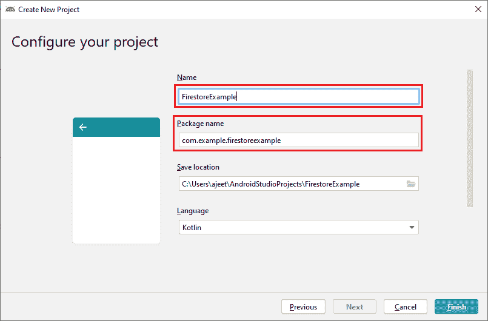
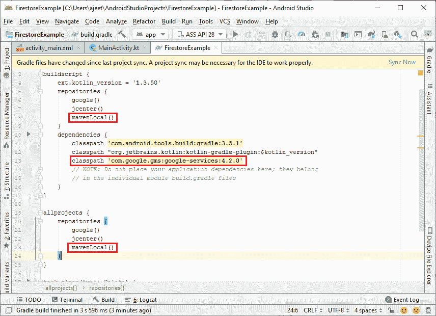
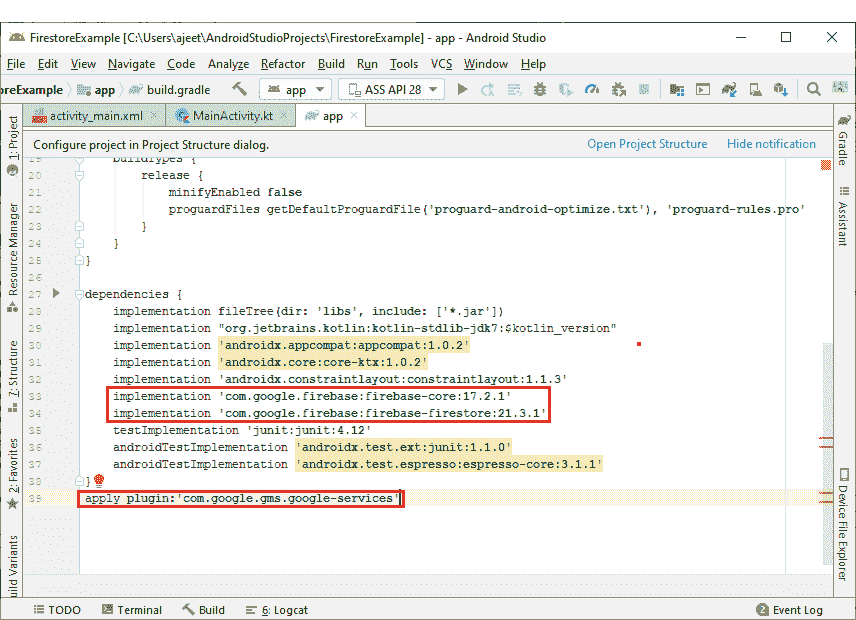
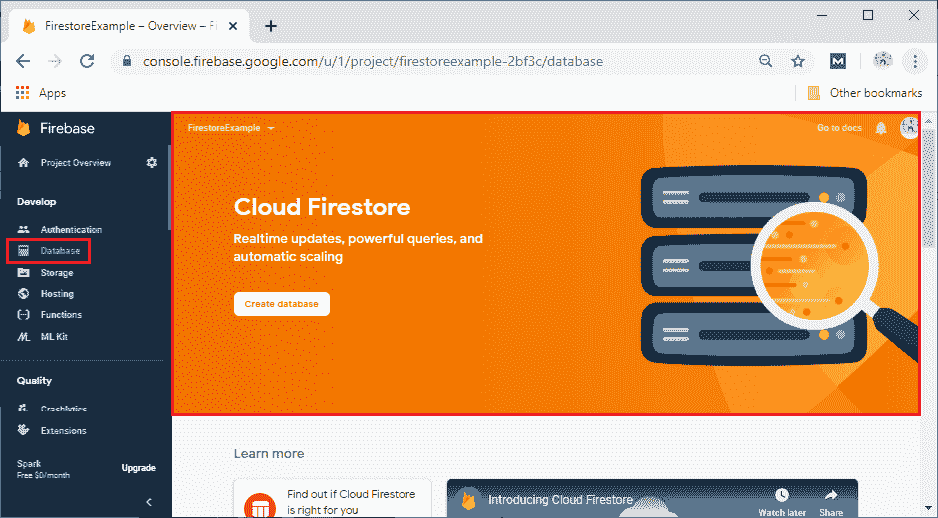
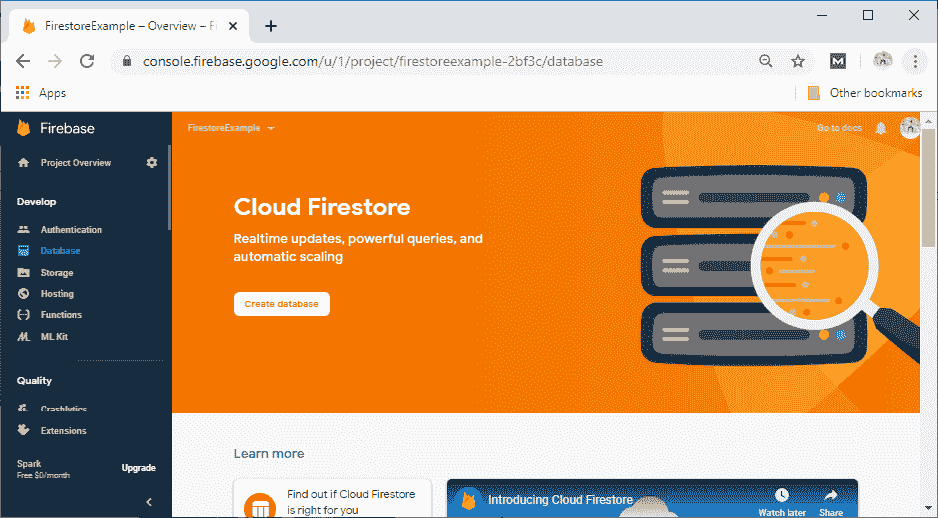
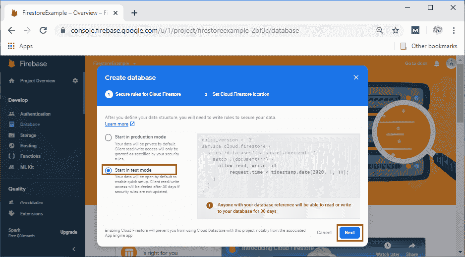
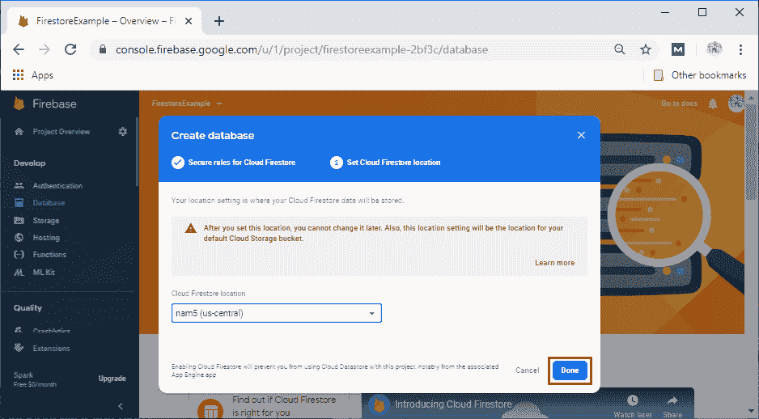
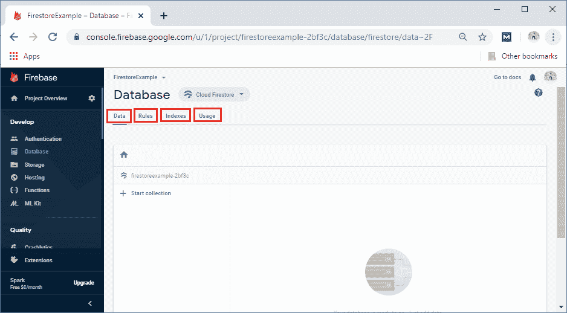
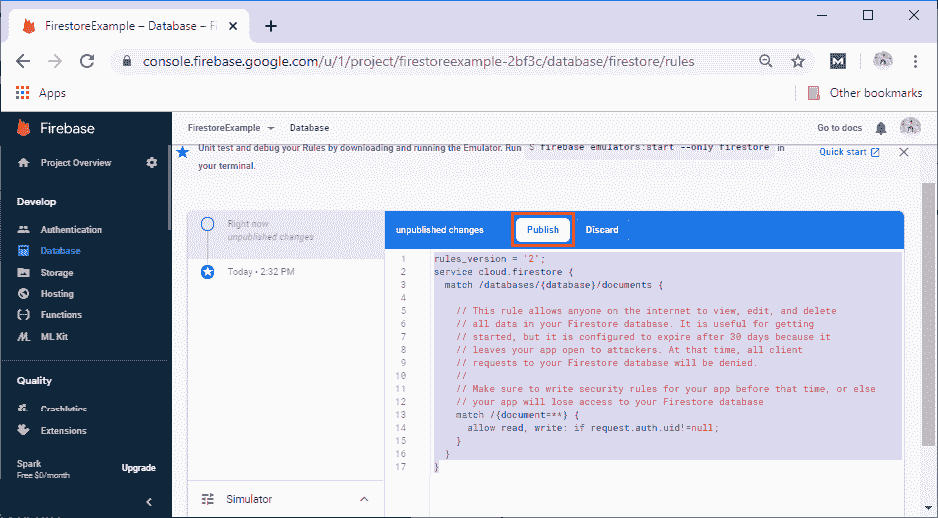

# Firestore 设置和配置

> 原文：<https://www.javatpoint.com/firebase-firestore-setup-and-configuration>

在前一节中，我们了解了云 Firestore、它的关键功能、特性以及它的工作原理。现在，我们将讨论如何使用 Firebase 设置和配置安卓应用程序，以便在我们的应用程序中使用云 Firestore。就像 Firebase 实时数据库和 Firebase 身份验证一样，Firestore 的启动步骤是相同的，将使用 Kotlin。因此，让我们从开始的步骤开始，并详细说明每个步骤，执行这些步骤是为了设置和配置应用程序以在 Firebase 中使用 Firestore。

**第一步:**

在第一步中，我们将创建一个新的安卓工作室项目，其中包含一个空的活动和 Kotlin 语言，并将其命名为 **FirestoreExample** 。



**第二步:**

在下一步中，我们将从 Firebase 助手或使用控制台手动将我们的安卓应用程序与 Firebase 连接。之后，我们将把所有需要的库和插件添加到 app.gradle 文件中。我们还将添加 mavenLocal()作为我们的存储库和所有项目。




**第三步:**

转到 Firebase 控制台，查看实时数据库。在开发者->数据库中，将有两个选项，即云 Firestore 和实时数据库。



**第四步:**

在下一步中，我们将通过单击创建数据库来创建数据库。点击“创建数据库”后，会打开一个弹出框，我们在其中创建一个具有特定规则的数据库。我们将其用作测试模式，因此选择**在测试模式**下启动。最后点击下一步。




点击**下一步**后，弹出框打开。在这里，我们可以根据我们想要定位的位置来选择我们的云 Firestore 位置。最后点击**完成**。



**第五步:**

点击**完成**后，会创建一个 Firestore 数据库，看起来和实时数据库有点不一样。这里，我们分别有数据、规则、索引和数据存储的用法、安全规则、索引和用法。



**第六步:**

现在，更改我们的安全规则，因为默认情况下，任何人现在都可以访问我们的数据库。更改将以只有经过身份验证的用户才能访问数据库的方式进行。做出修改后，我们将发布它们。安全规则定义为:

```

rules_version = '2';
service cloud.firestore {
  match /databases/{database}/documents {
    match /{document=**} {
      allow read, write: if request.auth.uid!=null;
    }
  }
}

```



这里完成了设置和配置，现在我们可以实现数据的代码操作了。

* * *