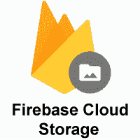
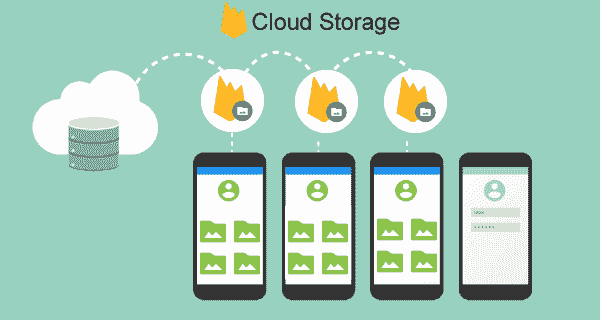

# Firebase:云存储

> 原文：<https://www.javatpoint.com/firebase-cloud-storage>

云存储是为需要存储和服务用户生成的内容(通常是照片或视频等大文件)的应用开发人员而构建的。它主要用于或开发照片和视频，但我们可能会将它用于其他东西，如文本文件。

一项功能强大、经济高效且简单的对象存储服务，专为扩展而构建:

1.  谷歌安全，当上传或下载文件从我们的 firebase 应用。
2.  我们可以存储图像、音频、视频或其他用户生成的内容。
3.  我们可以使用谷歌云存储访问服务器上的相同文件。

它是一种允许存储和管理移动应用用户生成的各种媒体内容的技术。它是一种云计算模式，通过云计算提供商在互联网上存储数据，该提供商将数据存储作为服务进行管理和运营。它是按需交付的，具有及时的成本和容量。它消除了购买和管理我们自己的数据存储基础架构。它通过“随时随地”的数据访问为我们提供了敏捷性、耐用性和全球规模。

## 关键能力

Firebase 云存储能够执行以下任务:

**稳健运营**

可靠性是云 Firestore 最大的优势之一。Firebase SDKs 执行上传和下载，而不考虑网络质量。下载和上传都很健壮。健壮意味着从它停止的地方，将从那里重新开始，并节省用户时间和带宽。

**强安全**

为了向开发人员提供简单直观的身份验证，Firebase 云存储 SDK 与 Firebase 身份验证集成在一起。为了允许基于文件名、大小、内容类型和其他元数据的访问，我们可以使用声明性安全模型。

**高可扩展性**

当我们的应用病毒式传播时，云存储是为 Exabyte 规模而构建的。使用与 Spotify 和谷歌照片相同的结构，轻松从原型发展到生产。

## 它是如何工作的？

云存储是从第三方云供应商处购买的，这些供应商拥有并运营数据存储容量，并以现收现付的模式通过互联网进行分发。这些云存储供应商管理安全性、容量和稳定性，使我们全球的应用都能访问数据。

应用通过传统存储协议或直接通过API使用云存储。许多供应商提供旨在帮助大规模收集、保护、管理和分析数据的补充服务。

云存储将我们的文件存储在谷歌云存储桶中，并使它们可以通过 Firebase 和谷歌云访问。它允许我们通过 Firebase SDKs 从移动客户端上传和下载文件，并使用谷歌云平台执行服务器端处理，如图像过滤或视频转码。云存储可自动扩展。这意味着不需要迁移到任何其他提供商。

Firebase 云存储是一个功能强大但易于使用的工具，用于存储所有类型的对象。在它的帮助下，我们可以存储视频、图像、音频和其他类型的用户内容。Firebase 云存储使我们能够轻松地从应用原型切换到完整的产品，这要归功于它具有高度可扩展性和处理千兆字节数据的能力。

* * *