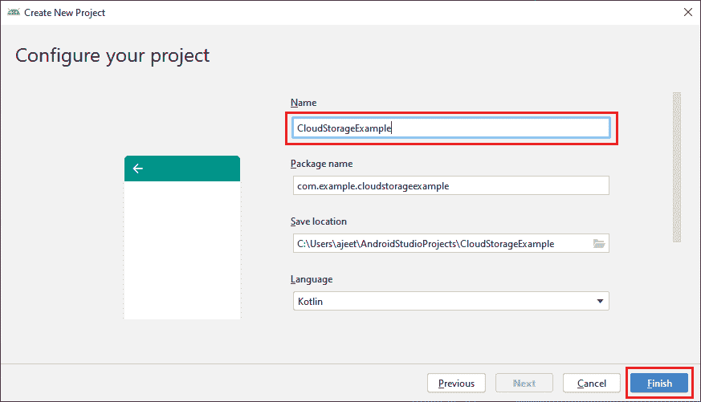
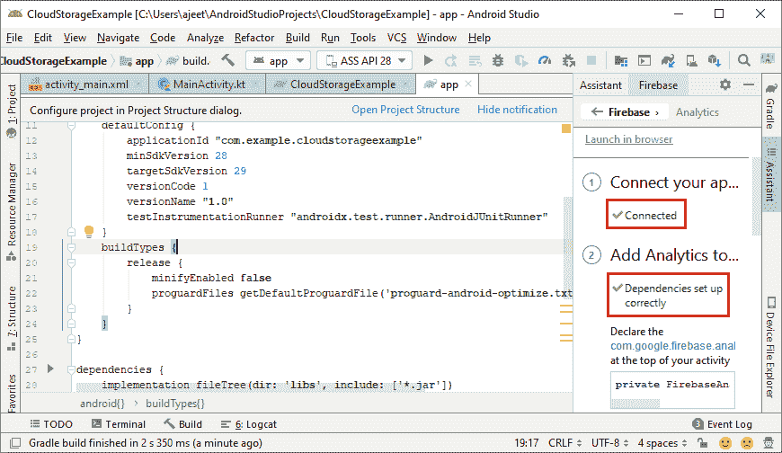
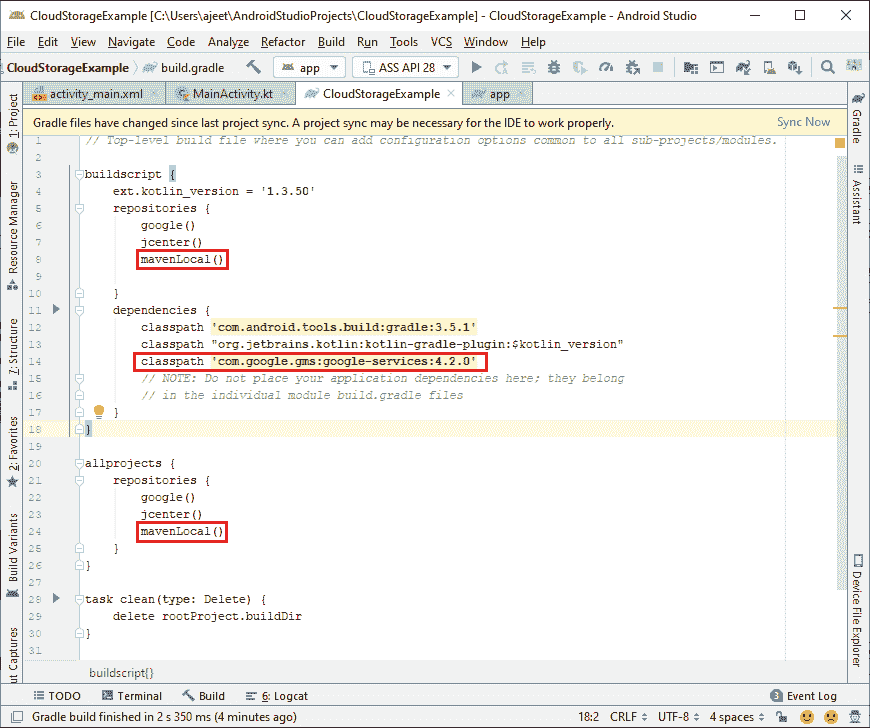
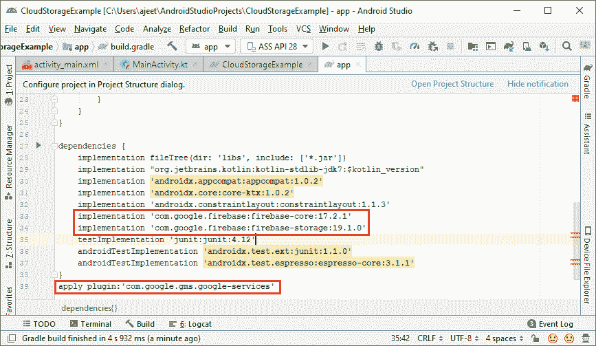
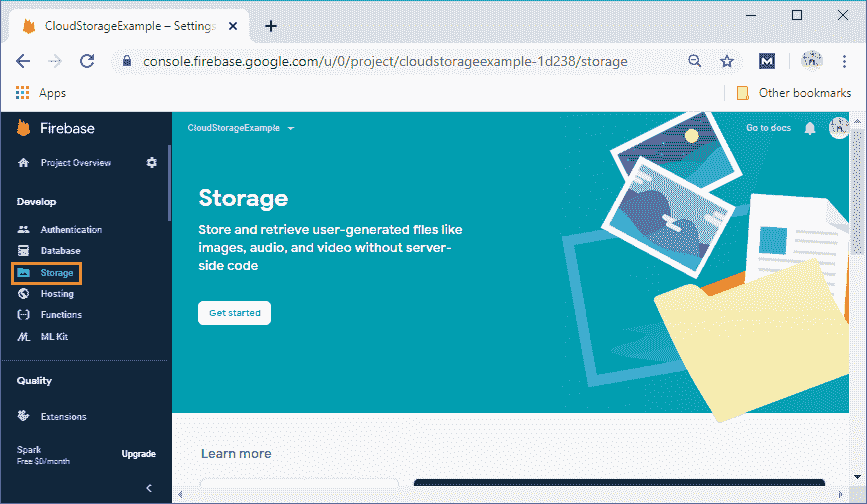
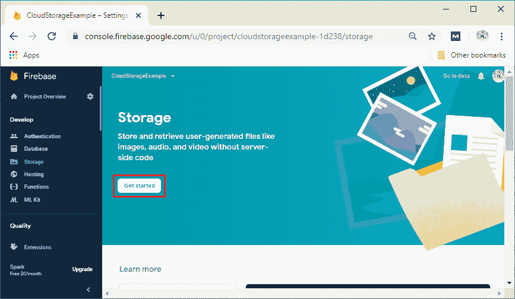
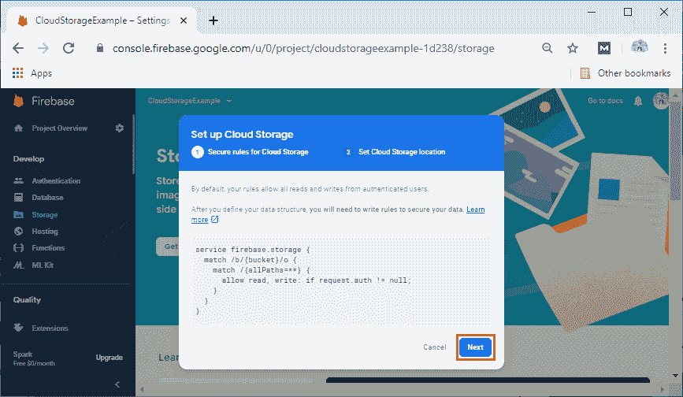
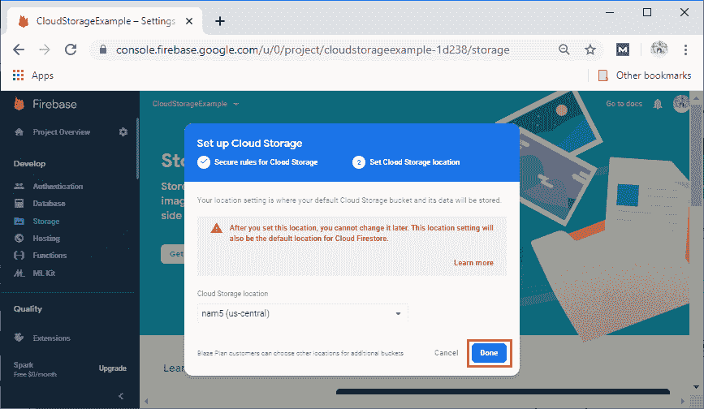
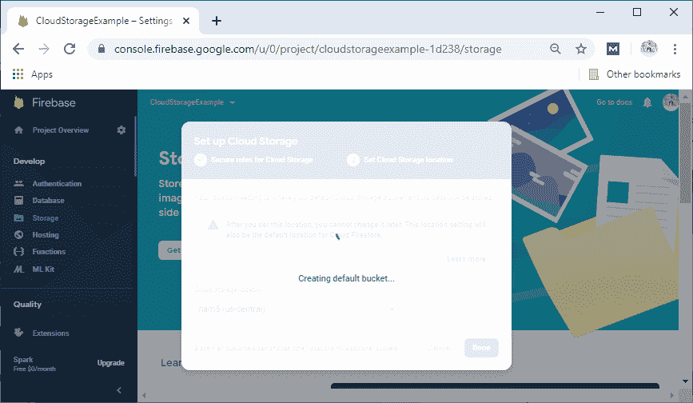
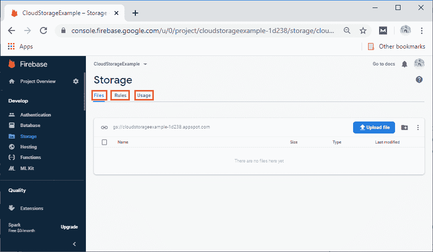

# 云存储设置和配置

> 原文：<https://www.javatpoint.com/firebase-cloud-storage-setup-and-configuration>

在上一节中，我们了解了云存储、其关键功能、特性及其工作原理。现在，我们将讨论如何使用 Firebase 设置和配置安卓应用程序，以便在我们的应用程序中使用云存储。就像 Firebase 实时数据库和 Firebase Firestore 一样，云存储的启动步骤是相同的，将使用 Kotlin。因此，让我们从开始的步骤开始，并详细说明每个步骤，执行这些步骤是为了设置和配置应用程序以在 Firebase 中使用云存储。

**第一步:**

在第一步中，我们将创建一个新的安卓工作室项目，其中包含一个空的活动和 Kotlin 语言，并将其命名为 **CloudStorageExample** 。



**第二步:**

我们将从 Firebase 助手或使用控制台手动连接我们的安卓应用程序和 Firebase。之后，我们将把所有需要的库和插件添加到 app.gradle 文件中。我们还将添加 mavenLocal()作为我们的存储库和所有项目。





**第三步:**

我们将转到 Firebase 控制台，查看开发人员->存储中的 Firebase 云存储。



**第四步:**

我们将通过点击“开始”来创建一个数据库。单击“开始”后，会打开一个弹出框，我们在其中设置具有特定规则的存储，然后单击“下一步”。




点击**下一步**后，弹出框打开。在这里，我们可以根据我们想要定位的位置选择我们的云存储位置，最后点击**完成**。



**第五步:**

点击**完成**后，会创建一个云存储，看起来与实时数据库和 Cloud Firestore 不同。这里，我们分别有文件、规则和文件存储的用法、安全规则和用法。




**第六步:**

不需要更改我们的安全规则，因为默认情况下，经过身份验证的用户只能读写存储。这些规则定义为:

```

rules_version = '2';
service firebase.storage {
  match /b/{bucket}/o {
    match /{allPaths=**} {
      allow read, write: if request.auth != null;
    }
  }
}

```

如果我们想公开我们的云存储，那么在安全规则中所做的修改如下:

```

//Everyone can read or write to the bucket, even non-user of our app.
//Because it is shared with Google App engine, this will also make files uploaded via the GAE public.

rules_version = '2';
service firebase.storage {
  match /b/{bucket}/o {
    match /{allPaths=**} {
      allow read, write;
    }
  }
}

```

如果我们想使用这些规则进行数据验证，这是可能的。我们可以验证文件名和路径。这些规则也用于验证元数据属性，如内容类型和大小。

```

service firebase.storage {
  match /b/{bucket}/o {
    match /images/{imageId} {// Upload onlt those image file that's less than 5MB
      allow write: if request.resource.size < 5 * 1024 * 1024
                   && request.resource.contentType.matches('image/.*');
    }
  }
}

```

这里完成了设置和配置，现在我们可以实现我们的代码来使用这个存储。

* * *