# Firebase 宿主

> 原文：<https://www.javatpoint.com/firebase-hosting>


Firebase Hosting 允许为我们的网络应用程序、静态和动态内容以及微服务提供快速和安全的托管。对于开发者来说，这是生产级的网络内容托管。我们只需一个命令，就可以轻松快速地部署网络应用程序，并将静态和动态内容提供给全球内容交付网络。我们可以将 Firebase Hosting 与 Cloud Function 或 Cloud Run 配对，用于在 Firebase 上构建和托管微服务。

Firebase Hosting 在快速 CDN 的帮助下提供文件。

## 关键能力

| 能力 | 描述 |
| 能够通过安全连接提供内容 | 现代网络是安全的。内容总是安全地交付，因为零配置 SSL 内置于 Firebase Hosting 中。 |
| 它承载静态和动态内容以及微服务 | 它支持用于托管的各种内容，从我们的 CSS 和 HTML 文件到我们的 Express.js 微服务或 API。 |
| 快速传递内容 | 我们上传的每个文件都缓存在世界各地 CDN 边缘的固态硬盘上。无论我们的用户在哪里，内容都传递得非常快。 |
| 使用一个命令部署新版本 | 使用 Firebase 命令行界面，我们可以在几秒钟内启动并运行我们的应用程序。命令行工具使得在我们的构建过程中添加部署目标变得很容易。 |
| 只需单击一下即可回滚 | 虽然快速部署很好，但是能够撤销错误就更好了。Firebase Hosting 通过一键回滚提供完整的版本管理和版本控制。 |

## 它是如何工作的？

Firebase Hosting 是为现代网络开发者设计的。随着前端 JavaScript 框架(如 Angular)和静态生成器工具(如 Jekyll)的增长，应用程序和网站比以往任何时候都更加强大。无论我们是部署复杂的渐进式 web 应用程序(PWA)还是简单的应用程序登录页，托管都为我们提供了部署和管理网站和应用程序的基础架构、工具和功能。

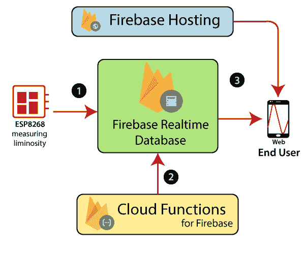

使用 Firebase 命令行界面，我们可以将文件从计算机上的本地目录部署到托管服务器。除了提供静态内容，我们还可以使用云运行或云功能为我们的内容提供动态内容，并在我们的网站上托管微软。所有内容都是通过 SSL 连接从全局 CDN 上最近的边缘服务器传送的。Firebase 中的托管为我们构建复杂的 PWAs 提供了轻量级的托管配置选项。我们可以轻松地为客户端路由设置自定义头或重写 URL。

为了提供我们的内容，Firebase 提供了几个域和子域选项:

*   默认情况下，所有 Firebase 项目在 firebaseapp.com 和 web.app 域上都有免费的子域。两者都提供相同的部署内容和配置。
*   如果我们有相关的应用程序和网站提供不同的内容，但仍然共享相同的 Firebase 项目资源，我们可以创建多个网站(例如，如果我们有一个管理面板、博客和公共应用程序)。
*   我们可以将自己的域名连接到 Firebase 托管的网站。

Firebase 自动为我们所有的域提供 SSL 证书，这样我们所有的内容都可以安全地得到服务

## 为什么是 Firebase 托管？

目前大部分的网络托管都是向我们收费的，可用的免费托管服务也比较慢。我们还必须支付额外的钱来获得一个 SSL 证书，以将我们的网站转换为一个安全的 https。

Firebase Hosting 是免费的，它不会再让我们花费更多。默认情况下，Firebase Hosting 提供了一个 SSL 证书，并在几个地理位置之间提供了令人印象深刻的速度，而不需要在顶部安装单独的 CDN。

使用 Firebase 主机有以下要求:

**1)谷歌账号**

在现在这个时代，每个人都有一个谷歌/Gmail 账户。Gmail 账号足够用了。如果我们没有，那就创造一个。

2)fire base-CLI

要安装 Firebase-CLI，要求我们的机器中有 **Node.js** 。因此，首先我们将在我们的机器上安装 Node.js，一旦我们安装了 NodeJs，我们将通过运行以下命令，使用 npm(节点包管理器)安装 Firebase CLI

```

npm install -g firebase-tools

```

**3)域**

这是可选要求。世界上有几个域名提供商。我们可以从[Godaddy.com](https://in.godaddy.com)购买域名。

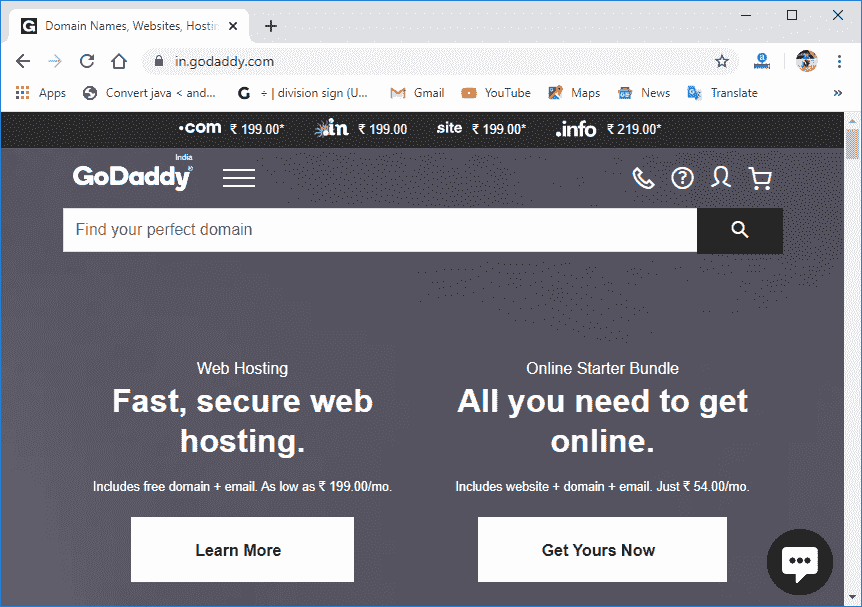

在使用 Firebase Hosting 之前，我们首先从以下链接安装 NodeJs:[https://NodeJs . or . g/en/download/](https://nodejs.org/en/download/)。

## 设置和配置

在设置 Firebase Hosting 之前，我们需要在 Firebase 控制台中创建一个 Firebase 项目。

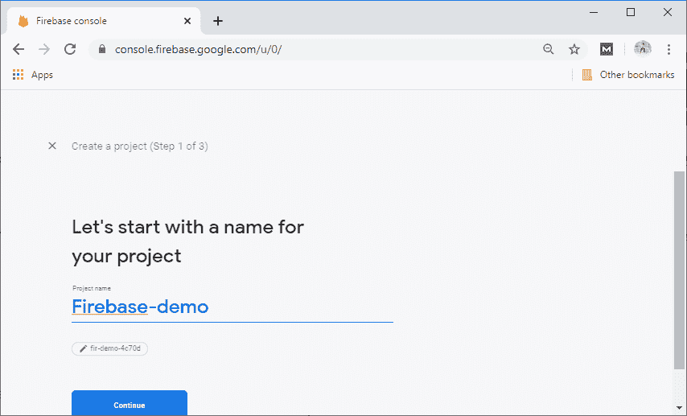

一旦有了 Firebase 项目，我们就必须执行以下步骤:

**第一步:**

第一步，我们必须安装 Firebase 命令行界面。Firebase CLI 提供了一组用于管理、查看和部署 Firebase 项目的工具。要安装 Firebase 命令行界面，有两个选项:

1.  使用 nvm-windows 安装节点。安装 Node.js 会自动安装 npm 命令工具。
2.  我们可以通过 npm 安装 Firebase CLI，方法是在命令提示符下运行以下命令:

```

npm install -g firebase-tools

```

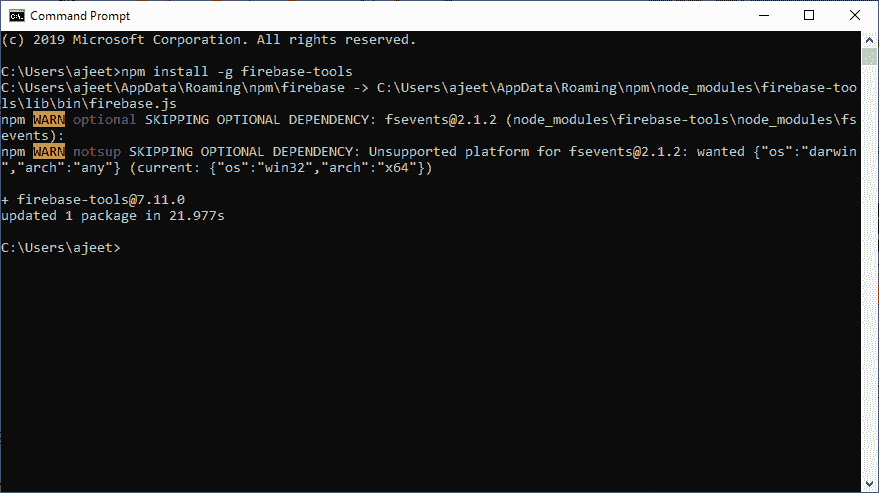

**第二步:**

在下一步中，我们将登录并测试 Firebase 命令行界面。安装命令行界面后，我们必须对其进行身份验证。之后，我们可以通过列出我们的 Firebase 项目来确认身份验证。

1)我们运行以下命令，使用我们的谷歌帐户登录 Firebase。

```

firebase login

```

上面的命令将我们的本地机器连接到 Firebase，并授予对 Firebase 项目的访问权限。

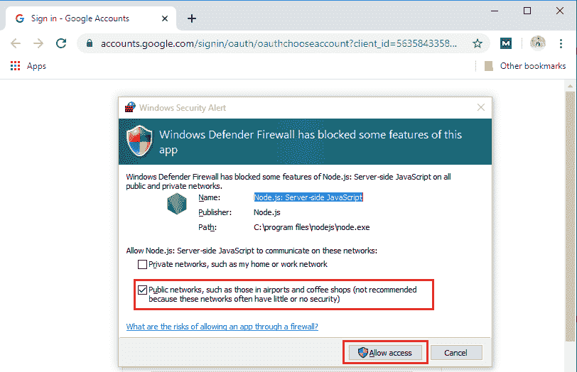

当我们选择允许访问时，我们将切换到浏览器以允许访问 Firebase CLI:


当我们单击“允许”时，它会显示以下窗口:

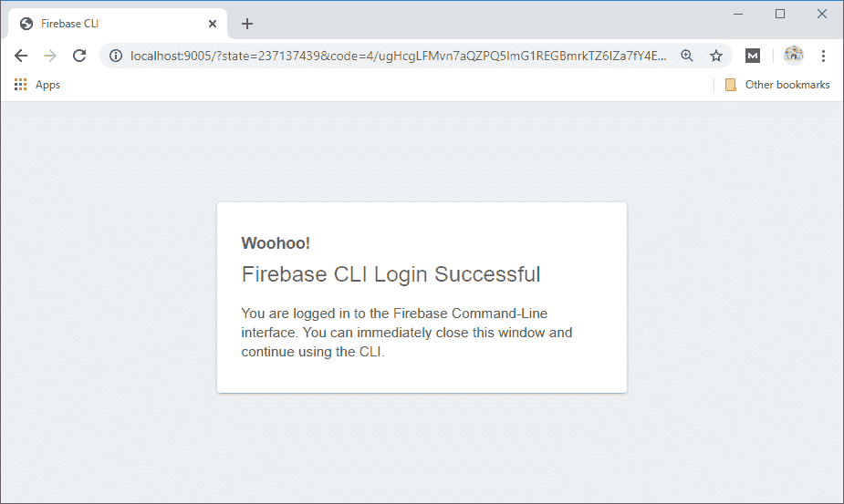
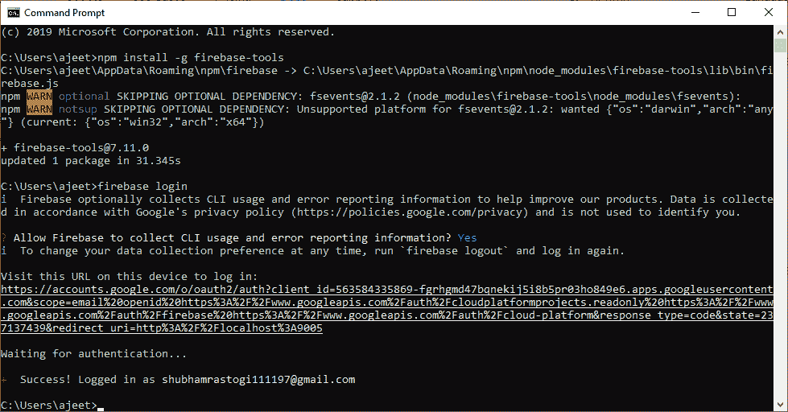

2)现在，我们测试 CLI 是否正常工作并访问我们的帐户。这是通过在以下命令的帮助下列出我们的 Firebase 项目来完成的:

```

firebase projects: list

```

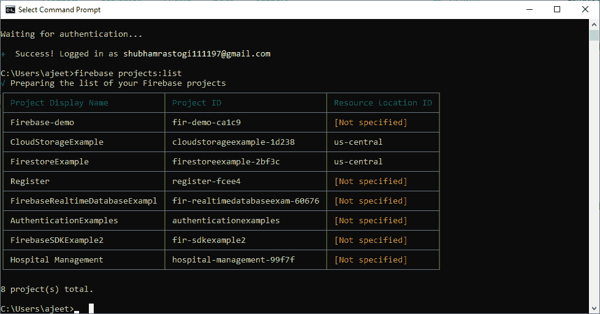

**第三步:**

许多常见的任务，比如部署 Firebase 项目，都需要一个**项目目录**。我们使用 **Firebase init** 命令设置项目目录。项目目录通常与我们的源代码管理根目录是同一个目录。运行 Firebase Init 后，目录包含 Firebase.json 配置文件。

```

firebase init

```

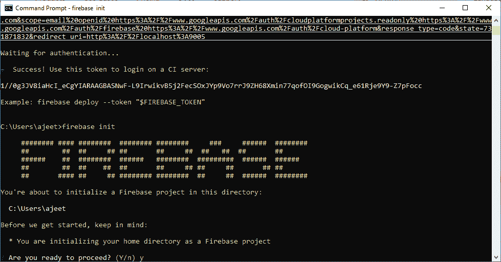

写 y 并按回车键继续该过程。

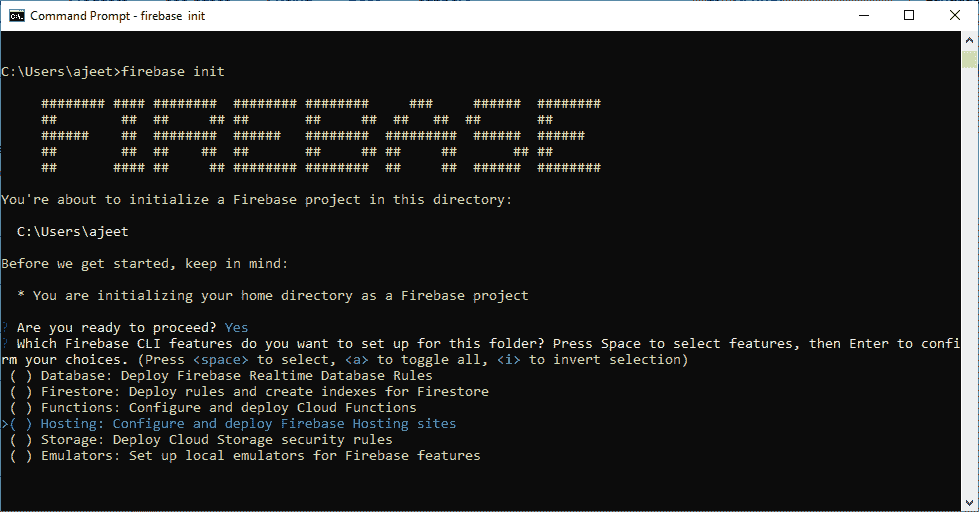

选择主机功能并按空格键，然后输入。

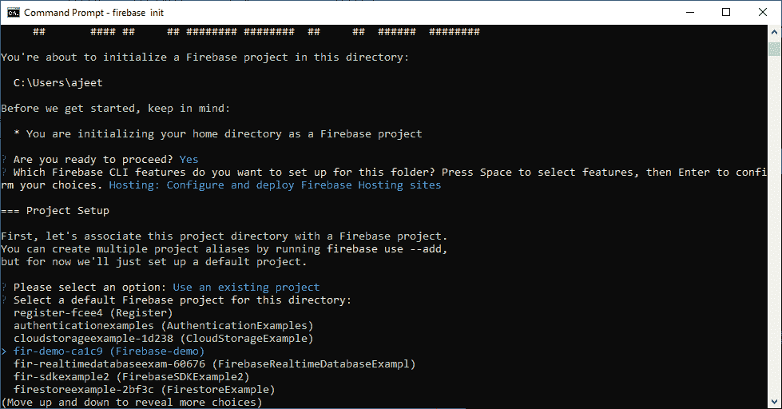

之后，选择 Firebase 项目，也就是我的例子中的 Firebase-demo。

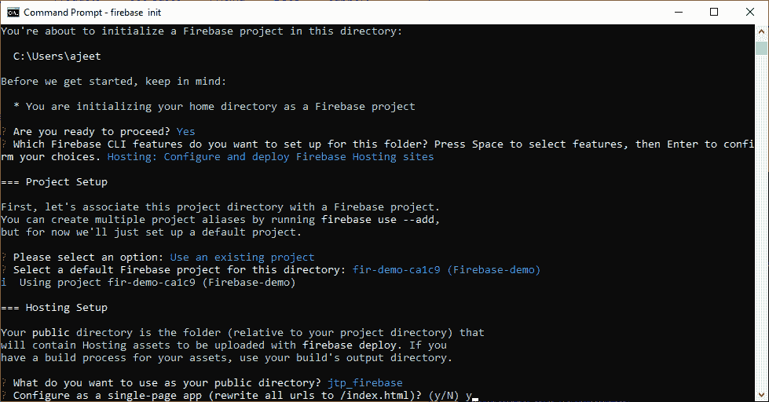

给出我们想要用作公共目录的名称，并按 y 键选择“配置为单页应用程序”。

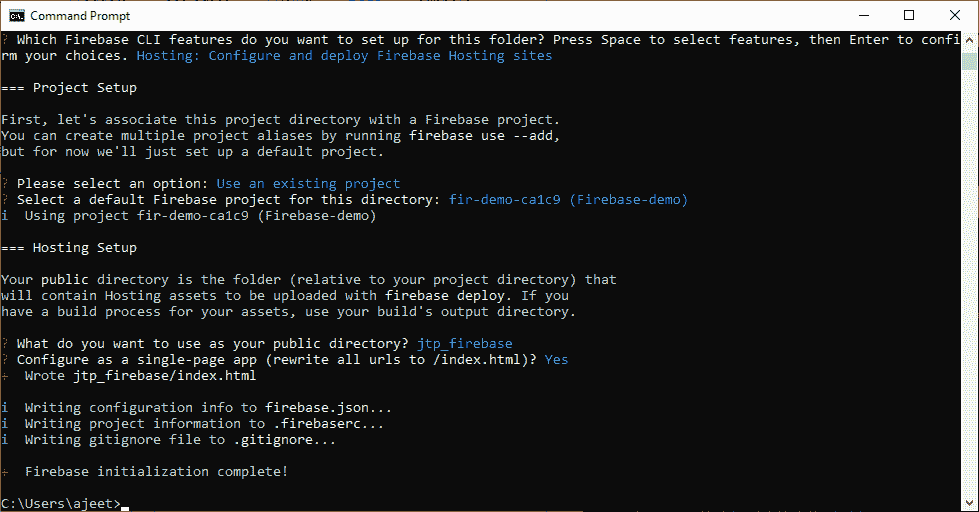

Firebase 初始化完成。

带有默认设置的 firebase.json 文件是在初始化期间创建的。如果我们在初始化期间为 Firebase 选择 Firebase 托管、云功能和云 Firestore，firebase.json 文件将如下所示:

```

{
  "hosting": {
    "public": "jtp_firebase",
    "ignore": [
      "firebase.json",
      "**/.*",
      "**/node_modules/**"
    ],
    "rewrites": [
      {
        "source": "**",
        "destination": "/index.html"
      }
    ]
  }
}

```

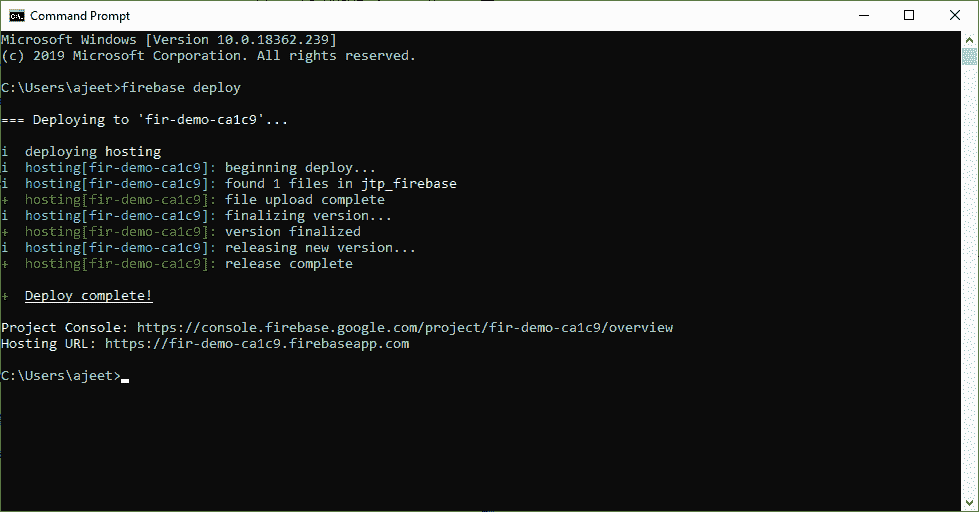

**第四步:**

在下一步中，我们将转到 Firebase 控制台，并转到开发->托管。在这里，我们选择开始。

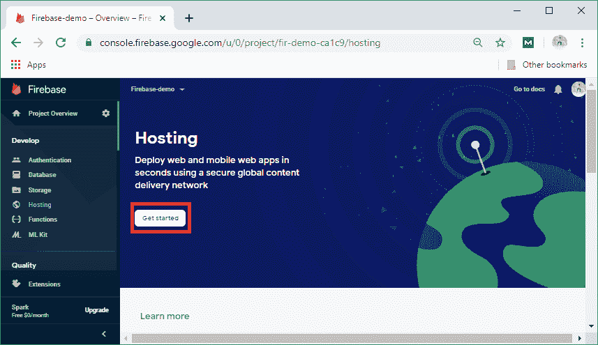

之后，我们点击**下一步**。

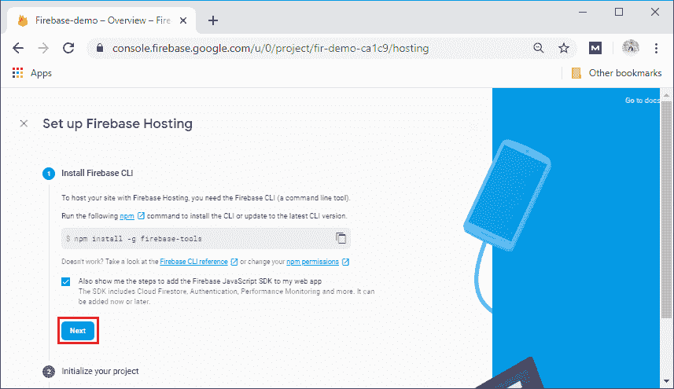

再次单击下一步。

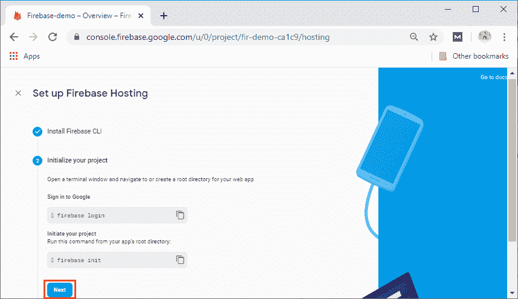

给一个昵称，点击注册并继续。

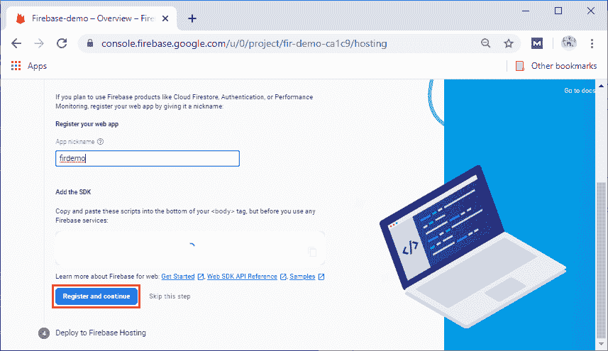

最后，点击继续控制台。

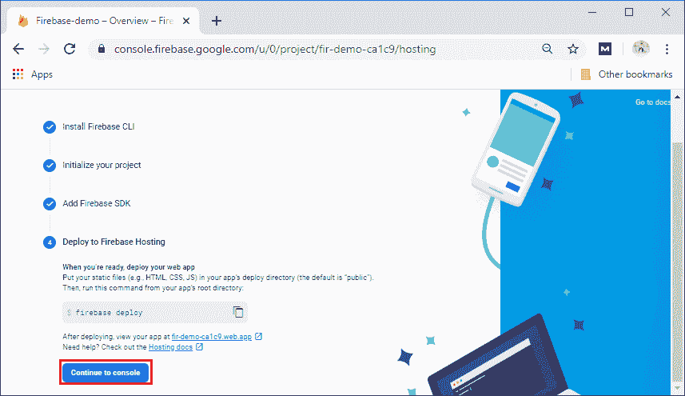

**第五步:**

我们还可以添加一个自定义域，这样我们就可以轻松地访问我们的 web 应用程序。点击**添加自定义域**。

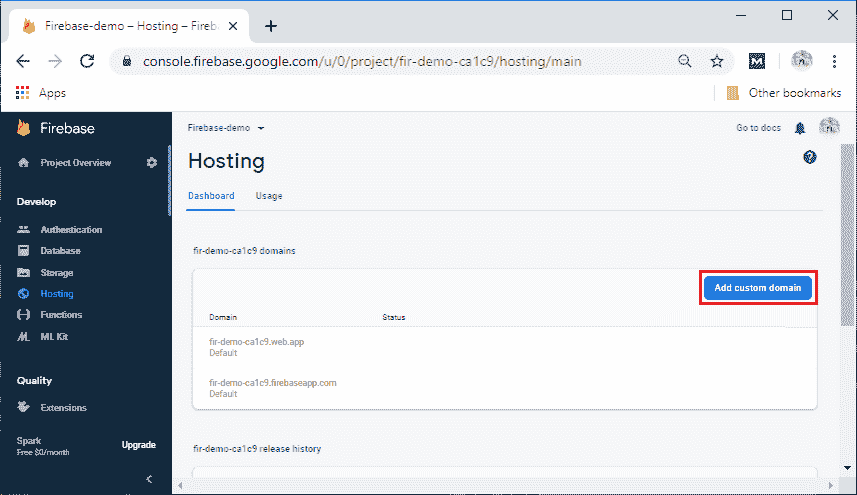

**第六步:**

下一步，我们将进入该域，点击**继续**。

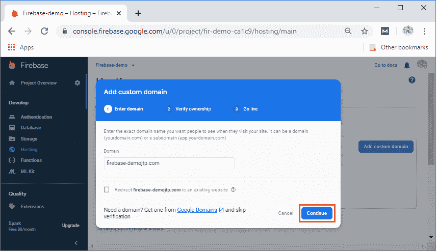

然后，将 txt 记录和值添加到我们的域提供商 DNS 中，并点击**验证**。


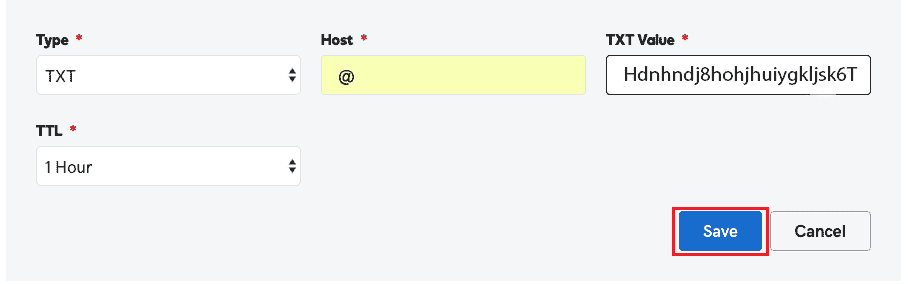

将 **A** 记录添加到我们的域提供商域名系统中。

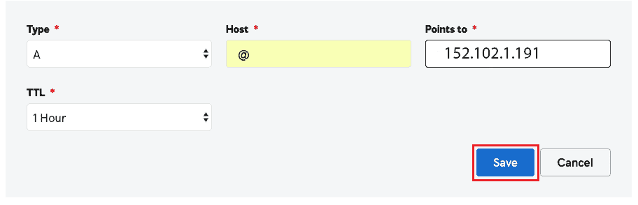
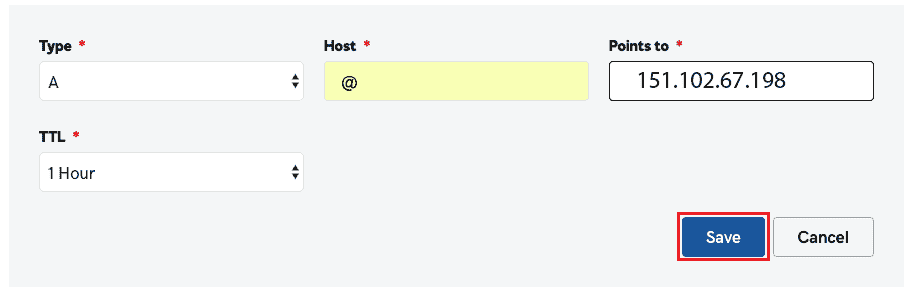

这最多需要 **5 分钟到 1 小时**，具体取决于我们的域名提供商更新域名系统记录。

* * *