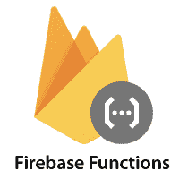
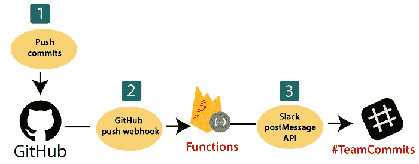
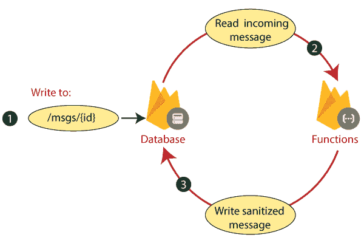
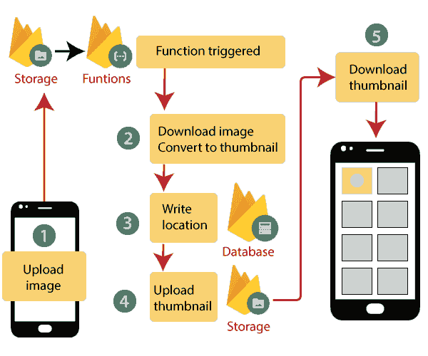

# Firebase云函数

> 原文：<https://www.javatpoint.com/firebase-cloud-function>

移动和网络应用需要后端代码来执行任务，如发送通知或处理长时间运行的任务。在过去的十年里，这些后端代码运行在服务器上。

最近，谷歌的 Firebase 推出了一项名为“云功能”的新服务。借助云功能，Firebase 为在云中运行后端代码提供了一个可扩展的解决方案。

**firebase 的云功能**使我们能够自动执行后端代码，以响应通过 HTTPS 请求和 Firebase 功能触发或导致的事件。我们的代码存储在谷歌的云中，在托管环境中运行，不需要管理和扩展我们自己的服务器。

在云中运行代码有各种优势，如下所示:

1.  没有必要运行和维护我们自己的服务器。
2.  对于后端代码，我们确实有一个独立的代码库。
3.  我们只得到代码实际执行时间的账单。
4.  云的基础设施是高度可扩展的。

云功能允许开发人员访问谷歌云事件和 Firebase，以及运行代码以响应这些事件的可扩展计算能力。预计 Firebase 应用将以独特的方式使用云功能，以满足其独特和特定的需求，用例可能属于以下领域:

1.  当有趣的事情发生时通知用户。
2.  执行实时数据库维护和清理。
3.  在云中执行密集型任务，而不是在我们的应用中执行。
4.  与 API 和第三方服务集成。

### 当有趣的事情发生时通知用户

“云功能”用于让用户参与并了解应用的相关信息。例如，考虑一个允许用户在应用中跟踪对方活动的应用。在这种应用中，由实时数据库触发的一种功能，用于存储新的关注者。这些关注者可以创建 **Firebase 云消息**让知道自己获得了新关注者的合适用户。

\

1.  该函数写入存储追随者的实时数据库路径。
2.  通过 **FCM** 发送的功能组成一条消息。
3.  通过 **FCM** 向用户设备发送通知消息。

### 执行实时数据库维护和清理

通过使用云功能数据库事件处理，我们可以保持系统干净和最新，并修改实时数据库以响应用户行为。例如，在一个建立在实时数据库上的聊天室应用中，我们可以跟踪写作事件，并清除用户消息中不恰当或亵渎的文本。

1.  该函数的数据库事件处理程序监听特定路径上的写事件，并检索包含任何聊天消息文本的事件数据。
2.  为了检测和清除任何不合适的语言，该函数处理文本。
3.  在数据库的背面，函数写入更新的文本。

### 在云中而不是在我们的应用中执行密集型任务

用户可以利用云功能来执行谷歌云资源密集型任务(繁重的中央处理器或网络)，这实际上是不可能在用户设备上运行的。

例如，我们编写一个函数来侦听映像上传到存储，运行该函数，将映像下载到实例，上传它，并将其修改回存储。我们的修改可能包括裁剪、调整图像大小等。为了使这项工作更容易，ImageMagick 命令行工具被提供来与云函数一起使用。

1.  当一个图像文件上传到云存储中时，一个函数触发。
2.  该功能创建图像的缩略图版本并下载图像。
3.  缩略图位置通过写入数据库，以便客户端应用可以找到或使用它。
4.  该功能将该缩略图上传回存储在新位置。
5.  应用下载缩略图链接。

### 与第三方服务和应用编程接口集成

通过调用和公开网络应用接口，云功能可以帮助我们的应用很好地与其他服务一起工作。例如，一个应用用于协作开发，可以将 GitHub 发送到工作组聊天室。

*   用户将提交推送到 GitHub repo。
*   一个 HTTPS 函数通过 GitHub **网络钩子应用编程接口**触发。
*   该函数通知提交到团队松弛通道

## 它是如何工作的？

在编写和部署一个功能后，谷歌的服务器立即开始管理该功能。我们可以用 HTTP 请求直接激发函数，或者，在后台函数的情况下。当该功能被触发时，谷歌的服务器将监听事件并执行相应的功能。

当负载增加或减少时，谷歌通过快速扩展运行我们的功能所需的虚拟服务器实例的数量来做出响应。每个功能都在自己的环境中以自己的配置独立运行。

## 背景函数的生命周期

开发人员为新函数编写代码，定义函数应该执行的条件，并选择事件提供程序(如实时数据库)。

开发人员将部署该函数，该函数通过 firebase 连接到选定的事件提供程序。

当事件提供程序生成与函数条件相匹配的事件时，将调用该代码。

如果函数忙于处理许多事件，谷歌会创建更多的实例来快速处理工作；如果函数空闲，则清理实例。

当开发人员通过部署更新的代码来更新函数时，旧版本的所有实例都会被清除，并通过新实例进行替换。

事件提供程序和函数之间的连接被移除，当开发人员删除函数时，所有实例都被清除。

* * *