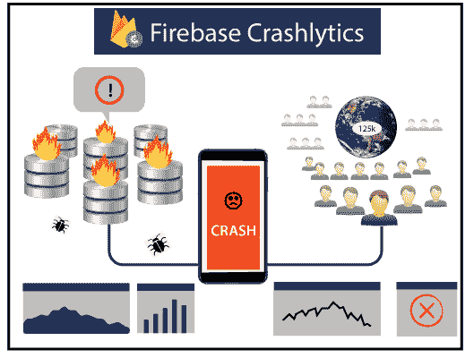

# Firebase碰撞物

> 原文：<https://www.javatpoint.com/firebase-crashlytics>

Firebase Crashlytics 是一个实时、轻量级的崩溃报告程序，帮助我们跟踪、修复和优先处理破坏我们应用质量的稳定性问题。通过智能地对崩溃进行分组，并突出导致崩溃的环境，在故障排除时，崩溃解决程序保护了我们。

Firebase Crashlytics 允许开发人员对应用问题获得清晰、可操作的见解。如果某个特定的崩溃影响了很多用户，开发人员很容易发现。当一个问题突然快速增加时，开发人员会得到警告，并能找出是哪一行代码导致了崩溃。

## 关键能力

| S.No | 能力 | 描述 |
| 1. | 精心策划的坠机报告 | Crashlytics 将大量崩溃整合到一个可管理的问题列表中，揭示崩溃的严重性和普遍性，并提供相关信息，以便您可以更快地查明根本原因。 |
| 2. | 常见崩溃的治疗方法 | Crashlytics 提供了 Crash Insight 和有用的提示，突出了常见的稳定性问题，并提供了使其更容易进行故障排除、分类和解决的资源。 |
| 3. | 与分析集成 | Crashlytics 可以在 Analytics 中将我们的应用错误捕获为 app_exception 事件。事件使我们易于调试，允许我们访问导致每次崩溃的其他事件列表，并通过允许我们为崩溃的用户调出 Analytics 报告来提供受众洞察。 |
| 4. | 实时警报 | 接收新问题、检索到的问题和可能需要立即关注的升级问题的实时警报。 |

* * *