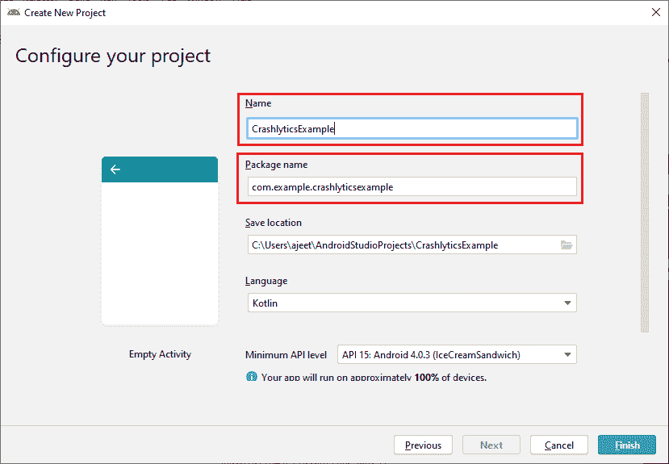
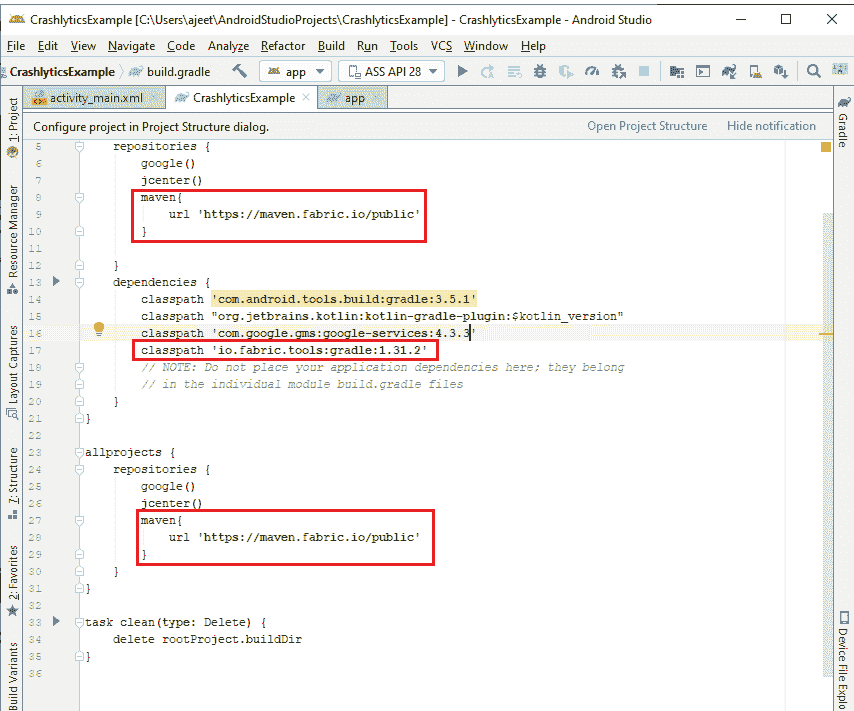
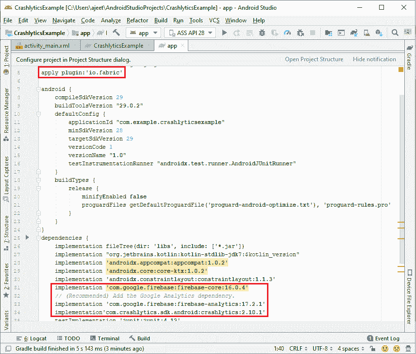
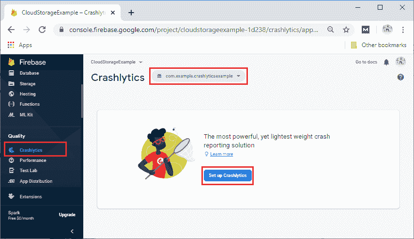
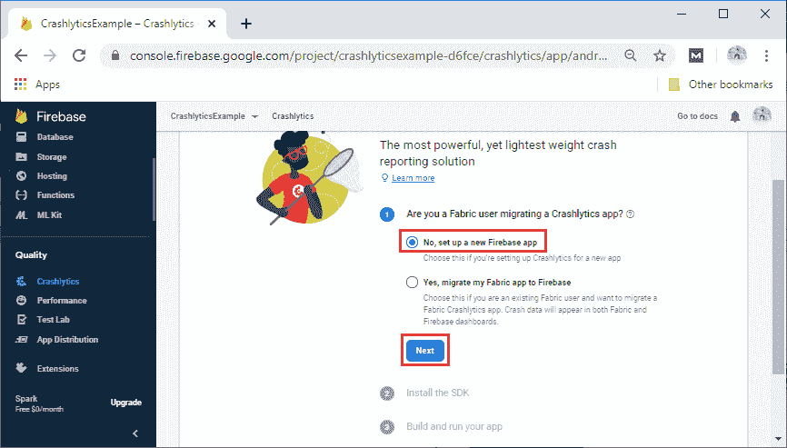
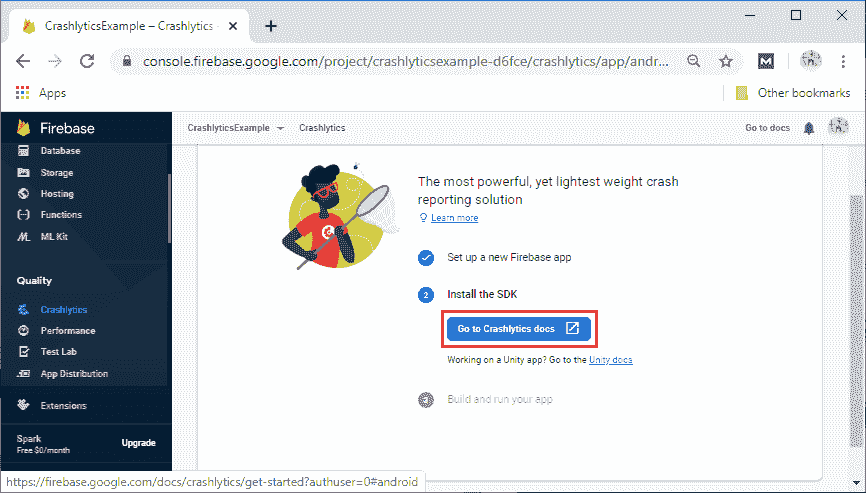
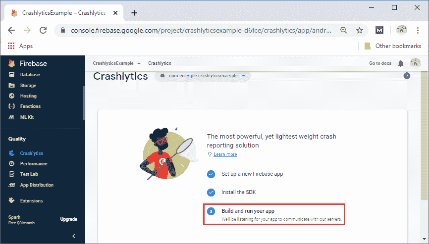

# 火焰分解器的设置和配置

> 原文：<https://www.javatpoint.com/firebase-crashlytics-setup-and-configuration>

在本文中，我们将学习如何在安卓应用中使用 Firebase Crashlytics。为此，我们需要一个安卓应用。就像 Firebase 实时数据库和 Firebase 身份验证一样，使用 Crashlytics 的开始步骤是相同的，我们也将在这里使用 Kotlin。因此，让我们从开始的步骤开始，并详细说明每个步骤，执行这些步骤是为了在 Firebase 中设置和配置应用以使用 Firestore。

**第一步:**

在第一步中，我们将创建一个新的安卓工作室项目，其中包含一个空的活动和 Kotlin 语言，并将其命名为**crashlysixesample**。

**第二步:**

在下一步中，我们将从 Firebase Assistant 或使用控制台手动连接我们的安卓应用和 Firebase。之后，我们将把所有需要的库和插件添加到 app.gradle 文件中。我们还将在我们的存储库和所有项目中添加 maven。

**第三步:**

我们将更新我们的 **app.gradle** 文件。我们将为谷歌服务和 io.fabric 添加插件。我们将为 Crashlytics 添加 Firebase 核心和分析的依赖。

**第四步:**

现在，转到 Firebase 控制台，从 **Firebase- >品质- >防撞器**中选择防撞器。之后，点击**设置防撞器**。

当我们点击**设置 Crashlytics** 时，它会问“**你是移植 Crashlytics 应用的 Fabric 用户吗？**“我们将选择**否，设置一个新的火焰基地追加，**点击**下一步**。

当我们点击下一步时，它会告诉我们安装 SDK，我们已经安装了。

当我们点击**转到 Crashlytics 文档**时，它会切换到 Firebase Crashlytics 文档页面，当我们回到控制台时，它会给出权限来构建和运行我们的应用。

在设置和配置方面，我们不需要做其他任何事情，因为在 Android Manifest xml 文件中有一个自动库克，它会自动初始化 Firebase SDK。

* * *