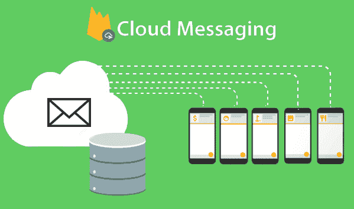

# Firebase 云消息传递

> 原文：<https://www.javatpoint.com/firebase-cloud-messaging>

Firebase 云消息传递(FCM)是一种跨平台的消息传递解决方案，可以免费可靠地发送消息。它被正式称为谷歌云消息，用于安卓、iOS 和网络应用。

该服务由谷歌的子公司 Firebase 提供，2014 年 10 月 21 日，Firebase 宣布被谷歌收购，收购金额未披露。谷歌云消息官方网站展示了 Firebase 云消息(FCM)作为 GCM 的新版本。

如果我们使用的是谷歌云消息(GCM)服务器和客户端 API，那么就有一些坏消息，那就是这项服务已经被移除，谷歌计划在 2019 年 4 月停止“大部分”GCM 服务。如果我们仍然使用 GCM，那么我们应该现在就开始将我们的项目迁移到 FCM，并在 2019 年 4 月完成迁移。

FCM 是一个免费的跨平台消息传递解决方案，它允许我们向观众发送推送通知，而不用担心服务器代码。将 FCM 与 Firebase 的 Notification Composer 结合使用(如下面的截图所示)，用户可以创建针对用户群中非常特定部分的通知，通常无需编写任何特定代码。使用 FCM:

1.  我们可以发送数据消息和通知消息。
2.  我们可以为单个设备、设备组或订阅某个主题的设备分发消息。
3.  我们可以通过 FCM 的电池高效连接和可靠通道将聊天、确认和其他消息从设备发送回服务器。

## FCM 和 GCM 有什么不同？

1.  在 FCM 中，不需要编写我们自己的注册或订阅重试逻辑。
2.  不需要在 FCM 中显式声明“接收方”。
3.  不需要初始化注册令牌，因为注册令牌的生成是由库本身处理的。
4.  FCM 通过 web 控制台提供无服务器通知解决方案-Firebase 通知。这个网络控制台将提醒我们关于解析推送控制台。

## 它是如何工作的？

FCM 实现包含发送和接收两个主要组件。第一个是可信的环境，如 Firebase 的云功能或用于构建、定位和发送消息的应用服务器，本质上是服务器端，另一个是接收消息的安卓客户端应用。如果我们在云函数或 Java 代码中实现自己的服务器代码，那么我们可以通过 Firebase Admin SDK 或 FCM 服务器协议发送消息。

我们还可以使用 Notification composer 进行测试，或者发送具有强大内置目标和分析功能的营销或参与消息。

### 实现路径

**1)设置 FCM 传感和诊断模块**

根据我们平台的设置说明，在我们的应用上设置 Firebase 和 FCM。

**2)开发我们的客户端应用**

在我们的客户端应用中，我们必须添加消息处理、主题订阅逻辑或其他可选功能。在开发过程中，我们可以轻松地从 Notification composer 发送文本消息。

**3)开发我们的应用服务器**

我们需要决定是使用 Firebase Admin SDK 还是其中一个服务器协议来创建我们的发送逻辑，即验证、构建发送请求、处理响应等逻辑。，并在我们的可信环境中构建逻辑。

**4)关于我们自己的应用服务器的开发**

它将为我们提供服务器环境的基础知识，但我们不会编写任何代码。

* * *