# 消息类型

> 原文：<https://www.javatpoint.com/firebase-types-of-message>

使用 Firebase Cloud Messaging，我们可以发送三种类型的消息，即**通知消息、数据消息、**以及同时带有**通知&数据负载**的消息。

## 1)通知消息

Firebase SDK 本身已经处理了通知消息。通常，通知消息包括标题、图标、消息等。这些消息也可以从 Firebase 控制台用户界面发送。通过发送这种类型的消息，我们将无法控制信息。当应用程序在后台时，通知将自动出现。

通知是安卓在我们的应用程序用户界面之外显示的信息，用于向用户提供提醒、与其他人的交流或关于我们应用程序的其他及时信息。用户可以点击通知打开我们的应用程序，或者直接从通知中采取行动。

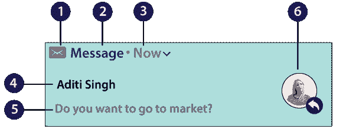

通知设计由系统模板决定——模板每个部分的内容由我们的应用程序定义。通知的某些信息仅出现在展开的视图中。通知最常见的部分如下:

1.  **小图标**
    在通知中设置小图标是必不可少的。这个小图标是用 setSmallIcon()设置的。
2.  **App 名称**
    应用名称由系统提供。
3.  **时间戳**
    时间戳也是系统提供的，但是我们可以用 setWhen()函数覆盖或者用**setshowwhat()**函数隐藏。
4.  **标题**
    也是可选的，用 setContentTitle()函数设置。
5.  **文本**
    文本是可选的，用 setContentText()设置。
6.  **大图标**
    这个是可选的，我们用它来联系照片。我们的应用图标不用它，用 **setLargeIcon()** 功能设置。

## 2)数据信息

数据信息由安卓应用处理。如果我们想随信息一起发送一些额外的数据，那么我们可以添加这样的消息。但是，不可能通过 Firebase 控制台发送这些消息。要使用 Firebase API 发送通知，我们必须有服务器端逻辑。发送此消息时，我们必须使用数据密钥。

我们可以使用数据消息向客户端应用程序发送自定义数据元素。但是，FCM 对这些数据消息设置了 4KB 的限制，因此如果我们的有效负载大于 4KB，我们必须使用 WorkManager 或 JobScheduler API 获取额外的数据。

## 3)包含通知和数据负载的消息

通知和数据负载也可以包含在消息中。根据应用程序状态，这些类型消息的发送分为两种情况，即后台和前台。我们可以为这些消息使用通知和数据键。

当应用程序状态处于后台时，当用户点击通知时，应用程序会接收到通知有效负载，当处于前台时，应用程序会接收到两个有效负载都可用的消息对象。

## FCM 控制台

现在，我们将创建一个安卓项目，并从谷歌助手或手动添加它与 Firebase。之后，我们将转到 FCM 控制台(Firebase->Grow->云消息)。

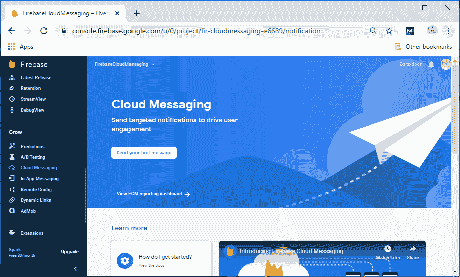

点击**发送你的第一条信息**。

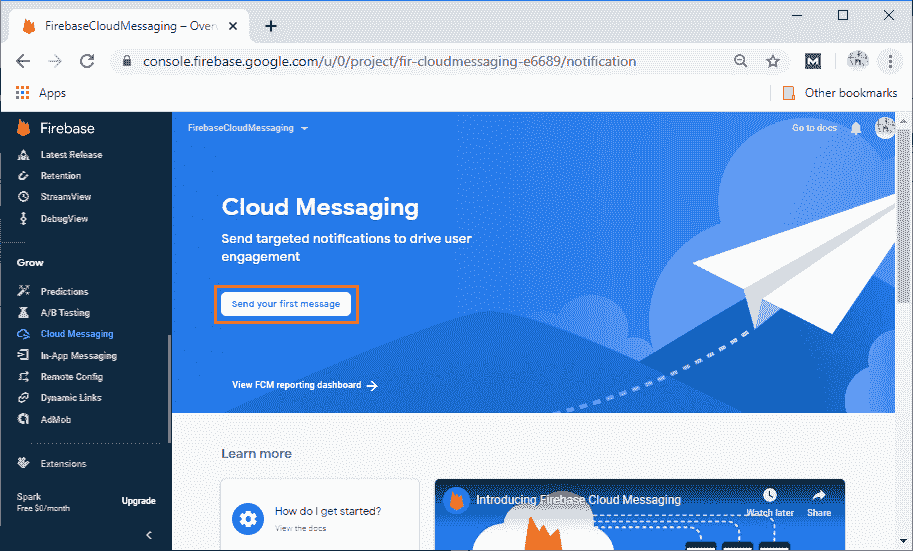

点击**发送第一条消息**后，会要求填写通知标题、通知文本、可选的通知图像、通知名称等几个字段，也是可选的。

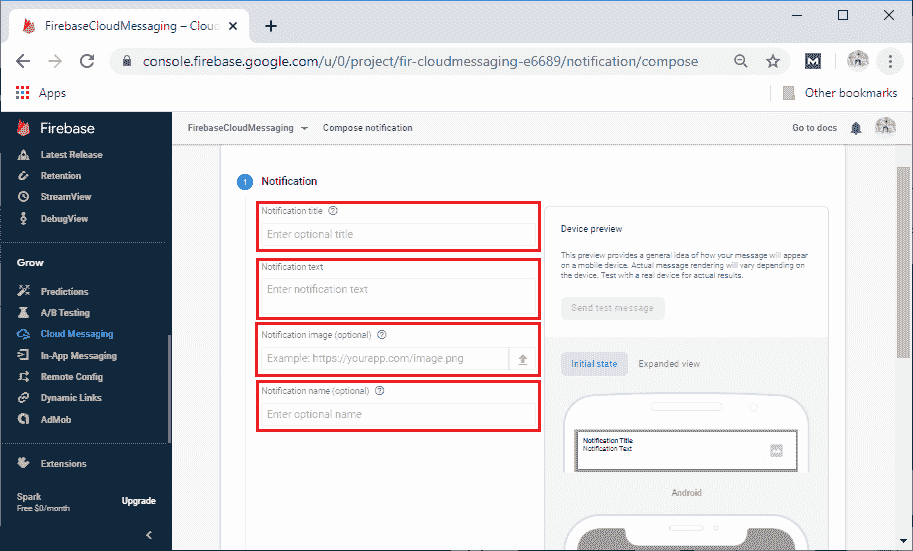

填写完所有字段后，点击**下一步**。

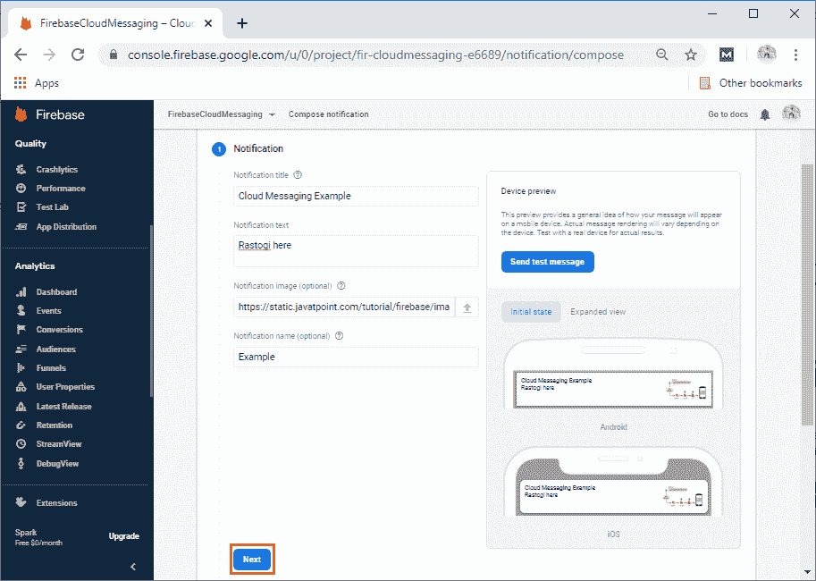

点击**下一步**后，会询问**目标**或者**用户段**或者**话题**。我们将为目标用户选择应用，然后点击**下一步**。

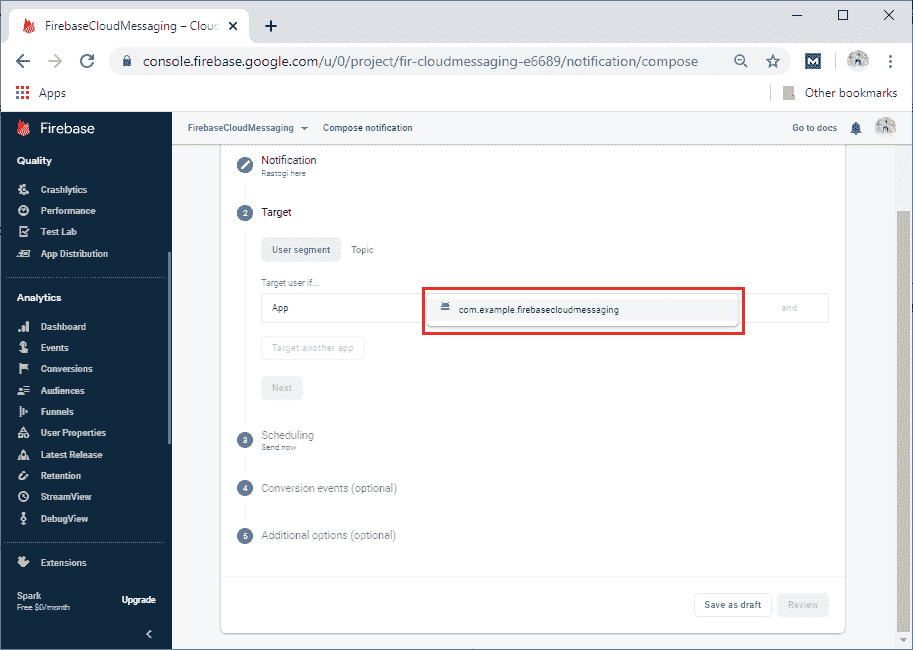

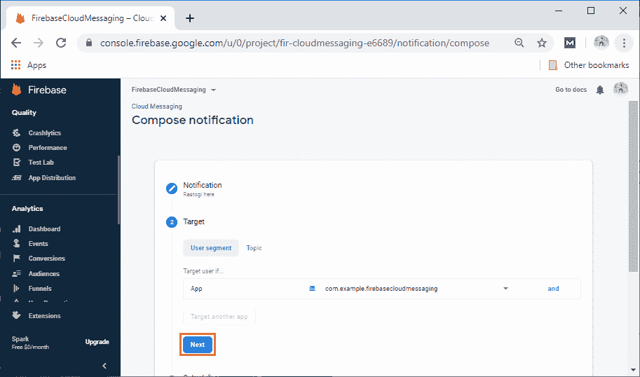

当我们点击**下一步**时，它会询问**调度**并再次点击**下一步**。

之后会询问**转换事件**。我们可以这样做，但这是可选的。所以，我们可以忽略它，继续前进。

之后，它会要求一些额外的选项，这些选项也是可选的。这些是通知通道、自定义数据、声音和过期时间等。之后，我们将点击**查看**。

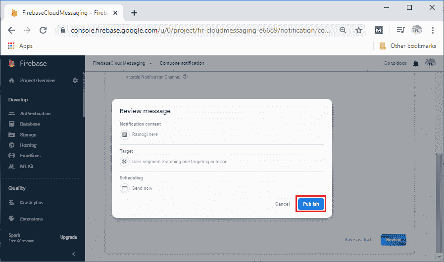

发布后，我们可以在控制台中看到通知。

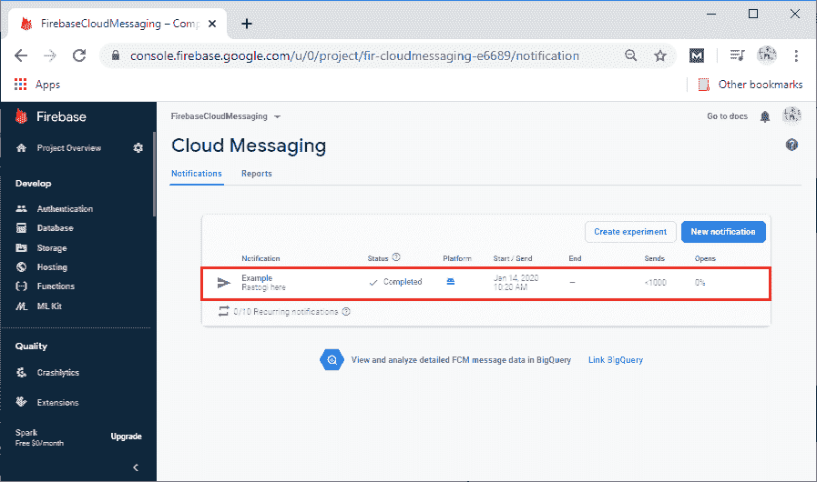

我们可以复制通知，如果我们想深入了解消息传递到我们的应用程序。我们可以转到报告仪表板，它记录了设备中发送的许多消息。它也有一些用户可以看到的印象通知的数据，但是我们将浏览更多的通知编辑器。

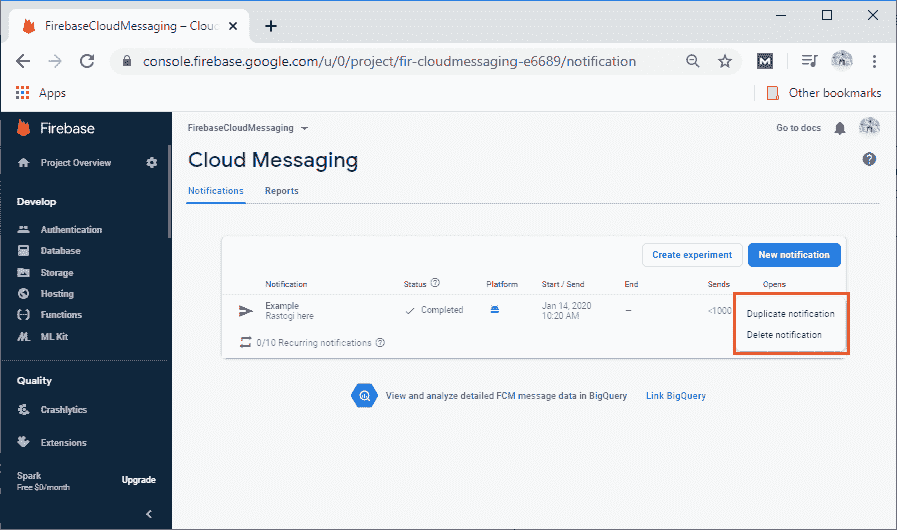

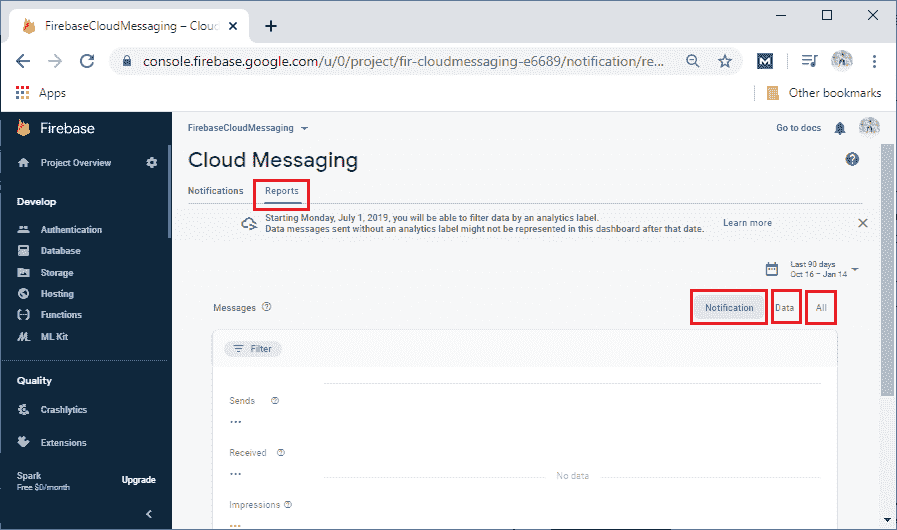

* * *