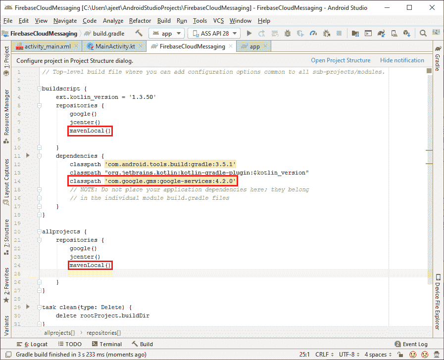
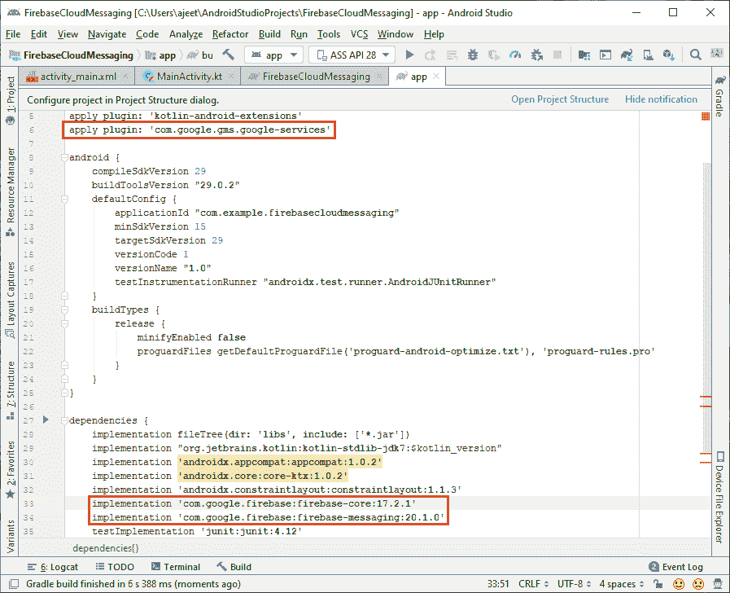
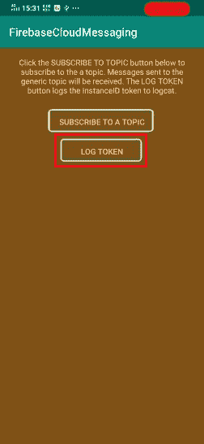
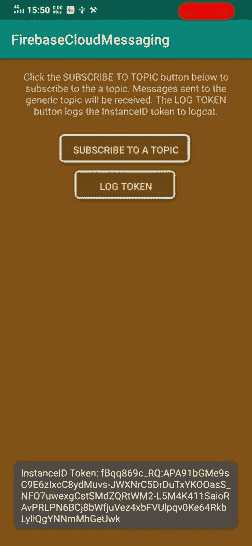
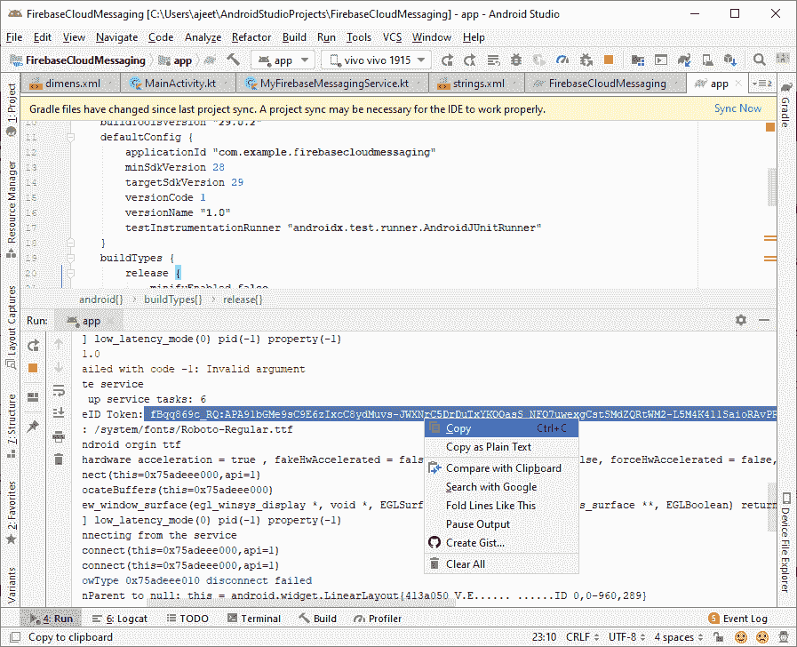
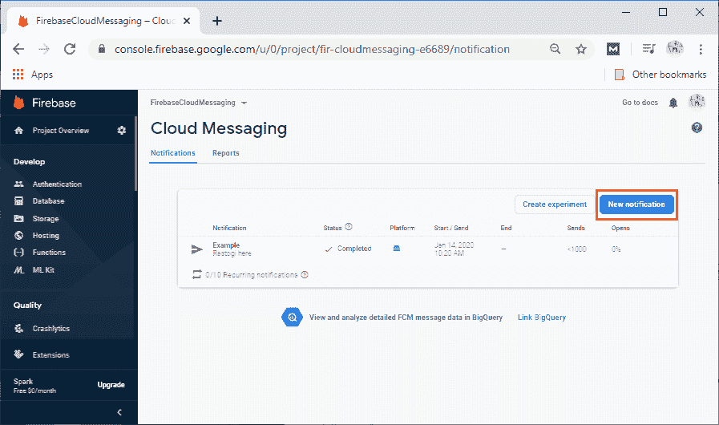
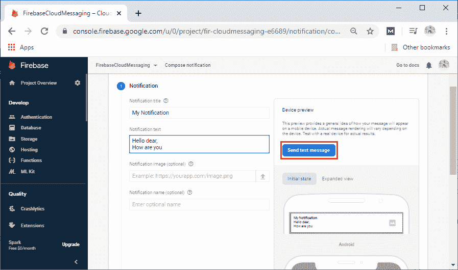
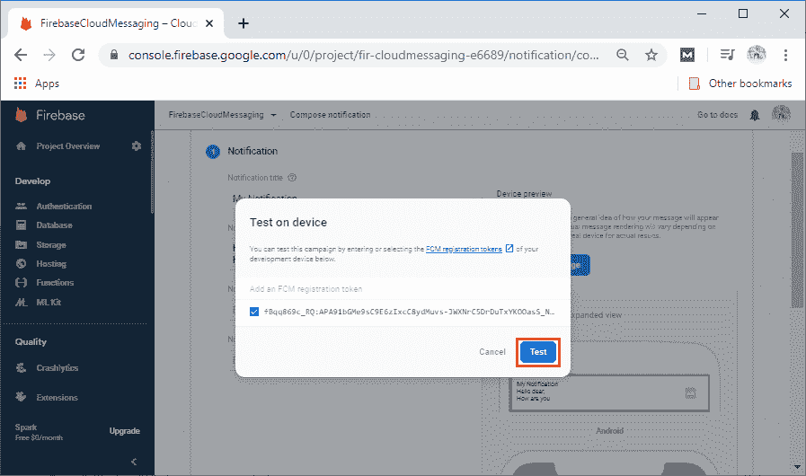

# 使用 Firebase 云消息发送通知消息

> 原文：<https://www.javatpoint.com/sending-notification-message-using-firebase-cloud-messaging>

在本节中，我们将讨论当应用程序位于设备的后台时，如何将测试通知消息从 Notification composer 发送到开发设备。为此，我们必须:

1)创建一个 Firebase 项目。

2)从助手或控制台将我们的应用程序连接到 Firebase，并将 google-services.json 文件下载到我们的应用程序目录。

3)在我们的项目级 build.gradle 文件中，确保在我们的 buildscript 和所有项目部分都包含 Google 的 Maven 存储库。



4)对于 app build.gradle 文件，我们有两个实现库”

1.  将云消息安卓库和 firebase 核心库添加到我们的 app/build.gradle 文件中:
    1.  实现' com . Google . firebase:firebase-core:17 . 0 . 0 '
    2.  实现“com . Google . firebase:firebase-messaging:19 . 0 . 1”
2.  另外，添加 google play 依赖项(类路径和应用):
    1.  apply plugin:' com . Google . GMS . Google-services '
    2.  类路径' com . Google . GMS:Google-services:4 . 2 . 0 '



**5)编辑我们的应用清单**

建议并支持通知渠道。FCM 给出了一个带有基本设置的默认通知通道。如果我们想要创建和使用我们的默认通道，那么我们必须将 default _ notification _ channel _ id 设置为我们的通知通道对象的 ID。当传入消息未明确设置通知通道时，FCM 将使用此值:

```

<meta-data
	android:name="com.google.firebase.messaging.default_notification_channel_id"
	android:value="fcm_default_channel"/>

```

6)现在，我们将转移到我们的主要活动，以确保创建通知渠道。

**7)访问设备注册令牌**

在我们的应用程序初始启动时，FCM 软件开发工具包会为客户端应用程序实例生成一个注册令牌。如果我们想要针对单个设备，我们将需要通过扩展 FirebaseMessagingService 和重写 onNewToken 来访问这个令牌。令牌可以在初始启动后轮换，因此强烈建议检索最新更新的注册令牌。

注册令牌可能会发生变化:

1.  当应用程序删除实例标识时。
2.  当应用程序在新设备上恢复时。
3.  当用户重新安装/卸载应用程序时。
4.  当用户清除应用数据时。
5.  检索当前注册令牌

当我们需要检索当前令牌时，调用 FirebaseIntanceId.getInstance()。getInstanceId(. 4)

```

FirebaseInstanceId.getInstance().instanceId
	.addOnCompleteListener{task-?
		if(!task.isSuccessful){
			Log.w(TAG, "getInstanceId failed", task.exception)
			return@OnCompleteListener
		}
		//Getting new instance id token
	val token=task.result?.token

	 //toast and log 
		val msg1=getString(R.string.msg_token_fmt, token)

		Log.d(TAG, msg1)
		Toast.makeText(baseContext, msg1, Toast.Length_Short).show()
)}

```

**9)监控令牌生成**

生成新令牌时，会触发 oneNewToken 回调。当我们获得令牌后，我们可以将其发送到我们的应用服务器，并使用我们首选的方法进行存储:

```

/**
* It is called if InstanceID token is modified(update). This may happen if the security of 
the previous token had been compromised. Essentially this is called when the InstanceID token
 is generated. 
*/
override fun onNewToken(token: String) {
Log.d(TAG, "Refreshed token: $token")

        	// If we want to send messages to this application instance or
        	// manage the app's subscription on the server-side, send the
       	// Instance ID token to your app server.
        	sendRegistrationToServer(token)
    }

```

**activity_main.xml**


**Main_activity.kt**

```

package com.example.firebasecloudmessaging

import android.app.NotificationChannel
import android.app.NotificationManager
import android.os.Build
import android.os.Bundle
import android.util.Log
import android.widget.Toast
import androidx.appcompat.app.AppCompatActivity
import com.google.android.gms.tasks.OnCompleteListener
import com.google.firebase.iid.FirebaseInstanceId
import com.google.firebase.messaging.FirebaseMessaging
import kotlinx.android.synthetic.main.activity_main.*

class MainActivity : AppCompatActivity() {

    override fun onCreate(savedInstanceState: Bundle?) {
        super.onCreate(savedInstanceState)
        setContentView(R.layout.activity_main)

        if (Build.VERSION.SDK_INT >= Build.VERSION_CODES.O) {
            // Creating channel to show notifications.
            val channelId = getString(R.string.default_notification_channel_id)
            val channelName = getString(R.string.default_notification_channel_name)
            val notificationManager = getSystemService(NotificationManager::class.java)
            notificationManager?.createNotificationChannel(NotificationChannel(channelId,
                channelName, NotificationManager.IMPORTANCE_LOW))
        }

        // Any data accompanying the notification, if a notification message is tapped.
        // message is available in the intent extras. 
        // The launcher intent is triggered when the notification is tapped, so any accompanying data can         // be handled here. If we want a different intent fired, click_action// set the field of the notification message to the desired intent. The launcher intent
        // is used when no click_action is specified.
        //
        // Handle possible data accompanying notification message.
        intent.extras?.let {
            for (key in it.keySet()) {
                val value = intent.extras!!.get(key)
                Log.d(TAG, "Key: $key Value: $value")
            }
        }

        subscribeButton.setOnClickListener {
            Log.d(TAG, "Subscribing to my topic")
            FirebaseMessaging.getInstance().subscribeToTopic("myTopic")
                .addOnCompleteListener { task ->
                    var msg1 = getString(R.string.msg_subscribed)
                    if (!task.isSuccessful) {
                        msg1 = getString(R.string.msg_subscribe_failed)
                    }
                    Log.d(TAG, msg1)
                    Toast.makeText(baseContext, msg1, Toast.LENGTH_SHORT).show()
                }
        }

        logTokenButton.setOnClickListener {
            // Getting token
            FirebaseInstanceId.getInstance().instanceId
                .addOnCompleteListener(OnCompleteListener { task ->
                    if (!task.isSuccessful) {
                        Log.w(TAG, "getInstanceId failed", task.exception)
                        return@OnCompleteListener
                    }

                    // Getting new Instance ID token
                    val token = task.result?.token
                     // toast and Log                     val msg1 = getString(R.string.msg_token_fmt, token)
                    Log.d(TAG, msg1)
                    Toast.makeText(baseContext, msg1, Toast.LENGTH_SHORT).show()
                })
        }
    }

    companion object {
        private const val TAG = "MainActivity"
    }
}

```

**my filebase messagingservice . kt**

```

package com.example.firebasecloudmessaging

import android.app.NotificationChannel
import android.app.NotificationManager
import android.app.PendingIntent
import android.content.Context
import android.content.Intent
import android.os.Build
import android.util.Log
import androidx.annotation.NonNull
import androidx.core.app.NotificationCompat
import com.example.firebasecloudmessaging.MainActivity
import com.example.firebasecloudmessaging.R
import com.google.firebase.messaging.FirebaseMessagingService
import com.google.firebase.messaging.RemoteMessage

class MyFirebaseMessagingService : FirebaseMessagingService() {

    /*** It is called when message is received.
     * @param remoteMessage Object representing the message received from Firebase Cloud Messaging.
     */
    override fun onMessageReceived(remoteMessage: RemoteMessage) {

//There are two types of messages, i.e., data messages and notification messages. //The data messages are handled here in onMessageReceived, either the app is in the foreground or background. 
//The data messages are traditionally used with GCM. 
//The notification messages are only received here in onMessageReceived when the app is in the foreground, and if the app is in the background, the automatically generated notification is displayed. 
//If the user taps on the notification, they are returned to the app. 
//Messages containing both notifications and data payloads are treated as notification messages. 
//The Firebase console always sends a notification message. 
//For more see: https://firebase.google.com/docs/cloud-messaging/concept-options

        // TODO(developer): Handle FCM messages here.
        Log.d(TAG, "From: ${remoteMessage?.from}")

        // Check if message contains a data payload.
        remoteMessage?.data?.isNotEmpty()?.let {
            Log.d(TAG, "Message data payload: " + remoteMessage.data)
        }

        // Check if message contains a notification payload.
        remoteMessage?.notification?.let {
            Log.d(TAG, "Message Notification Body: ${it.body}")
            sendNotification(it.body.toString())
        }

        // Also, if we intend on generating our own notifications as a result of a received FCM message, here is where that should be initiated. See the send notification method below.
    }

    /**
     * It called if InstanceID token is modified(update). This may happen if the security of      * the previous token had been compromised. This is essentially called when the InstanceID token* is generated, so this is where we would retrieve the token.
     */
    override fun onNewToken(token: String) {
        Log.d(TAG, "Refreshed token: $token")

        // If we want to send messages to this application instance or// manage this apps subscription on the server-side, send the// Instance ID token to our app server.
        sendRegistrationToServer(token)
    }

    /*** Preserve token to third-party servers.
     * Modify this method relate to the user's FCM InstanceID token with any server-side account
     * maintained by your application.
     *
     * @param token The new token.
     */
    private fun sendRegistrationToServer(token: String?) {
        // TODO: Implement this method to send a token to your app server.
    }

    /**
     * Creating and showing a simple notification containing the received FCM message.
     *
     * @param messageBody FCM message body received.
     */
    private fun sendNotification(messageBody: String) {
        val intent = Intent(this, MainActivity::class.java)
        intent.addFlags(Intent.FLAG_ACTIVITY_CLEAR_TOP)
        val penIntent = PendingIntent.getActivity(this, 0 /* Request code */, intent,
            PendingIntent.FLAG_ONE_SHOT)

        val channelId = getString(R.string.default_notification_channel_id)
        val notificationBuilder = NotificationCompat.Builder(this, channelId)
            .setSmallIcon(R.drawable.ic_stat_ic_notification)
            .setContentTitle(getString(R.string.fcm_message))
            .setContentText(messageBody)
            .setAutoCancel(true)
            .setContentIntent(penIntent)

        val notificationManager = getSystemService(Context.NOTIFICATION_SERVICE) as NotificationManager

        // Since android Oreo notification channel is needed.
        if (Build.VERSION.SDK_INT >= Build.VERSION_CODES.O) {
            val channel = NotificationChannel(channelId,
                "Channel human readable title",
                NotificationManager.IMPORTANCE_DEFAULT)
            notificationManager.createNotificationChannel(channel)
        }

        notificationManager.notify(channelId, 1,  notificationBuilder.build())
    }

    companion object {
        private const val TAG = "MyFirebaseMsgService"
    }
}

```

 

当我们点击日志令牌按钮时，它为我们提供了一个实例令牌，我们在 FCM 控制台中使用它来发送消息。



现在，我们将移至 FCM 控制台，点击**新通知**。



点击**需要通知**后，会要求我们填写通知标题、文字、图片等部分字段。，并点击**选择测试信息**。



我们将复制的 InstanceId 令牌粘贴到**添加一个 FCM 注册令牌**字段，并点击**测试**。



最后一步是在我们应用的通知栏中创建通知消息。通知仅在我们的应用程序将在后台运行时显示。


* * *