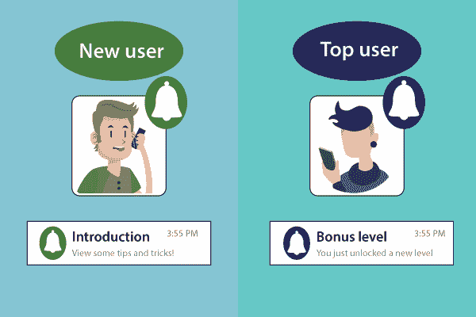

# Firebase 应用内消息

> 原文：<https://www.javatpoint.com/firebase-in-app-messaging>

应用内消息传递类似于云消息传递，只是消息发送到应用，而不是设备。这有助于我们吸引应用的活跃用户，向他们发送有针对性的上下文信息，鼓励他们使用关键的应用功能。例如，我们可以发送一条应用内消息，让用户订阅、完成一个级别、观看视频或购买一个项目。我们可以将消息定制为横幅、卡片、图像或模式，并设置事件，以便它们在对用户最有利的时候出现。

Firebase 的目标是让开发人员更容易让他们的活跃用户参与到他们的应用中，并引导用户朝着正确的方向去做有价值的工作。Firebase 应用内消息有助于提高我们的应用保留率。目标上下文消息以模态和横幅的形式发送。我们可以设置触发器，使它们看起来完全符合用户最大的利益。

## 用例

1.  用于在 app_launch 事件上显示欢迎消息。
2.  用于显示 app_update 事件的特定通知。
3.  展示节日，生日愿望卡。
4.  在某一天展示折扣优惠。

## 关键能力

Firebase 应用内消息传递能够执行以下操作:

**发送相关的、吸引人的信息**

Firebase 应用内消息在最需要的时候以及用户在我们的应用中实际使用的时候发送消息。当用户访问我们的应用内商店时，扩大大销售，而不是当他们在杂货店排队时。当用户玩我们的游戏时，而不是当他们坐在一起看大型游戏时，突出酷，新的水平。

**按行为或受众定位信息**

Firebase 应用内消息传递与预测和分析合作，提供向用户传递消息的工具，我们最想接触到这些用户。这些信息是根据用户过去的行为、人口统计数据，甚至对他们未来行为的预测来发送的。

**创建灵活的自定义警报**

Firebase 应用内消息传递帮助我们完成从发送促销优惠到为用户更新新版本应用的所有工作，用户只需点击几下鼠标即可定制我们的消息的样式、显示触发器、外观和内容。

* * *