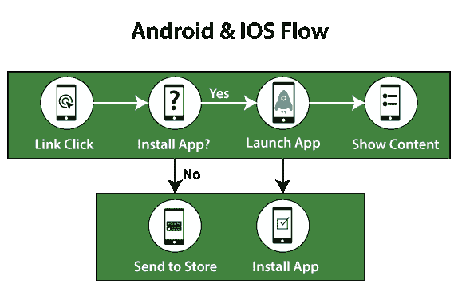
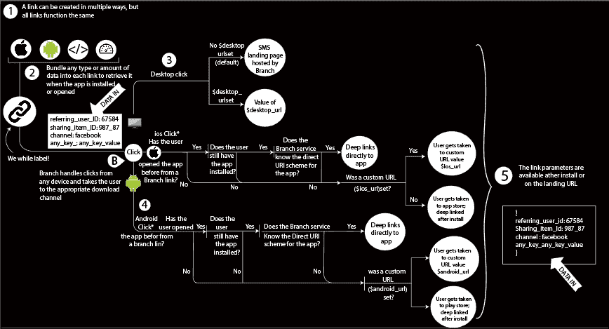

# Firebase 中的动态链接

> 原文：<https://www.javatpoint.com/dynamic-links-in-firebase>

Firebase 动态链接是按照我们想要的方式工作的链接，跨多个平台，无论我们的应用是否预装。

我们的用户在动态链接的帮助下，在打开我们的链接的平台上获得最佳的可用体验。如果用户在安卓、iOS 或桌面浏览器上打开一个动态链接，他将被重定向到链接内容进入我们的原始应用或我们的网站。

除此之外，动态链接在应用安装上起作用，即在 iOS 或安卓设备上打开动态链接，首先要求用户安装你的应用，然后只有用户才能访问该链接。动态链接是智能网址，允许我们将现有和潜在用户发送到我们的安卓和 iOS 应用中的任何位置。

## 动态链接的主要优势

**动态链接**有以下好处:

1.  它有助于将网络用户转换为本地应用用户。
2.  它增加了用户对用户共享的转换。
3.  它通过电子邮件、社交和短信营销活动推动更多安装。
4.  这也有助于将桌面用户转变为移动应用用户。

## 用例

用例是我们通过使用应用中的动态链接来增加开发或增长以及参与度的一些方法。这些案例如下:

### 1.将网络用户转换为应用用户

如果移动网络用户通过打开没有动态链接的应用安装链接来安装我们的应用，那么他们必须再次导航到他们所在的位置。在动态链接的帮助下，我们可以确保在网络用户安装我们的应用后，他们可以继续他们停止的地方。

### 2.用户对用户的共享

让我们的用户可以轻松地与他们的朋友分享我们应用的内容。不用担心平台，要么他们的朋友已经用了我们的 app，要么没有。

### 3.电子邮件、社交和短信活动

发送促销优惠使用链接，在任何平台上工作。当前和未来用户可以兑换我们的优惠；要么他们使用 iOS、安卓或网络浏览器，要么没有，要么他们已经安装了我们的应用。

### 4.真实世界的应用推广

我们使用埃迪斯通信标和二维码，它们在我们的物理显示器上编码一个动态链接，在场馆和活动中推广我们的应用。

### 5.将桌面用户转换为应用用户

动态链接是在网页用户为网页添加书签或给自己发送链接时生成的。如果他们在不同的设备上打开链接，他们可以获得设备的最佳体验。

## 它是如何工作的？

动态链接是通过将动态链接参数添加到特定于我们应用的域中来形成一个网址，或者通过使用 Firebase 控制台、iOS、使用 REST API 或安卓构建器 API 来创建的。这些参数指定了我们想要打开的链接，这取决于用户的平台和我们的应用是否已安装。

当用户打开我们的动态链接时，如果我们的应用还没有安装，用户会被发送到 Play Store 或 App Store 安装我们的应用(除非您另外指定)，我们的应用就会打开。然后，我们可以检索为我们的应用提供的链接，并为我们的应用处理适当的链接。

* * *