# 创建动态链接的 Firebase

> 原文：<https://www.javatpoint.com/firebase-creating-dynamic-link>

在 Firebase 中，我们可以通过四种方式创建**动态链接**。这些措施如下:

## 使用 Firebase 控制台

我们可以在 Firebase 控制台的帮助下创建一个动态链接。如果我们正在创建宣传片链接，以便在社交媒体上分享，这将非常有用。我们可以在 Firebase 控制台中为链接选择一个自定义后缀和名称。我们可以在 Firebase 控制台或通过 Analytics REST API 跟踪这些动态链接的性能。

## 使用动态链接生成器应用编程接口

这是在我们的应用中动态创建链接的首选方式，用于用户对用户的共享或任何需要许多链接的情况。我们可以跟踪动态链接的性能，动态链接是使用构建器应用编程接口使用动态链接分析应用编程接口创建的。

## 使用 REST 应用编程接口

这是在没有构建器应用编程接口的平台上动态创建链接的首选方式。分析休息应用编程接口可用于跟踪在控制台中创建的促销活动的表现。

## 用手

如果我们不需要跟踪点击数据，也不在乎链接是否强大，我们可以使用 URL 参数手动构建动态链接

我们可以用 Firebase 动态链接生成器 API 创建短的或长的动态链接。它接受长动态链接或包含动态链接参数的对象。为了创建一个动态链接，我们必须有一个安卓应用，并将其添加到 Firebase 项目中。

我们首先创建一个安卓应用，并从 Firebase 控制台或手动将其添加到 Firebase。

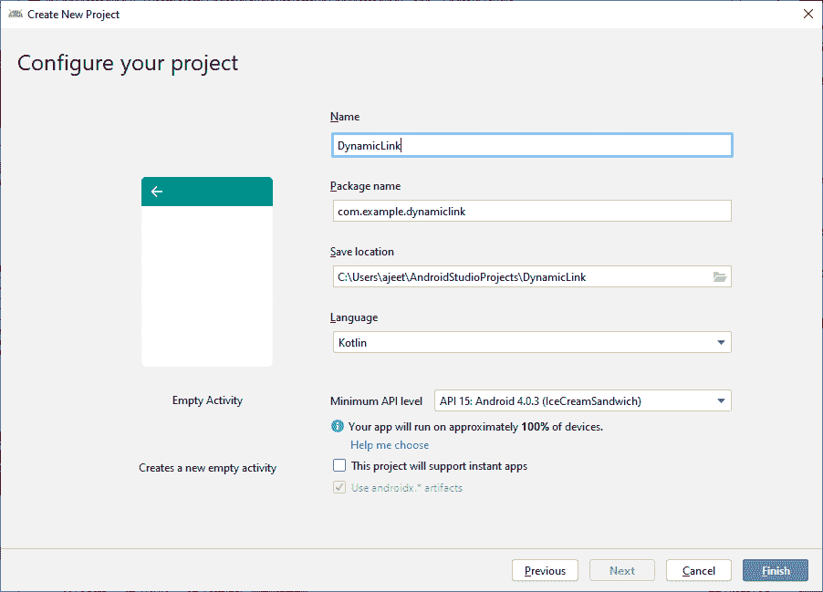

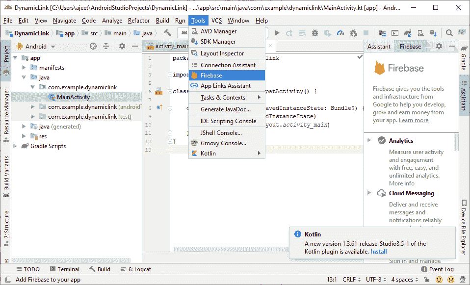

它还要求 SHA-1 和 SHA-256 键在控制台中启动安卓项目。

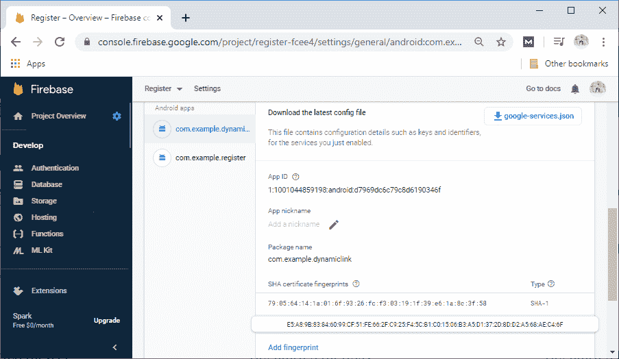

在下一步中，我们将添加所有的依赖项，即 firebase 核心和 Firebase 动态链接到我们的 Firebase 项目和应用级 build.gradle 文件。

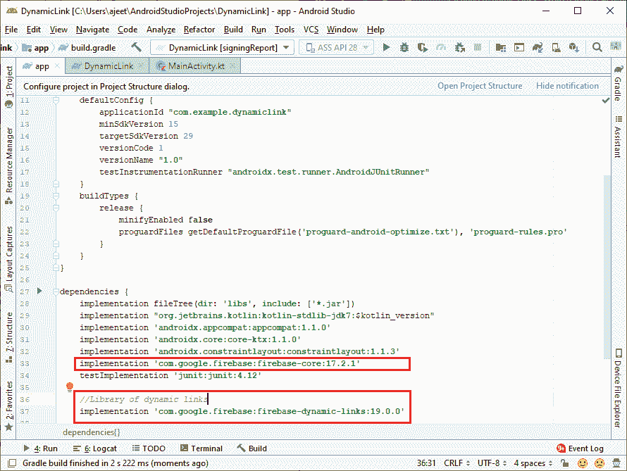

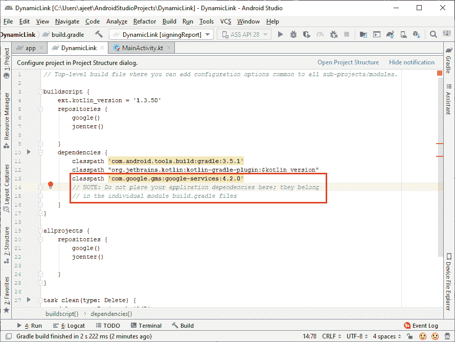

## 使用 Firebase 控制台创建动态链接

首先，我们将移至Firebase控制台**(Firebase- >成长- >动态链接)**中的**动态链接**部分。如果我们还没有接受服务条款，那么我们必须为我们的动态链接设置一个域，我们将在提示时这样做。如果我们已经有了一个动态链接域，当我们以编程方式创建动态链接时，我们必须提供一个动态链接域。

之后，我们将指定深度链接和回退链接中允许的 URL 模式。我们防止未经授权的一方创建动态链接，这将从我们的域重定向到我们无法控制的站点。如果我们想为测试目的或我们的营销团队生成一个动态链接，它可以用于类似社交媒体帖子的东西。最简单的方法是访问 Firebase 控制台，按照一步一步的形式手动创建一个。

因此，我们将转到 Firebase 控制台的动态链接部分。

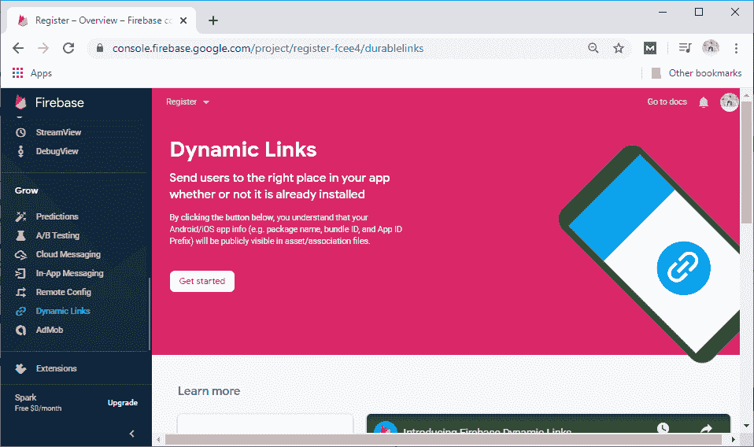

现在我们点击**开始**。

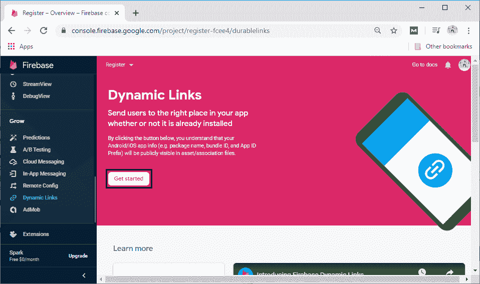

点击开始后，它会要求添加网址前缀和模式。如果我们没有自己的领域，我们可以使用示例下的领域。我们可以把它作为一个免费的**定制页面。链接**。所以，我们只需要想出一些我们以前没有用过的名字。

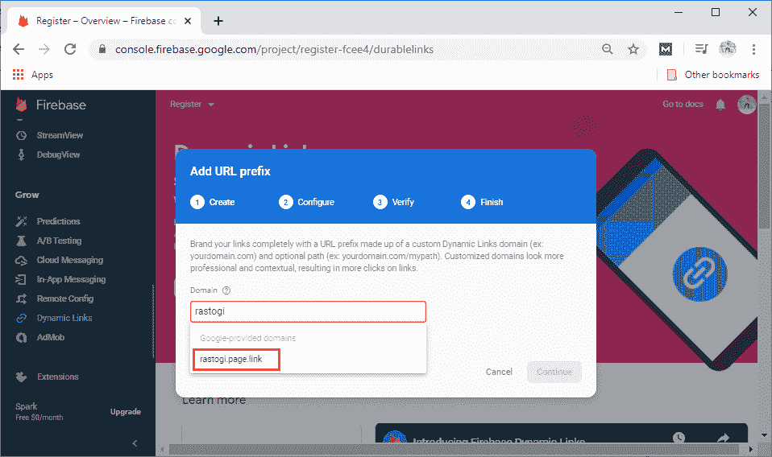

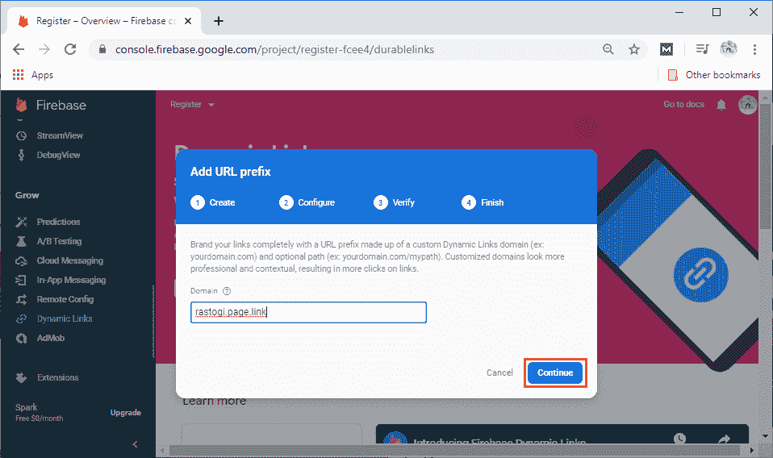

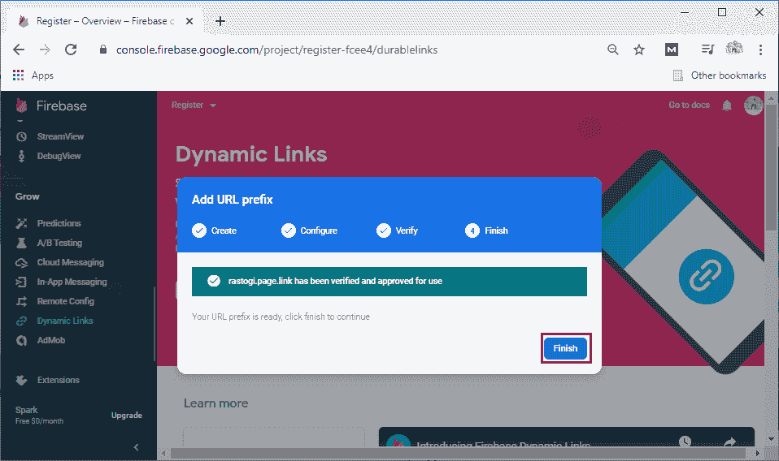

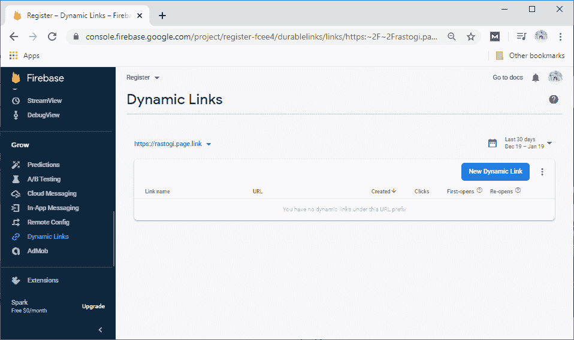

现在，没有动态链接。我们将通过点击**新建动态链接**来创建一个动态链接。


该点击将打开“创建**动态链接**门户”，并要求设置一个简短的网址链接、设置或动态链接，为 iOS 定义链接行为，为安卓定义链接行为，以及可选的活动跟踪、社交标签和高级选项。

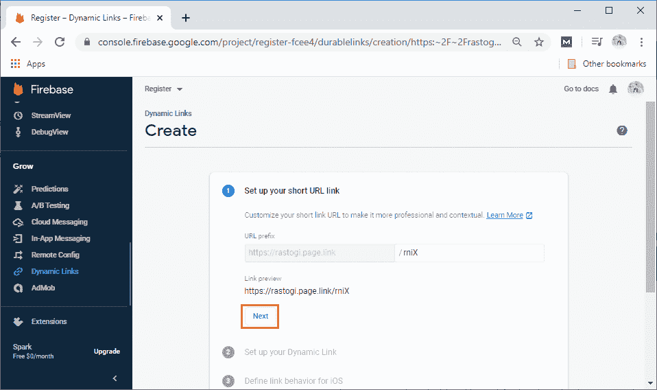

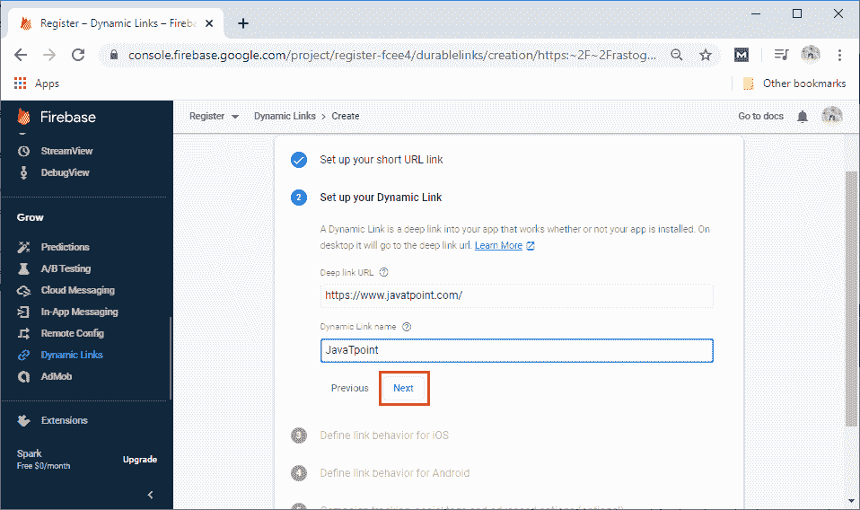

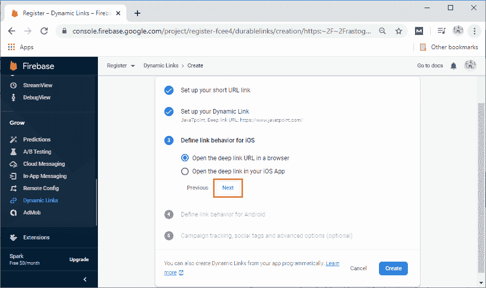

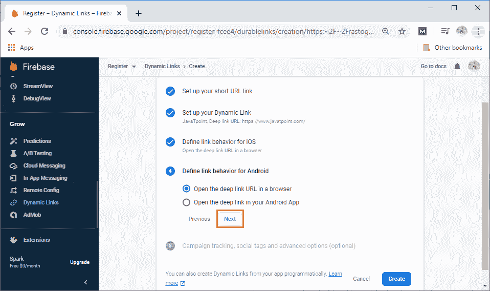

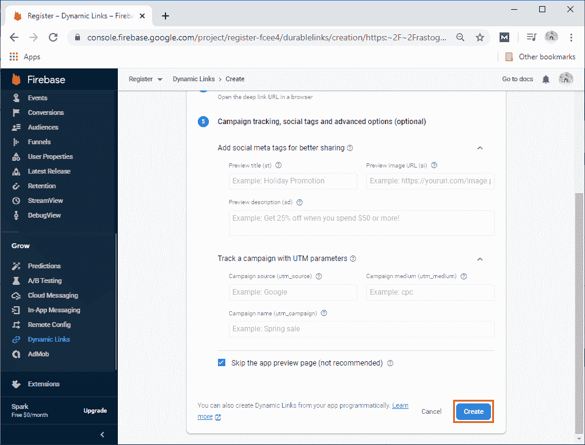

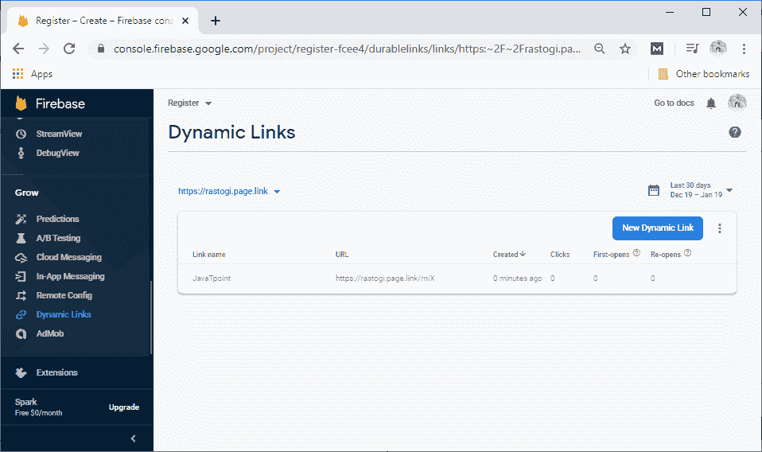

## 从参数创建动态链接

用于以编程方式创建动态链接

1.  用它的构建器创建一个新的动态链接对象。
2.  使用生成器方法指定动态链接参数。
3.  调用 buildDynamicLink 或 buildShortDynamicLink。

下面是创建一个到 https://www.example.com/.的长动态链接的例子。它用我们在安卓上的安卓应用和在 iOS 上的应用打开。

```

val dynamicLink =FirebaseDynamicLinks.getInstance().createDynamicLink()
	.setLink(Uri.parse(https://www.example.com/))
	.setDomainUriPrefix("https://example.page.link")
 //opening links with this app on Android 
	.setAndroidParameters(DynamicLink.AndroidParameters.Builder().build())
 //Opening links with com.example.iOS on iOS
	.setIosParameters(DynamicLink.IosParameters.Builder("com.examples.ios").build())
.buildDynamicLink()
val dynamicLinkUri=dynamicLink.uri

```

## 创建短动态链接

要创建短动态链接，请以相同的方式构建动态链接，然后调用 buildShortDynamicLink()。它需要一个网络调用，所以不是直接返回链接，而是 buildShortDynamicLink()返回一个 Task，并在请求完成时提供一个短链接。

```

val shortLinkTask = FirebaseDynamicLinks.getInstance().createDynamicLink()
	.setLink(Uri.parse("https://www.example.com/"))
	.setDomainUriPrefix("https://example.page.link")
 //Setting parameters 
	//…
	.buildShortDynamicLink()
	.addOnSuccessListener{ result->
		//Short link created
		val shortLink = result.shortLink
		val flowchartLink = result.previewLink
	}
	.addOnFailureListener{
		//Error
		//…
	}

```

## 动态链路参数

我们可以使用动态链接生成器应用编程接口来创建带有任何支持参数的动态链接。

```

val dynamicLink = FirebaseDynamicLink.getInstance().createDynamicLink()
	.setLink(Uri.parse("https://www.example.com/"))
	.setDomainUriPrefix("https://example.page.link")
	.setAndroidParameters(
		DynamicLink.AndroidParameters.Builder("com.example.android")
			.setMinimumVersion(125)
			.build())
	.setIosParameters(
		DynamicLink.IosParameters.Buildert("com.example.ios") 
			.setAppStoreId("123456789")
			.setMinimumVersion("1.0.1")
			.build())
	.setGoogleAnalyticsParameters(
		DynamicLink.GoogleAnalyticsParameters.Builder()
			.setSource("orkut")
			.setMedium("social")
			.setCampaign("example-promo")
			.build())
	.setItuneConnectAnalyticsParameter(
		DynamicLink.ItuneConnectAnalyticsParameter.Builder()
			.serProviderToken("123456")
			.setCampaignToken("example-promo")
			.build())
	.setSocialMetaTagParameters(
		DynamicLink.SocialMetaTagParameters.Builder()
			.setTitle("Example of a Dynamic Link")
			.setDescription("This link works whether the app is installed or not!")
			.build())
	.buildDynamicLink()//Or buildShortDynamicLink()

```

* * *