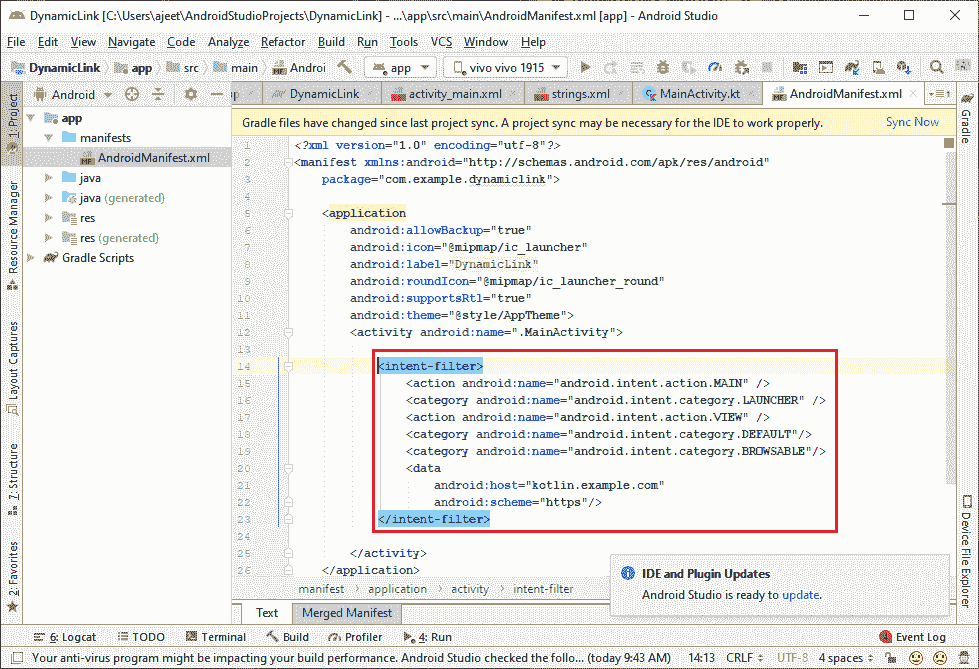
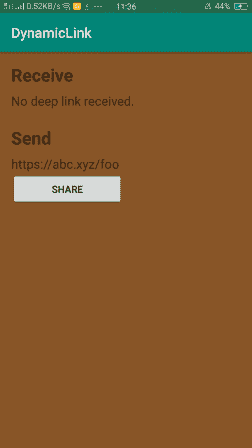
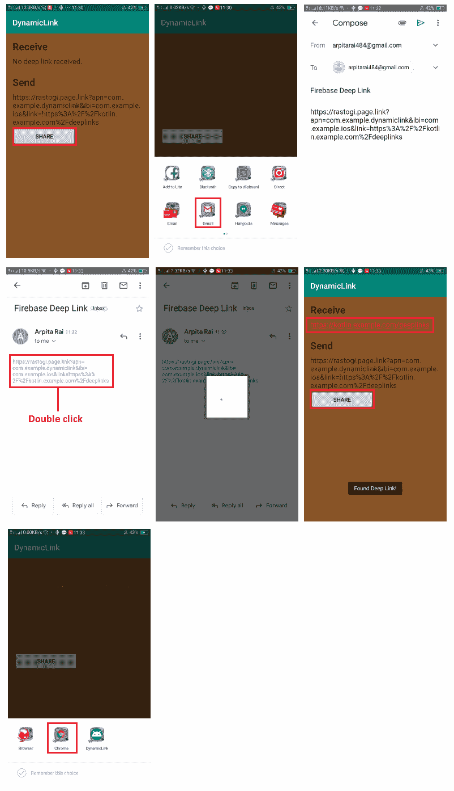

# 在 Firebase 中接收动态链接

> 原文：<https://www.javatpoint.com/receiving-dynamic-links-in-firebase>

在本节中，我们将讨论如何接收**动态链接**。因此，为了接收我们之前创建的 Firebase 动态链接，请在我们的应用程序中包含动态链接软件开发工具包。当我们的应用程序加载以获取动态链接中传递的数据时，我们还需要调用 FirebaseDynamiCluns . GetDynamiClung()方法。我们必须添加一个新的意图过滤器来处理我们的应用程序深层链接的活动。意图过滤器应该捕捉我们的领域的深层链接，因为动态链接将重定向到我们的领域，如果我们的应用程序被安装。这是我们的应用程序在从游戏商店安装/更新动态链接数据并点击继续按钮后接收该数据所必需的。

当用户打开一个动态链接，其中包含我们指定的方案和主机的深层链接时，我们的应用程序将使用这个意图过滤器启动活动来处理该链接。

## AndroidManifest.xml

```

<intent-filter>
            <action android:name="android.intent.action.VIEW" />
            <category android:name="android.intent.category.DEFAULT"/>
            <category android:name="android.intent.category.BROWSABLE"/>
            <data
            		android:host="kotlin.example.com"
                        	android:scheme="https"/>
</intent-filter>

```



## 处理深层链接

为了处理深层链接，我们必须在每个可能由链接启动的活动中调用 getDynamicLink()方法，即使该链接可能可以从使用 getIntent()的意图中获得。getData()。当我们调用 getDynamicLink()时，它会检索链接并清除数据，因此我们的应用程序只接收一次。我们通常可以在主活动中调用 getDynamicLink()，也可以调用与链接匹配的意图过滤器启动的任何活动。

```

FirebaseDynamicLinks.getInstance()
    .getDynamicLink(intent)
    .addOnSuccessListener(this) { pendingDynamicLinkData ->
        // Getting deep link from result (may be null if no link is found)
        var deepLink: Uri? = null
        if (pendingDynamicLinkData != null) {
            deepLink = pendingDynamicLinkData.link
        }

        // Handle the deep link. For example, opening the linked
        // content, or applying promotional credit to the user's
        // account.
        // ...
}
.addOnFailureListener(this) { e -> Log.w(TAG, "getDynamicLink:onFailure", e) }

```

## activity_main.xml



## MainActivity.kt 公司

```

package com.example.dynamiclink

import android.content.Intent
import android.net.Uri
import androidx.appcompat.app.AppCompatActivity
import android.os.Bundle
import android.util.Log
import android.widget.Toast
import com.google.firebase.dynamiclinks.DynamicLink
import com.google.firebase.dynamiclinks.FirebaseDynamicLinks
import kotlinx.android.synthetic.main.activity_main.*

class MainActivity : AppCompatActivity() {

    override fun onCreate(savedInstanceState: Bundle?) {
        super.onCreate(savedInstanceState)
        setContentView(R.layout.activity_main)

        // Creating a deep link and display it in the UI
        val newDeepLink = buildDeepLink(Uri.parse(DEEP_LINK_URL))
        linkViewSend.text = newDeepLink.toString()

        // Share button click listener
        buttonShare.setOnClickListener {  shareDeepLink(newDeepLink.toString())  }

        FirebaseDynamicLinks.getInstance()
            .getDynamicLink(intent)
            .addOnSuccessListener(this) { pendingDynamicLinkData ->
                // Getting deep link from result (may be null if no link is found)
                var deepLink: Uri? = null
                if (pendingDynamicLinkData != null) {
                    deepLink = pendingDynamicLinkData.link
                }

                // Handle the deep link. For example, opening the linked
                // content, or applying promotional credit to the user's
                // account.
                // ...

                // Display deep link in the UI
                if (deepLink != null) {
                    Toast.makeText(getApplicationContext(),"Found Deep Link!", Toast.LENGTH_LONG).show()
                    linkViewReceive.text = deepLink.toString()
                } else {
                    Log.d(TAG, "getDynamicLink: no link found")
                }
            }
            .addOnFailureListener(this) { e -> Log.w(TAG, "getDynamicLink:onFailure", e) }
    }

    fun buildDeepLink(deepLink: Uri): Uri {
        val dynamicLink = FirebaseDynamicLinks.getInstance().createDynamicLink()
            .setLink(Uri.parse(deepLink.toString()))
            .setDomainUriPrefix("https://rastogi.page.link")
            // Open links with this app on Android
            .setAndroidParameters(DynamicLink.AndroidParameters.Builder().build())
            // Open links with com.example.ios on iOS
            .setIosParameters(DynamicLink.IosParameters.Builder("com.example.ios").build())
            .buildDynamicLink()

        val dynamicLinkUri = dynamicLink.uri

        return dynamicLinkUri;
    }

    private fun shareDeepLink(deepLink: String) {
        val intent = Intent(Intent.ACTION_SEND)
        intent.type = "text/plain"
        intent.putExtra(Intent.EXTRA_SUBJECT, "Firebase Deep Link")
        intent.putExtra(Intent.EXTRA_TEXT, deepLink)

        startActivity(intent)
    }

    companion object {

        private const val TAG = "MainActivity"
        private const val DEEP_LINK_URL = "https://kotlin.example.com/deeplinks"
    }
}

```

**输出**



[Click Here to Download Dynamic Link Project](https://static.javatpoint.com/tutorial/firebase/download/DynamicLink.zip)

* * *