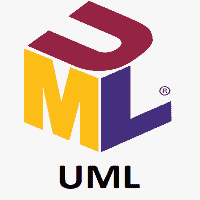

# UML 教程

> 原文：<https://www.javatpoint.com/uml>

UML 是软件工程领域的通用图形建模语言。UML 用于指定、可视化、构建和记录软件系统的工件(主要元素)。它最初是由 Grady Booch、Ivar Jacobson 和 James Rumbaugh 在 1994-95 年在 Rational software 开发的，它的进一步开发一直进行到 1996 年。1997 年，它被目标管理小组采纳为标准。

UML 是软件工程领域的通用图形建模语言。UML 用于指定、可视化、构建和记录软件系统的工件(主要元素)。它最初是由 Grady Booch、Ivar Jacobson 和 James Rumbaugh 在 1994-95 年在 Rational software 开发的，它的进一步开发一直进行到 1996 年。1997 年，它被目标管理小组采纳为标准。

## 什么是 UML

UML 代表 UML，是软件工程领域标准化的通用可视化建模语言。它用于指定、可视化、构建和记录软件系统的主要工件。它有助于设计和表征，尤其是那些包含面向对象概念的软件系统。它描述了软件和硬件系统的工作。

UML 是在 1994-95 年由 Grady Booch、Ivar Jacobson 和 James Rumbaugh 在 Rational Software 开发的。1997 年，它被对象管理小组(OMG)采纳为标准。

对象管理组(OMG)是控制开放标准 UML 的几个公司的联合。OMG 的建立是为了建立一个主要支持面向对象系统互操作性的开放标准。它不受边界限制，但也可以用于非软件系统的建模。OMG 最受认可的是通用对象请求代理架构(CORBA)标准。

## UML 的目标

*   因为它是一种通用的建模语言，所以所有的建模者都可以使用它。
*   由于当时缺乏标准的方法，UML 是在引入面向对象的概念来系统化和巩固面向对象开发之后出现的。
*   UML 图是为业务用户、开发人员、普通人或任何期望理解系统的人制作的，这样系统可以是软件或非软件。
*   由此可以得出结论，UML 是一种简单的建模方法，用于对所有实际系统进行建模。

## UML 的特点

UML 具有以下特性:

*   它是一种通用的建模语言。
*   它不同于其他编程语言，如 C++、Python 等。
*   它与面向对象的分析和设计相关。
*   它用于可视化系统的工作流程。
*   这是一种图形语言，用于生成强大的建模工件。

## 概念制作模型

在继续讨论 UML 的概念之前，我们应该首先了解概念模型的基础。

概念模型由几个相互关联的概念组成。这使得理解对象以及它们如何相互作用变得容易。这是绘制 UML 图之前的第一步。

以下是从 UML 开始需要的一些面向对象的概念:

*   **对象:**对象是现实世界的实体。单个系统中存在许多对象。它是 UML 的一个基本构件。
*   **类:**类是对象的软件蓝图，这意味着它定义了特定类型的所有对象共有的变量和方法。
*   **抽象:**抽象是在隐藏无关信息的同时，向用户刻画对象本质特征的过程。基本上，它被用来想象一个物体的功能。
*   **继承:**继承是从现有类中派生出一个新类的过程。
*   **多态性:**是表示具有多种形式的对象用于不同目的的机制。
*   **封装:**它将数据和对象绑定在一起，成为一个单元，使它们之间能够紧密耦合。

## 面向对象分析与设计

面向对象是对对象的分析，设计意味着组合那些被识别的对象。所以，面向对象分析的主要目的是识别设计系统的对象。也可以对现有系统进行分析。如果我们能识别出物体，分析会更有效率。一旦我们确定了对象，它们的关系就被确定了，设计也就产生了。

面向对象的目的如下:

*   识别系统的对象。
*   来确定他们的关系。
*   当采用面向对象的概念时，进行可执行的设计。

以下是应用和实现面向对象概念的步骤:

**第一步:OO 分析**

面向对象分析的主要目的是识别对象并正确描述它们。在对象被识别之后，设计步骤很容易执行。必须确定有责任的对象。这里的责任指的是对象执行的功能。每个单独的对象都有自己要执行的功能。系统的目的是通过协作这些职责来实现的。

**第二步:OO 设计**

这个阶段主要强调满足需求。在这个阶段，对象按照预期的关联被连接在一起。关联完成后，设计阶段也就完成了。

**第三步:OO 实现**

这是设计完成后的最后一个阶段。它使用 C++、Java 等任何面向对象语言来实现设计。

## UML 在面向对象设计中的作用

因为 UML 是一种建模语言，用于对软件和非软件系统进行建模，但是这里它侧重于对面向对象软件应用进行建模。理解面向对象设计和 UML 之间的关系是非常必要的。当需要的时候，面向对象设计可以转换成 UML。面向对象语言影响着编程世界，因为它们模拟现实世界的对象。

UML 本身是面向对象符号的融合，如面向对象设计(OOD)、对象建模技术(OMT)和面向对象软件工程(OOSE)。UML 利用这三种方法的优势来表示更多的一致性。

## 观众

这个 UML 教程是为初学者和专业人士编写的，帮助他们理解 UML 的基本概念。完成本教程后，你会发现自己处于一个中等水平的专业知识水平，从那里你将自己提升到下一个水平。

## 先决条件

在开始学习本教程之前，不需要特别的技能作为先决条件。学习者必须对获得 UML 知识充满热情。

## 问题

我们向您保证，您在本教程中不会发现任何困难。但是如果有任何疑问，或者你发现任何错误，请在联系表格中发布，让我们知道，以便我们进一步改进。

* * *