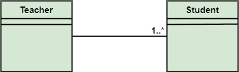
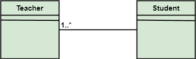
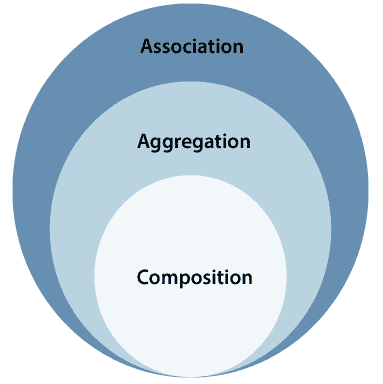
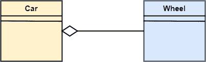
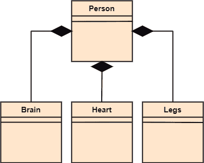

# UML 关联、聚合和组合

> 原文：<https://www.javatpoint.com/uml-association-vs-aggregation-vs-composition>

在 UML 图中，关系被用来链接几个东西。它是结构、行为或分组事物之间的联系。下面列出了标准的 UML 关系:

*   联合
*   属国
*   一般化
*   实现

## 联合

关联关系是一种结构关系，其中不同的对象在系统内链接。它展示了表示活动的对象之间的二元关系。它描绘的是对象之间的关系，比如一个老师，可以关联多个老师。

它由类之间的一条线表示，后跟一个导航方向的箭头，当箭头在两侧时，它被称为双向关联。我们可以通过在表示关联的线上添加装饰来指定关联的多样性。

示例:

1)一个老师有多个学生。

2)一个学生可以和很多老师交往。

组合和聚合是关联的两个子集。在这两种情况下，一个类的对象归另一个类的对象所有；唯一的区别是，在组合中，子代不独立于其父代而存在，而在聚合中，子代不依赖于其父代，即独立存在。聚合是一种特殊的关联形式，组合是聚合的特殊形式。

## 聚合

聚合是关联的子集，是不同事物的集合。它代表有关系。它比关联更具体。它描述了部分-整体或部分的关系。它是二元关联，即只涉及两个类。这是一种孩子独立于父母的关系。

例如:

这里我们考虑一辆汽车和一个车轮的例子。汽车没有轮子是无法行驶的。但是轮子可以独立地与自行车、踏板车、自行车或任何其他车辆一起使用。车轮对象可以在没有车对象的情况下存在，证明是聚合关系。

## 作文

作文是聚合的一部分，刻画的是整体与部分的关系。它描述了复合物(父)和它的部分(子)之间的依赖关系，这意味着如果复合物被丢弃，它的部分也会被删除。它存在于相似的物体之间。

从下面给出的例子中可以看出，构图关联关系将 Person 类与 Brain 类、Heart 类和 Legs 类联系起来。如果这个人被摧毁了，大脑、心脏和腿也会被丢弃。

## 关联、聚合和组合

| 联合 | 聚合 | 作文 |
| 关联关系用箭头表示。 | 聚合关系由一端为空菱形的直线表示。 | 构图关系用一端有黑色菱形的直线表示。 |
| 在 UML 中，它可以存在于两个或多个类之间。 | 它是关联关系的一部分。 | 它是聚合关系的一部分。 |
| 它结合了类之间一对一、一对多、多对一和多对多的关联。 | 它表现出一种弱关系。 | 它展示了一种强烈的关系。 |
| 它可以将一个或多个对象关联在一起。 | 在聚合关系中，关联的对象在系统范围内独立存在。 | 在组合关系中，关联的对象不能在系统范围内独立存在。 |
| 在这种情况下，对象被链接在一起。 | 在这种情况下，链接的对象相互独立。 | 这里链接的对象相互依赖。 |
| 如果删除一个元素，它可能会也可能不会影响另一个关联的元素。 | 删除聚合关系中的一个元素不会影响其他关联的元素。 | 如果它的一个关联元素被删除，它会影响另一个元素。 |
| 例如:一个导师可以和多个学生交往，或者一个学生可以和多个老师交往。 | 汽车需要一个轮子才能正常工作，但可能不需要同一个轮子。它也可以和另一个轮子一起工作。 | 示例:如果文件放在文件夹中，该文件夹将被删除。驻留在该文件夹中的文件也会在文件夹删除时被删除。 |

* * *