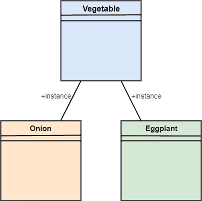
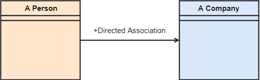

# UML-关联

> 原文：<https://www.javatpoint.com/uml-association>

关联是类之间的语义关系，表明一个实例如何与系统中的其他实例连接或合并。这些对象在逻辑上或物理上是结合在一起的。因为它将一个类的对象连接到另一个类的对象，所以它被归类为结构关系。下面列出了应用于关联关系的约束:

1.  **{implicit}:** 顾名思义，隐式约束定义关系不可见，但它基于一个概念。
2.  **{ordered}:** 它描述了实体集合以特定的方式位于关联的一端。
3.  **{可变}:** 可变约束确保系统内几个对象之间的连接根据需要被添加、改进和分离。
4.  **{addOnly}:** 它指定可以从位于关联另一端的对象添加任何新连接。
5.  **{冻结}:** 冻结约束指定每当在对象之间添加链接时，在通过连接或给定链接激活链接时，该链接不能被更改。

## 自反联想

在自反关联中，链接位于相同类的对象之间。换句话说，可以说反身联想是由两端的同一个类组成的。对象也可以称为实例。

让我们来看看它的一类蔬菜的例子。蔬菜类有两个对象，即洋葱和茄子。根据反身联想的定义，洋葱和茄子之间的联系是存在的，因为它们属于同一类，即蔬菜。

## 定向联想

有向关联关注关联类内部的流向。关联的流程可以通过使用定向关联来显示。两个类之间的有向关联由带有箭头的线表示，箭头指示导航方向。从一个类到另一个类的关联流总是朝着一个方向。

可以说，一个人和公司之间是有关联的。这个人为公司工作。这里的人是为公司工作，而不是公司为一个人工作。

* * *