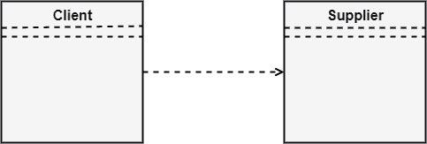

# 依赖关系

> 原文：<https://www.javatpoint.com/uml-dependency>

依赖性描述了系统中的各种事物是如何相互依赖的。在 UML 中，依赖关系是一种客户(一个元素)依赖于供应商(另一个元素)的关系。它被用在类图、组件图、部署图和用例图中，这表明对供应商的变更需要对客户的变更。下面给出了一个例子:

## 依赖关系的类型

以下是下面给出的依赖关系、关键字或原型的类型:

*   **< <派生> > -** 它是一个约束，指定模板可以由源在目标位置利用给定的参数进行初始化。
*   **< <派生> > -** 表示可以从目标对象评估源对象的位置。
*   **< <好友> > -** 陈述源在目标对象中的唯一性。
*   **< <实例> > -** 它声明目标分类器的实例是源对象。
*   **< <实例化> > -** 定义源对象的能力，创建目标对象的实例。
*   **< <细化> > -** 表示源对象比目标对象具有更高的抽象性。
*   **< <使用> > -** 当在 UML 中创建包时，使用原型，因为它描述了源包的元素也可以存在于目标包中。它指定源包使用目标包的一些元素。
*   **< <替代> > -** 替代原型表示在运行时可以用客户替代供应商。
*   **< <访问> > -** 也叫私有合并，源包访问目标包的元素。
*   **< <导入> > -** 它指定目标导入源包的元素，因为它们是在目标中定义的。它也被称为公共合并。
*   **< <许可> > -** 描述源元素可以访问供应商元素或供应商提供的任何可见性。
*   **< <扩展> > -** 表示源元素的行为可以被目标扩展。
*   **< <包含> > -** 它描述的是源元素，可以包含另一个元素在特定位置的行为，就像 C/C++中的函数调用一样。
*   **< <变为> > -** 表示目标与源相似，角色和价值观鲜明。
*   **< <调用> > -** 指定源可以调用目标对象。
*   **< <副本> > -** 声明目标是源对象的独立副本。
*   **< <参数> > -** 描述供应商是客户行为的参数。
*   **< <发送> > -** 客户端充当操作，向供应商发送一些未指定的目标。

* * *