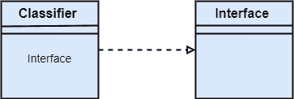
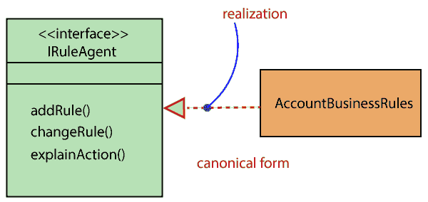
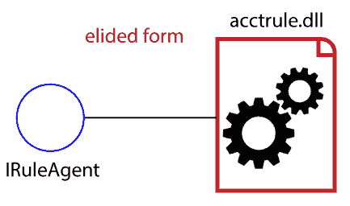

# UML-实现

> 原文：<https://www.javatpoint.com/uml-realization>

在 UML 建模中，实现是两个对象之间的关系，其中客户(一个模型元素)实现供应商(另一个模型元素)指定的责任。实现关系可以用在类图和组件图中。

实现关系没有名称。它主要存在于界面中。它由一端带有空心箭头的虚线表示，箭头从客户端指向服务器。

## 界面实现

接口实现是分类器和接口之间的一种特殊关系。在接口实现关系中，实现分类器符合接口定义的契约。

实现接口的分类器识别符合接口及其任何祖先的对象。分类器可以执行一个或多个接口。由分类器实现的接口集是它的**给定接口。**给定的接口是分类器向其客户提供的一组服务。

接口实现关系不包含名称，如果您给它命名，那么该名称将出现在图中连接器的旁边。

接口实现关系由带有空心箭头的虚线表示，箭头从分类器指向给定的接口。

## 实现类型:

**1。规范形式:**在 UML 中，规范形式实现了整个系统的接口。接口原型用于创建接口，实现关系用于实现(实现)特定的接口。在这种情况下，实现关系由带有空心箭头的虚线表示，接口使用对象实现。

从下图可以看出，对象**账户业务规则**实现了接口 **Iruleagent。**

**2。省略形式:**就是那种用圆圈表示界面的实现关系，也叫棒棒糖记法。当使用系统中存在的任何东西来实现接口时，就会创建一个省略的结构。

这里，接口 Iruleagent 用省略的形式表示，这是由 acctrule.dll 实现的。

* * *