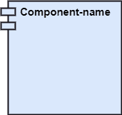
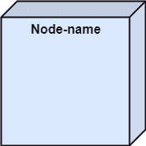
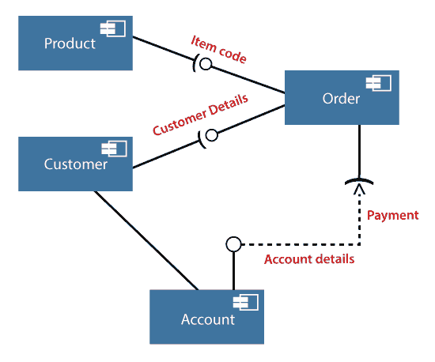

# UML 组件图

> 原文：<https://www.javatpoint.com/uml-component-diagram>

组件图用于将大型面向对象系统分解成较小的组件，从而使它们更易于管理。它对系统的物理视图进行建模，如可执行文件、文件、库等。驻留在节点中的。

它可视化了系统中存在的组件之间的关系和组织。它有助于形成一个可执行的系统。组件是系统的单个单元，可以替换和执行。组件的实现细节是隐藏的，它需要一个接口来执行一个功能。它就像一个黑盒，其行为由提供的和需要的接口来解释。

## 组件图的符号

一个组件

一个节点

## 组件图的用途

因为它是一种特殊的 UML 图，所以它有不同的用途。它描述了用于实现功能的所有独立组件，但不是系统的功能。它可视化了系统内部的物理组件。组件可以是库、包、文件等。

组件图还描述了系统的静态视图，包括特定时刻组件的组织。组件图的集合代表整个系统。

组件图的主要用途如下:

1.  它设想了系统的每个组件。
2.  它通过结合正向和反向工程来构建可执行文件。
3.  它描述了组件的关系和组织。

## 为什么使用组件图？

组件图非常重要。它用于描述系统中存在的所有组件的功能和行为，不像其他用于表示系统架构、系统工作或系统本身的图表。

在 UML 中，组件图描绘了组件在任何时刻的行为和组织。系统不能被任何单独的组件可视化，但是它可以被组件的集合可视化。

以下是需要组件图的一些原因:

1.  它描绘了运行时系统的组件。
2.  这对测试系统很有帮助。
3.  它设想了几个连接之间的联系。

## 何时使用组件图？

它代表运行时系统的各种物理组件。它有助于可视化系统的结构和组织。它描述了单个组件如何一起形成单个系统。以下是一些说明何时使用组件图的原因:

1.  根据功能将单个系统分成多个组件。
2.  表示系统的组件组织。

## 如何绘制组件图？

组件图有助于表示系统的物理方面，如文件、可执行文件、库等。组件图的主要目的不同于其他图。它用于任何应用程序的实施阶段。

一旦使用不同的 UML 图设计了系统，并且准备好了工件，就可以使用组件图来获得实现的想法。它在高效实现应用程序方面发挥着至关重要的作用。

以下是在绘制组件图之前需要识别的一些工件:

1.  系统内部使用了哪些文件？
2.  相关库和工件的应用是什么？
3.  器物之间有什么关系？

以下是识别工件后需要记住的几点:

1.  使用有意义的名称来确定将要为其绘制图表的组件。
2.  在生产所需的工具之前，要做一个心理布局。
3.  为了阐明要点，可以加入注释。

## 组件图示例

在线购物系统的组件图如下所示:

## 在哪里使用组件图？

组件图是一种特殊用途的图，用于可视化系统的静态实现视图。它代表系统的物理组件，或者我们可以说它描绘了系统内部组件的组织。组件，如库、文件、可执行文件等。首先需要在实现之前进行组织。

组件图可用于以下目的:

1.  为系统的组件建模。
2.  为数据库的模式建模。
3.  为应用程序的应用程序建模。
4.  模拟系统的源代码。

* * *