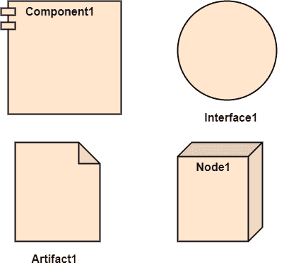

# UML部署图

> 原文：<https://www.javatpoint.com/uml-deployment-diagram>

部署图可视化了将在其上部署软件的物理硬件。它描绘了系统的静态部署视图。它涉及节点及其关系。

它确定软件是如何部署在硬件上的。它将设计中创建的软件架构映射到物理系统架构，在物理系统架构中，软件将作为节点执行。因为它涉及许多节点，所以通过利用通信路径来显示关系。

## 部署图的目的

部署图的主要目的是表示软件是如何安装在硬件组件上的。它描述了软件与硬件交互执行的方式。

部署图和组件图彼此紧密相关，因为它们关注软件和硬件组件。组件图表示系统的组件，而部署图描述它们实际上是如何部署在硬件上的。

部署图并不关注系统的逻辑组件，而是将注意力放在硬件拓扑上。

下面列出了部署图的用途:

1.  想象系统的硬件拓扑。
2.  表示安装了软件组件的硬件组件。
3.  描述运行时节点的处理。

## 部署图的符号和符号

部署图由以下符号组成:

1.  组件
2.  一件艺术品
3.  界面
4.  节点

## 如何绘制部署图？

部署图描绘了系统的部署视图。它有助于可视化系统的拓扑视图。它包含节点，节点是物理硬件。节点用于执行工件。工件的实例可以部署在节点的实例上。

由于它在管理过程中起着至关重要的作用，因此它涉及以下参数:

1.  高性能
2.  可量测性
3.  可维护性
4.  轻便
5.  容易理解

部署图的基本元素之一是节点和工件。因此有必要识别所有的节点以及它们之间的关系。如果已经知道了所有的节点、工件及其关系，那么开发一个部署图就变得更容易了。

## 部署图示例

苹果 iTunes 应用程序的部署图如下所示。

iTunes 设置可以从 iTunes 网站下载，也可以安装在家用电脑上。安装和注册完成后，iTunes 应用程序可以轻松地与苹果 iTunes 商店互联。用户可以购买和下载音乐、视频、电视剧等。并将其缓存在媒体库中。

像苹果 iPod Touch、苹果 iPhone 这样的设备，可以借助 USB 从电脑用 iTunes 更新自己的媒体库，也可以简单的从苹果 iTunes 商店直接下载媒体，比如使用无线协议；Wi-Fi、3G 或 EDGE。

## 何时使用部署图？

部署图主要由网络工程师、系统管理员等使用。目的是表示软件在硬件系统上的部署。它设想软件与硬件的交互来完成执行。所选硬件必须具有良好的质量，这样软件才能以更快的速度更有效地工作，并立即产生准确的结果。

现在的软件应用相当复杂，因为它们是独立的、分布式的、基于网络的等等。因此，设计高效的软件是非常必要的。

部署图可用于以下情况:

1.  对系统的网络和硬件拓扑进行建模。
2.  为分布式网络和系统建模。
3.  实施正向和反向工程流程。
4.  为客户机/服务器系统建模硬件细节。
5.  为嵌入式系统建模。

* * *