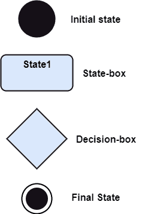
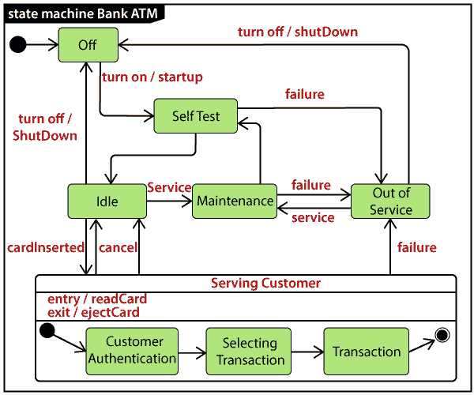

# UML 状态机图

> 原文：<https://www.javatpoint.com/uml-state-machine-diagram>

状态机图也称为状态图或状态转换图，它显示了系统中对象经历的状态顺序。它捕捉软件系统的行为。它对一个类、一个子系统、一个包和一个完整系统的行为进行建模。

它往往是一种有效的方式来建模外部实体和系统中的交互和协作。它为基于事件的系统建模，以处理对象的状态。它还定义了系统中组件的几种不同状态。每个对象/组件都有特定的状态。

下面给出了状态机图的类型:

1.  **行为状态机**
    行为状态机图记录了系统内某个对象的行为。它描述了一个特定实体的实现。它模拟系统的行为。
2.  **协议状态机**
    它捕获协议的行为。协议状态机描述了协议状态的变化和系统内的并行变化。但是它没有描述特定组件的实现。

## 为什么是状态机图？

因为它记录了系统的动态视图，所以它描述了软件应用的行为。在生命周期中，一个对象经历了几种状态，这样生命周期一直存在到程序执行。每个状态描述了一些关于对象的有用信息。

它设计了一个交互系统，对内部事件或外部事件做出响应。从一种状态到另一种状态的执行流程由状态机图表示。它可视化了对象从创建到终止的状态。

主要目的是描述单个对象的每个状态。它代表一个交互系统和系统内部的实体。它记录了系统的动态行为。

## 状态机图的符号

下面是下面列出的状态机图的符号:

1.  **初始状态:**定义系统的初始状态(开始)，用黑色实心圆表示。
2.  **最终状态:**代表系统的最终状态(结束)。它由圆圈内的实心圆圈表示。
3.  **决策框:**菱形表示根据评估的后卫做出的决策。
4.  **转变:**由于某一事件的发生，控制从一种状态转变为另一种状态，这被称为转变。它由一个标有事件的箭头表示，由于该事件，变更已经发生。
5.  **状态框:**描绘某一类特定对象在特定时间点的条件或情况。带有圆角的矩形用于表示状态框。

## 国家类型

UML 由三个状态组成:

1.  **简单状态:**不构成任何子结构。
2.  **复合状态:**它由嵌套状态(子状态)组成，因此它不包含一个以上的初始状态和一个最终状态。它可以嵌套到任何级别。
3.  **子机状态:**子机状态与复合状态语义相同，但可以重用。

## 如何绘制状态机图？

状态机图用于描述对象经历的各种状态。从一种状态到另一种状态的变化是由于某种事件的发生。在绘制状态机图之前，必须识别特定组件的所有可能状态。

状态机图的主要焦点是描述系统的状态。绘制状态转换图时，这些状态是必不可少的。在实现状态机图之前，必须确认导致状态转换发生的对象、状态和事件。

下面是绘制状态机图时要包含的步骤:

1.  应该为描述系统行为的状态转换指定一个唯一且可理解的名称。
2.  在多个对象中，只有基本对象被实现。
3.  应该给事件和过渡起一个恰当的名字。

## 何时使用状态机图？

状态机图实现了现实世界的模型以及面向对象的系统。它记录系统的动态行为，用于区分系统的动态和静态行为。

它描绘了一个物体从开始到结束所经历的变化。它基本上设想了触发一个事件会如何引起系统内的变化。

状态机图用于:

1.  用于对系统的对象状态进行建模。
2.  用于将反应系统建模为由反应对象组成。
3.  用于确定导致状态转换的事件。
4.  用于实施正向和反向工程。

## 状态机图示例

下面给出了一个显示银行自动柜员机的顶级状态机图的示例。

最初，自动取款机是关闭的。电源接通后，ATM 开始执行启动动作，进入**自检**状态。如果测试失败，自动柜员机将进入**退出** **服务**状态，或者将经历**无触发转换**到**空闲**状态。这是客户等待交互的状态。

每当客户将银行或信用卡插入自动柜员机的读卡器时，自动柜员机状态从**空闲**变为**服务客户**，进入**服务客户**状态后执行进入动作**读卡**。由于客户可以随时取消交易，因此**取消**事件可以触发从**服务客户**状态回到**空闲**状态的转换。

这里的**服务客户**是一个复合状态，有连续的子状态，分别是**客户认证、选择交易、**和**交易**。

**客户认证**和**交易**是复合状态，其本身由隐藏的分解指示图标显示。交易完成后，**服务客户**包括无触发转换回到**空闲**状态。离开该状态时，它经历退出动作**弹出卡**排出客户卡。

## 状态机与流程图

| 状态机 | 流程图 |
| 它描绘了一个系统的几种状态。 | 它演示了程序的执行流程。 |
| 它包含了 WAIT 的概念，即等待一个事件或一个动作。 | 它不构成 WAIT 的概念。 |
| 它适用于真实世界的建模系统。 | 它设想了系统的分支序列。 |
| 这是一个建模图。 | 这是一个数据流程图(DFD) |
| 它与系统的几个状态有关。 | 它侧重于控制流和路径。 |

* * *