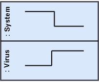
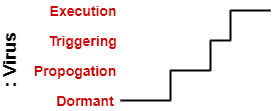
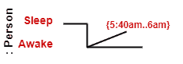
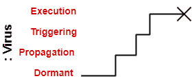
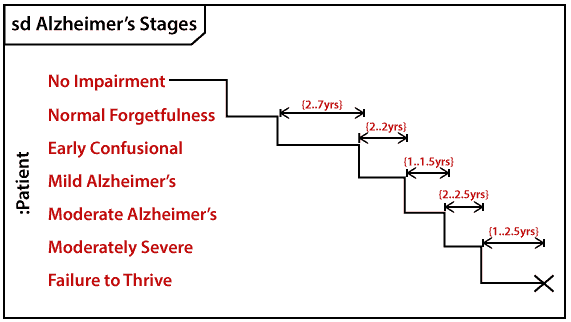

# UML 时序图

> 原文：<https://www.javatpoint.com/uml-timing-diagram>

在 UML 中，时序图是交互图的一部分，它不包含类似于顺序图和协作图的符号。它由描述特定时间点生命线状态的图表或波形组成。它说明了沿着线性时间轴的生命线内部和之间的条件是如何变化的。

时序图描述了一个对象如何经历从一种形式到另一种形式的变化。一个波形描绘了软件程序在不同时间的流动。

下面是时序图的一些重要要点:

1.  它强调的是消息在对象之间发送的特定时间。
2.  它详细解释了对象的时间处理。
3.  它用于分布式和嵌入式系统。
4.  它也解释了一个物体如何在它的生命线中经历形式的变化。
5.  由于生命线位于边缘的左侧，因此时序图是从左向右读取的。
6.  它描绘了单位时间内生命线状态的图形表示。
7.  在 UML 中，时序图提供了几种符号来简化单位时间内两条生命线之间的转换状态。

## 时序图的基本概念

在 [UML](https://www.javatpoint.com/uml) 中，时序图由几个主要元素组成，如下所示:

**生命线**

顾名思义，生命线描绘了交互中的单个元素。它代表单个实体，是交互的一部分。它由它所描述的分类器的名称来表示。生命线可以放在“泳道”或图表框架内。

***代表系统和病毒实例的生命线***

**状态或条件时间线**

时序图表示参与的分类器或属性的状态，或者一些可测试的条件，这是分类器的离散值。

在 UML 中，状态或条件是连续的。它主要用于显示实体经受连续状态变化的温度和密度。

***显示病毒在休眠、传播、触发、执行之间状态变化的时间线***

**持续时间约束**

持续时间约束是指持续时间间隔的约束。它用于确定在一段时间内是否满足约束。持续时间约束语义继承自约束。

负跟踪定义了违反的约束，这意味着系统失败。持续时间间隔和它所约束的结构之间的图形关联可以表示持续时间约束。

***冰应该在 1 到 6 分钟内融化到水中。*T3】**

**时间限制**

它是一个间隔约束，指的是时间间隔。因为它是一个时间表达式，所以它描述了是否满足约束。约束免除了它的时间约束语义。

负跟踪定义了违反的约束，这意味着系统失败。时间约束由时间间隔和它所约束的构造之间的图形关联来表示。

图形关联主要由时间间隔和事件规范之间的一条细线表示。

***一个人应该在早上 5:40 到早上 6 点之间醒来***

**破坏事件**

销毁事件是指由生命线定义的表示实例销毁的消息的发生。它可能随后破坏由该对象的组成所拥有的其他对象，使得在给定生命线上的破坏事件之后不发生任何事情。它由时间线末端的十字表示。

***病毒生命线被终止***

## 时序图示例

描述阿尔茨海默病(AD)不同阶段的医学[域](https://www.javatpoint.com/what-is-domain)的时序图示例解释如下。

由于阿尔茨海默氏症是一种非常严重的致命性脑部疾病，它会导致记忆力和智力的丧失。这种疾病背后的原因还有待发现。它无法治愈，也是美国死亡率上升的主要原因之一。

医生可能需要一个三至七阶段的诊断框架，这样它的演变可能会持续大约 8 至 10 年。此外，在某些情况下，从神经元开始变化起，它可以持续长达 20 年。

下面给出的例子构成了七阶段框架的时间安排。给出的例子只是一个 [UML 图](https://www.javatpoint.com/uml-diagrams)，不应该被认为是医学研究的参考。提供医疗细节是为了让您更好地理解 UML 图。

以下是阿尔茨海默病的七个阶段框架，解释如下:

*   **无损伤，正常状态**
    这是记忆和认知能力看起来正常的阶段。
*   **正常老年遗忘**
    多见于 65 岁年龄组的人，他们经历认知和/或功能障碍的主观抱怨，这意味着他们在回忆名字和过去 5 到 10 年的历史时面临问题。
*   **早期易混淆，轻度认知障碍**
    它在检索单词、计划、组织、物体错位以及忘记新鲜学习等方面造成问题，进而影响周围环境。
*   **晚期精神错乱，轻度老年痴呆症**
    在这种情况下，一个人会忘记最近的事件和谈话。这个人记得自己和家人，但在执行烹饪、驾驶等连续任务时会面临问题。它的持续时间大约是两年，
*   **早期痴呆，中度阿尔茨海默病**
    在这种情况下，人不能独立管理。他很难回忆起过去的细节和联系方式。大约持续 1.5 年。
*   **中度痴呆，中度重度阿尔茨海默病**
    导致对时事认知不足，人无法回忆过去。它导致人们无法独立洗澡和穿衣。大约持续 2.5 年。
*   **晚期或重度痴呆，不能茁壮成长**
    智力严重受限。在这种情况下，一个人要么通过简短的话语交流，要么通过哭泣交流，这导致健康下降，因为它关闭了身体系统。其期限为 1 至 2.5 年。

## 时序图的优势

1.  它描述了对象在特定时间点的状态。
2.  它实现正向和反向工程。
3.  它密切关注系统内发生的每一个变化。

## 时序图的缺点

1.  很难维护和理解。

* * *