# 统一建模语言工具

> 原文：<https://www.javatpoint.com/uml-tools>

由于 UML 是一种统一建模语言，它被用来为软件应用程序创建有意义的、面向对象的模型。它清楚地代表了任何硬件/软件系统的工作。有许多商业和开源工具可用于设计 UML 图，列举如下:

## 1\. 星光

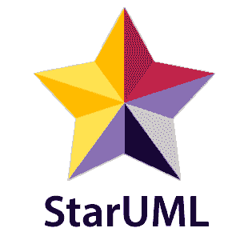

StarUML 是一个开源软件建模工具，由 MKLab 提供。它已经提出了 11 种不同类型的建模图。它还支持 UML2.0 指定的图表。

### 特点:

*   它允许您创建对象、用例、部署、序列、协作、活动和概要图。
*   它是符合 UML 2.x 标准的。
*   它提供多平台支持(MacOS、Windows 和 Linux)。

**下载链接:**

## 2\. 雨伞

翁布里罗是一个基于 KDE 技术的统一建模语言工具。它支持 [C++](https://www.javatpoint.com/cpp-tutorial) 和 [Java](https://www.javatpoint.com/java-tutorial) 的逆向工程和代码生成。

### 特点:

*   它实现了结构图和行为图。
*   它导入 C++并且可以导出更多的语言。

**下载链接:**[https://umbrello.kde.org](https://umbrello.kde.org/)

## 3.UML 设计工具

UML 设计工具有助于修改和设想 UML2.5 模型。它允许你创建所有的 UML 图。

### 特点:

*   它为 DSL 和 UML 模型的工作提供了透明度。
*   使用 UML 设计工具，用户可以重用提供的演示。
*   它实现了组件、类和复合结构图。
*   要开始使用 DSL，您可以使用 UML 遗留模型。

**下载链接:**[http://www.umldesigner.org/download/](http://www.umldesigner.org/download/)

## 4\. 阿尔托瓦

Altova 提供了 UModel，这是另一个 UML 软件建模工具。它支持所有类型的 14 个 UML2 图以及用于嵌入式系统的 SysML。它还支持企业分析师的业务流程建模。它通过结合 Java、C++和 c#或 Visual Basic [来生成可视化设计的软件模型。NET](https://www.javatpoint.com/net-framework) 。

### 特点:

*   它为单个图表提供了专用工具栏。
*   它提供了无限的撤销/重做，这激发了人们去发现新的想法。
*   在 UML 图中，您可以轻松地向任何元素添加超链接。
*   它还提供了直观的颜色编码、图标、自定义对齐网格以及颜色、字体和线条大小的级联样式。

**下载链接:**[https://www.altova.com/umodel](https://www.altova.com/umodel)

## 5\. 填写

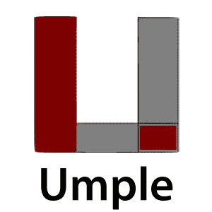

Umple 是一种面向对象的建模语言，在文本上支持状态图和类图。它采用了 JAVA、C++、 [PHP](https://www.javatpoint.com/php-tutorial) ，使得代码可读性更强，代码更短。

### 特点:

*   它包括 Singleton 模式、键、不变性、混合和面向方面的代码注入，这使得 UML 更容易被用户理解。
*   它通过支持 UML 多重性来加强引用完整性。

**下载链接:**[https://cruise . EEC . uota wa . ca/umple/](https://cruise.eecs.uottawa.ca/umple/)

## 6.视觉范式

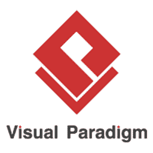

可视化范例是一种支持对象管理组的 SysML、UML2 和业务流程建模符号的工具。它包括报告生成和代码生成。

### 特点:

*   它支持所有 14 个 UML2 图。
*   它支持 BPMN 2.0，ERD，ORMD，SysML。

**下载链接:**[https://www.visual-paradigm.com](https://www.visual-paradigm.com)

## 7.WhitestarUML

Whitestar UML 是 StarUML 5.0 的一个分支，它提供了 bug 修复，并提高了与最新操作系统的兼容性，即支持 Unicode 字符串或只是在 Windows 7 和 8 上开发和测试。

### 特点:

*   它提供了一个刷新的用户界面。
*   它完全处理 Unicode 字符串的功能。
*   它在 Windows 7、8 和 10 上提供支持。
*   按需上传和下载单元。
*   它直接集成了 ERD 概要文件，并扩展到生成和解析 SQL 表。

**下载链接:**[http://whitestaruml.sourceforge.net](http://whitestaruml.sourceforge.net)

## 8.画画。超正析象管(Image Orthicon)

Draw.io 是一个开源建模工具，用于创建流程图、流程图、 [UML](https://www.javatpoint.com/uml) 、ER 和网络图。

### 特点:

*   由于它非常容易使用，它提供了直观的界面，拖放功能，大量的模板，而且，它不需要安装。
*   它提供了安全性和可靠性。
*   它可以在任何地方使用，无论是在线还是离线。
*   它兼容所有浏览器。

**下载链接:**

## 9.GenMyModel

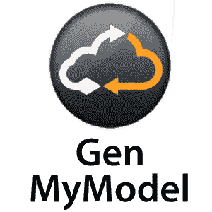

GenMyModel 是一个在线建模平台，提供业务(Archimate，BPMN，流程图支持)以及 IT 建模(RDS，UML2.5 类图)。

### 特点:

*   它提供了一个在线平台。
*   它生成在线代码。
*   它为简单和同步的模型协作提供了一个集中的存储库。
*   您可以以 PDF 格式导入或导出。

**下载链接:**[https://www.genmymodel.com](https://www.genmymodel.com)

## 10.拉美裔美国居民

它是一个在线平台，提供了 UML 工具来更快地开发 UML 图。它基于 UMLet，这是一个 eclipse 插件，或者作为一个独立的工具工作。

### 特点:

*   它允许您将图表导出为 XML 或任何其他图像文件，如 Gif、JPEG 或 SVG 格式。
*   这是一个免费安装的网络应用程序。

**下载链接:**[http://www . Recht . com/reception/reception . html](http://www.umlet.com/umletino/umletino.html)

## 11.流程图

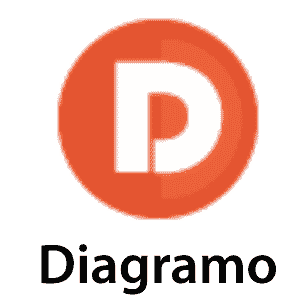

Diagramo 是一个在线开源 HTML5 软件，可以让你构建流程图。它允许在服务器上轻松下载和安装。

### 特点:

*   它将图表保存为图像。
*   这是一种 UML 图，因为它提供了一个以流程图为中心的软件。
*   它提供终身支持和存储。

**下载链接:**[http://diagramo.com](http://diagramo.com)

## 第 12 届 阿斯塔

Astah，以前被称为 JUDE (Java 和 UML 开发者环境)，是一个 UML 建模工具。

### 特点:

*   它导入 XML 文件并导出 HTML、RTF 和图像文件。
*   它直观地与 Windows、Mac 和 Linux 操作系统一起工作。

**下载链接:**[http://astah.net](http://astah.net)

## 13.BOUML

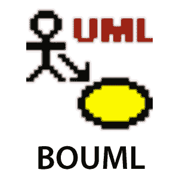

BOUML 是一个用 Qt 和 C++编程的 UML 图设计器。它允许你用 C++、Java、Idl、Php、 [Python](https://www.javatpoint.com/python-tutorial) 和 [MySQL](https://www.javatpoint.com/mysql-tutorial) 指定和生成代码。

### 特点:

*   它支持代码生成、逆向工程，并且是多语言的。
*   它运行在 Windows、Linux 和 MacOS X 上。
*   因为它非常快，所以不需要太多内存来处理成千上万个类。

**下载链接:**

## 14.ConceptDraw

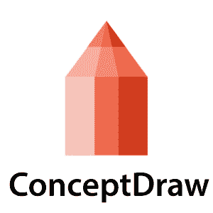

ConceptDraw 是一个软件，用于创建业务图形，包括图表、流程图、信息图、数据设想、数据表示和项目管理文档。

### 特点:

*   它用于创建 UML 图、DFD、ERD、计算机网络拓扑等。
*   它通过增强技术表示技术来改善交互。
*   它提供了一个强大和包容的绘图工具。

**下载链接:**[https://www.conceptdraw.com/products/drawing-tool](https://www.conceptdraw.com/products/drawing-tool)

## 15.国防情报局

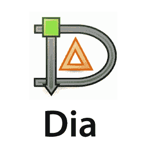

Dia 是一个开源的通用绘图工具，在 GPL 下获得许可。它可以让你创建流程图、UML 图、网络图、电路图等等。它允许您在编写一个简单的 [XML](https://www.javatpoint.com/xml-tutorial) 文件来绘制新形状的同时，合并可缩放矢量图形(SVG)的子集。

### 特点:

*   Dia 可以将图表导出为多种格式，包括 EPS(封装 PostScript)、SVG(可缩放矢量图形)、DXF (AutoCAD 的绘图交换格式)、CGM(由 ISO 标准定义的计算机图形元文件)、WMF (Windows Meta 文件)、PNG(可移植网络图形)、JPEG(联合图像专家组)和 VDX (Microsoft 的用于 Visio 绘图的 XML)。
*   它允许您创建许多不同类型的图表，因为它包含了特殊的对象，可以帮助您绘制 ER 图表、UML 图表、网络图表、流程图等。

**下载链接:**[http://dia-installer . de](http://dia-installer.de)

## 16.Sparxsystems

Sparxsystems 是一个图表设计工具，有助于可视化、分析、建模、测试和维护软件、系统、流程和架构。它构建了一个健壮且可维护的软件。

### 特点:

*   它以可视化的形式集成和连接了广泛的结构和行为信息，以创建一个逻辑合理的模型。
*   它构建战略和业务层面的模型。
*   它提供特定于领域的概要文件和可重用的模型模式。
*   它还提供基于角色的安全性。

**下载链接:**[https://sparxsystems.com](https://sparxsystems.com)

## 17.格菲

Gliffy 是一个开源软件，设计 UML 图、平面图、文氏图、流程图等等。它允许用户动态地共享和编辑格利菲图。

### 特点:

*   它构成了一个拖放界面。
*   它以各种格式导出图表；PDF、JPEG、PNG 和 SVG。
*   所有的网络浏览器都支持它，比如谷歌 Chrome、火狐、Safari 和 Internet Explorer 9+。

**下载链接:**[https://www.gliffy.com](https://www.gliffy.com)

## 18.Lucidchart

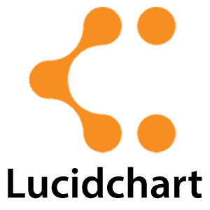

Lucidchart 是一个基于 HTML-5 的 UML 工具，允许用户在绘制、编辑和共享图表时进行交互。使用 Lucidchart，您可以创建简单的流程图以及复杂的技术图表。

### 特点:

*   使用键盘快捷键可以更快地工作。
*   它构成了集装箱化的概念，因为复杂的图表涉及几个步骤和人员。
*   它通过提高安全性来管理用户帐户。
*   它与平台无关。

**下载链接:**[https://www.lucidchart.com/pages/](https://www.lucidchart.com/pages/)

## 19.魔术画

Magic Draw 用于建模支持团队动态协作的 UML 图、SysML、BPMN 和 UPDM。该工具面向业务分析师、软件分析师、程序员和质量保证工程师。它有助于分析和设计面向对象的系统和数据库。

### 特点:

*   它为编程语言(J2EE、C#、C++、COBRA IDL)提供往返支持。NET、XML 模式、DDL 生成和数据库模式。
*   它包含了逆向工程的概念。
*   这是一种特定领域的语言。
*   它构成了模型分解，将主要项目分成几个不同的独立部分。
*   它包括模型重构以改进现有模型。

**下载链接:**[https://www.nomagic.com/products/magicdraw](https://www.nomagic.com/products/magicdraw)

## 20.矢量图绘制软件

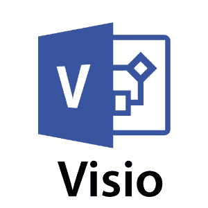

Visio 是微软系列的一部分，它是一个图表软件。它有助于绘制建筑平面图、平面图、数据流图、流程图、业务流程建模、泳道图等等。

### 特点:

*   它将图表和流程图与实时数据联系起来。
*   因为它是独立于平台的，所以可以从任何地方访问。

**下载链接:**[https://products.office.com/en-in/visio/flowchart-software](https://products.office.com/en-in/visio/flowchart-software)

## 21.Modelio

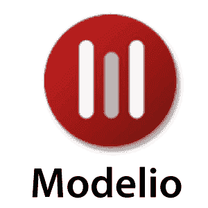

Modelio 是一个开源的 UML 工具，它融合了 UML2 和 BPMN 标准来支持一系列的模型和图表。

### 特点:

*   它为 Jython 提供支持，Jython 是一种脚本语言。
*   它用统一建模语言提供了 BPMN 集成支持。
*   它提供 XMI 进出口。

**下载链接:**[https://www.modelio.org](https://www.modelio.org)

## 22\. N 类

Nclass 是一个开源工具，用于创建支持 c#和 Java 的类图。它需要一个框架。NET 4.0。它设计了一个简单和用户友好的用户界面，以实现快速和轻松的开发。

### 特点:

*   它提供了一个简单易用的用户界面。
*   它提供了多语言用户界面。
*   它为非 windows 用户提供单声道支持。
*   它提供了内联类编辑器，可以快速轻松地进行编辑。
*   它结合了源代码生成和逆向工程。Net 程序集。

**下载链接:**[http://nclass.sourceforge.net](http://nclass.sourceforge.net)

## 23.打开模型球体

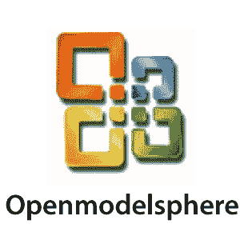

用 Java 编写的 Open ModelSphere 是一个开源的数据、过程和 UML 建模工具。它支持正向和反向工程。

### 特点:

*   它支持用英语和法语编写的用户界面。
*   它提供了一个内置接口，通过 JDBC/ODBC 驱动程序连接到 SQL 数据库。
*   它已经提出了一个双向插件数据库接口。
*   它支持物理、逻辑和数据库建模。

**下载链接:**[http://www.modelsphere.com/org/](http://www.modelsphere.com/org/)

## 24.系统设计狂想曲

系统设计狂想曲提供了一个基于 UML 的协同设计和建模环境，用于创建实时的嵌入式系统。它有助于管理复杂的问题，如产品系统开发。

### 特点:

*   对于系统和软件工程师来说，它已经提出了一个基于 UML、SysML 和 AUTOSAR 的协同设计、开发和测试环境。
*   它有助于分析和阐述项目需求。
*   它在实时、嵌入式、敏捷的工程环境中表现出色。
*   它在自动化设计评审后生成文档。

**下载链接:**[https://www . IBM . com/in-en/market/systems-design-rhapsody](https://www.ibm.com/in-en/marketplace/systems-design-rhapsody)

## 25.反应块

一个可视化的模型驱动环境是基于由反应块支持的活动图。因为它是一个 UML 工具，所以它结合了代码生成、分层建模和 Java 平台的大量现成组件库。

### 特点:

*   它通过合并可重用的块来帮助创建复杂的图形应用程序。
*   它为 Java、开放服务网关计划、Eclipse Kura 和 ESF 提供支持。

**下载链接:**[http://www.bitreactive.com/reactive-blocks/](http://www.bitreactive.com/reactive-blocks/)

## 26.软件想法建模器

软件思想建模器是用 C#编写的案例和设计工具，支持由 UML2.5、SysML、ERD、architect、流程图、DFD、线框、用户故事等指定的所有 14 个图表。

### 特点:

*   它可用于创建用于数据可视化的信息图表。
*   它包括自动滚动、拖放、撤销/重做功能。
*   它提供简单的任务管理。
*   它支持逆向工程。
*   它也支持 SVN。

**下载链接:**[https://www.softwareideas.net](https://www.softwareideas.net)

* * *