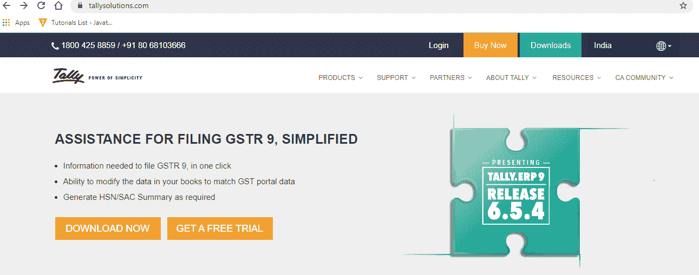
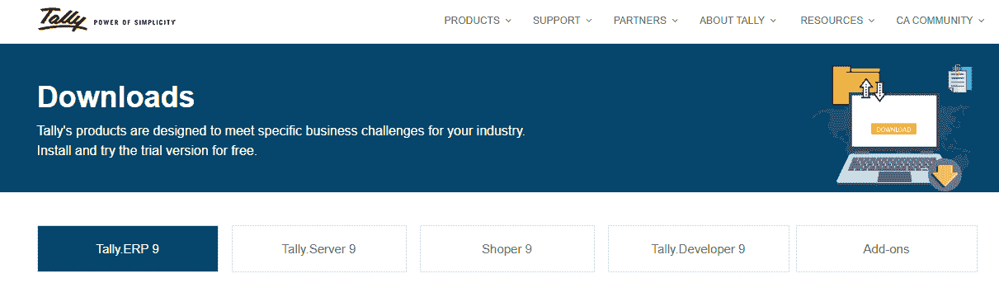

# 如何下载 Tally ERP 9 软件

> 原文：<https://www.javatpoint.com/how-to-download-tally-erp-9-software>

在这一部分，我们将下载最新版本的带有商品及服务税的 Tally ERP 9。Tally ERP 9 软件的下载和安装是一种快速简便的方法。在这里，我们有简单的步骤来下载 Tally 软件，并将其安装在苹果电脑或视窗操作系统的计算机系统上进行练习。

Tally 解决方案提供各种产品供实践和商业下载，但需要许可证。在试用版中，我们可以免费试用 Tally。它提供如下各种产品:

1.  泰利。企业资源管理
2.  泰利。开发者
3.  商品及服务税增加
4.  购物商
5.  泰利。计算机网络服务器

以下是下载 Tally 的步骤:

1.使用 Tally 解决方案官网，我们可以下载 Tally ERP 9 软件。下载链接如下:[https://tallysolutions.com](https://tallysolutions.com)

2.现在从菜单中选择选项下载。

3.选择选项“Tally”。ERP 9。

4.现在选择立即安装或下载以备后用选项来下载最新版本的 Tally。ERP 9。

5.如果我们选择立即安装选项，它使我们能够通过在线安装 Tally。

6.如果我们选择“稍后下载”选项，它使我们能够将 Tally 软件下载到您的系统中。然后我们将使用自定义设置安装它。

* * *