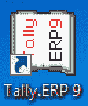
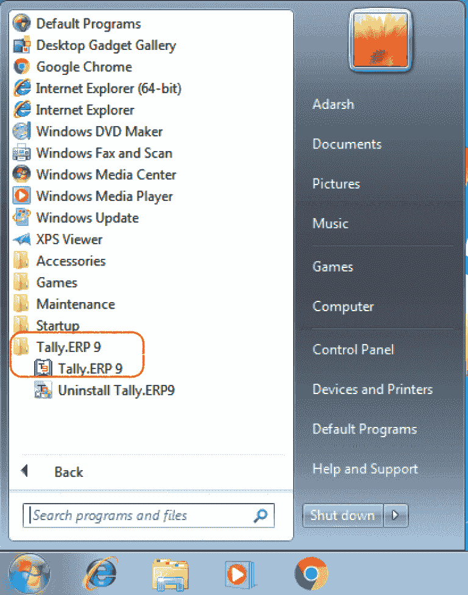
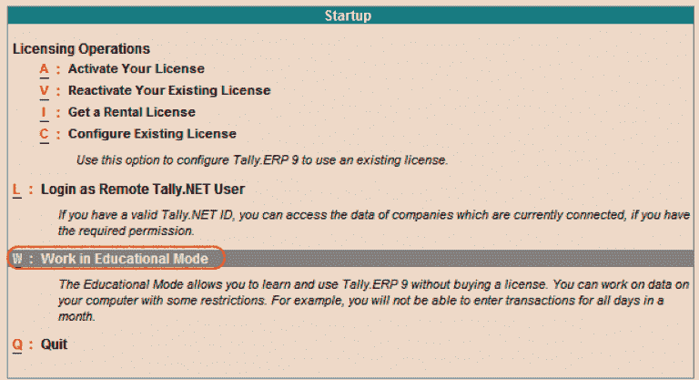
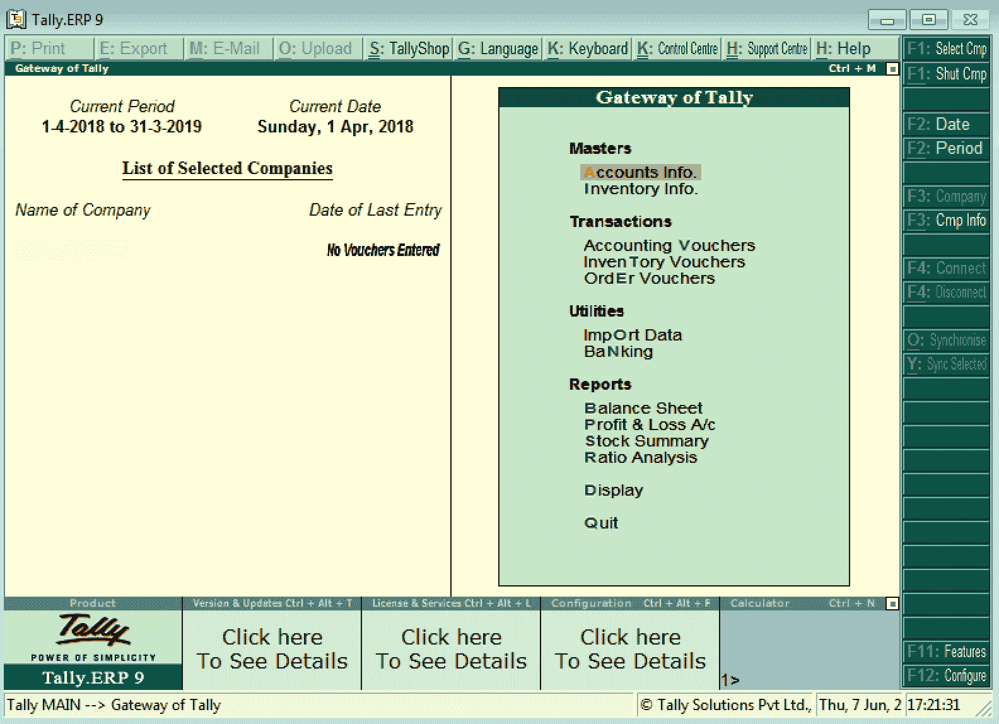

# 如何开始 Tally

> 原文：<https://www.javatpoint.com/how-to-start-tally>

当我们在 Windows 或 Mac OS 上成功安装了 Tally 后，我们可以通过以下方法之一启动 Tally ERP 9。

现在，从电脑上双击 Tally ERP 9 图标，如下所示:

或者我们可以遵循以下路径:**启动>程序>Tally。ERP 9**

以下选项将出现在启动屏幕上:

1.  **许可操作:**要激活我们的许可证，我们将从我们的关键字中按 A。
2.  **以远程 Tally.Net 用户身份登录:**如果我们输入当前连接的公司的有效 Tally.Net 用户 id 和密码，我们可以以远程身份登录。
3.  **教育模式下的工作:**出于实践目的，我们使用教育模式下的工作。这种方法用于在不购买带有某些限制的许可证的情况下使用 tally。
4.  **相当:**要关闭 Tally，点击“相当”选项。

在这里，我们将使用 Tally ERP 9 软件进行教育实践。因此，我们将选择教育模式下的工作选项如下:

#### 注意:如果我们想将 Tally 用于商业目的，我们必须购买许可证，并使用购买的许可证密钥激活它。

当我们登录 Tally 时，系统上会显示 Tally ERP 9 的欢迎屏幕。

将 Tally 软件加载到我们的系统后，Tally 网关在屏幕上显示如下:

从上面的屏幕，我们被允许使用 Tally ERP 9 软件。

## 如何关闭 Tally ERP 9 软件

使用 Tally ERP 9 后，我们可以退出 Tally ERP 9 屏幕。但是我们必须在关闭 Tally ERP 9 之前关闭所有屏幕。

要退出 Tally 软件，我们可以使用以下方法之一:

1.  我们应该从我们的关键字按下 **ESC** 键，直到我们看到确认信息退出:是/否。要退出 Tally ERP 9，从我们的关键字按下 Y。
2.  要在没有确认信息的情况下退出 Tally ERP 9，我们应该从 Tally 网关按下 **Ctrl+Q** 按钮。
3.  或者，我们可以点击右上角菜单中的**退出**选项。

* * *