# Tally 企业资源规划 9 配置

> 原文：<https://www.javatpoint.com/tally-erp-9-configuration>

Tally ERP 9 配置适用于位于 Tally 数据目录中的所有公司。F12:配置可能因菜单而异。

例如:如果我们在凭证屏幕上按 F12:配置，则相应的屏幕会显示在屏幕上。

## 如何在 Tally 中打开配置

Tally 网关→点击 **F12:配置**或按功能键 **F12**

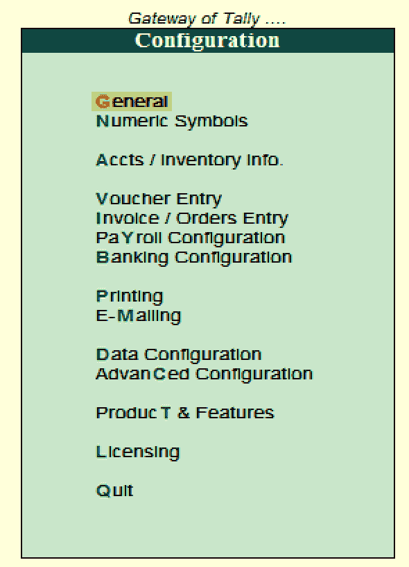

配置屏幕用于包含多个设置，这些设置有助于配置凭证输入、打印、银行业务、主创建等所需的信息。配置屏幕上有以下设置:

*   一般
*   凭证条目
*   印刷
*   电子邮件
*   库存信息/帐户
*   数字符号
*   订单输入/发票
*   产品测试和特性
*   数据配置
*   批准
*   高级配置
*   银行配置
*   薪资配置

**常规:**在常规配置中，我们可以配置国家的详细信息、姓名样式、日期格式、数字格式、表格配置、导入/导出配置等选项。

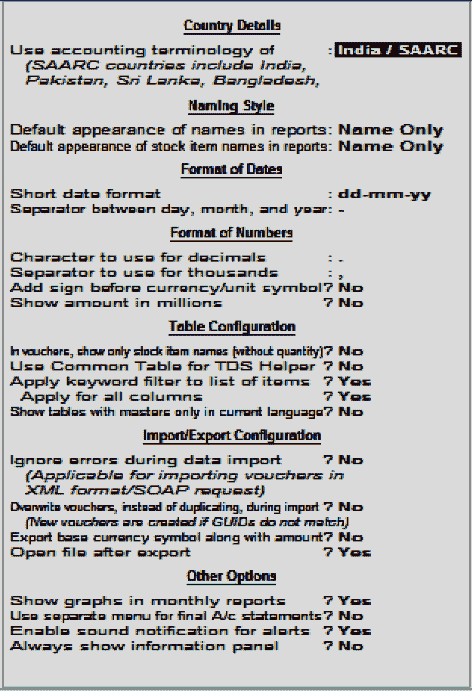

**数字符号:**数字符号中包含以下配置:

*   用于正数的符号
*   用于负数的符号
*   用于借记帐户的符号
*   用于信用帐户的符号

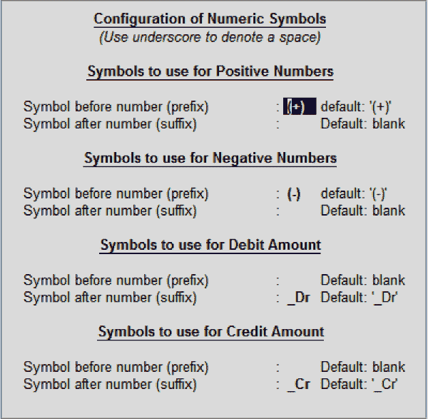

**库存信息/ Accts:** 账户和库存信息中包含以下配置:

*   主数据
*   帐目
*   库存

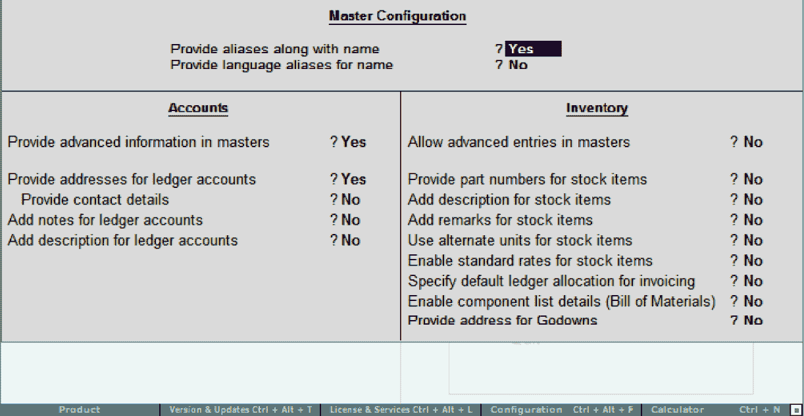

**凭证录入:**凭证录入包含以下配置明细:

*   帐目
*   库存
*   法定的

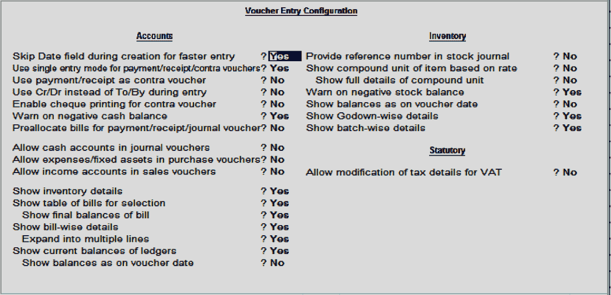

**订单录入/发票:**订单录入/发票中包含以下配置:

*   帐目
*   库存
*   法定的

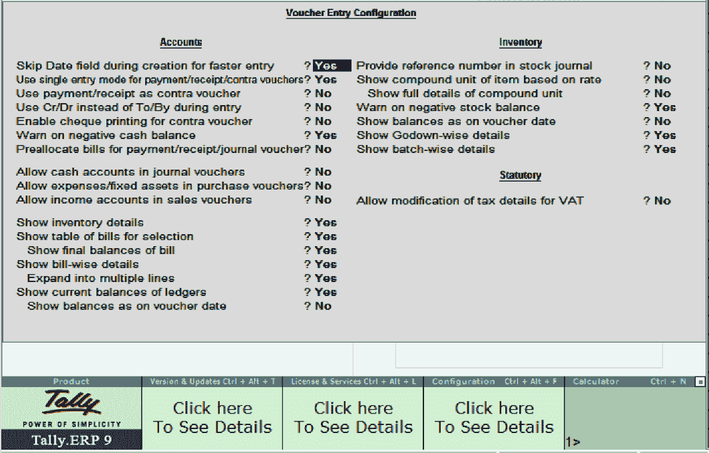

**薪资配置:**薪资配置中包含以下详细信息:

*   为员工添加注释
*   显示法定细节
*   提供护照和签证细节
*   提供合同细节
*   显示辞职/退休员工
*   显示员工显示名称

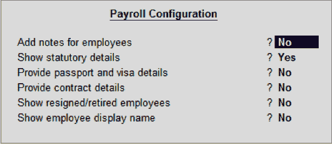

**银行配置:**银行配置包含以下详细信息:

*   在截止日期之前的 BRS 中显示所有未对账的交易
*   更改对账凭证时删除银行日期
*   新银行对账单的位置
*   付款指示的位置
*   导出/上传前显示详细信息
*   允许上传交易时重置
*   新中间文件的位置
*   导入的中间文件的位置

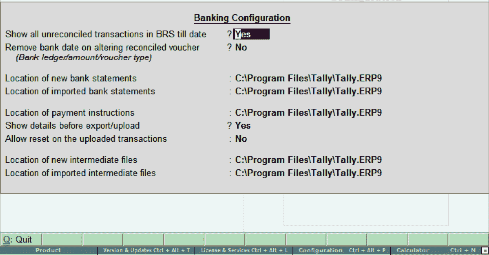

**打印:**打印配置用于配置打印屏幕

*   购买交易记录
*   付款凭证
*   销售交易记录
*   收款单据
*   日记帐/对销
*   借方/贷方票据
*   提醒信
*   确认声明
*   付款通知配置
*   工资单
*   高级配置

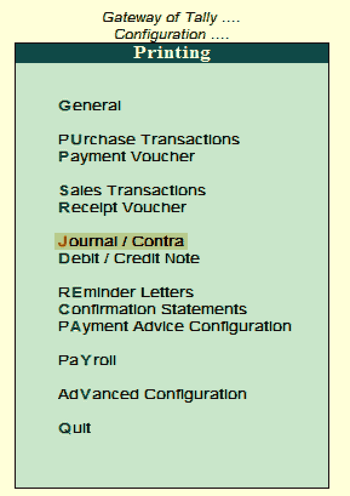

**电子邮件:**此配置用于设置公司的电子邮件服务器。

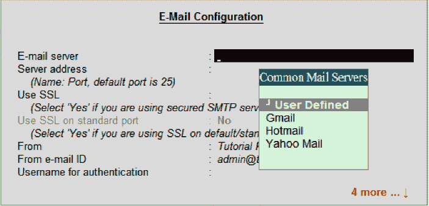

**数据配置:**数据配置用于定义以下内容:

*   数据文件的位置
*   导出文件的位置
*   启动时加载公司
*   选择要在启动时预加载的公司
*   语言文件的位置
*   配置文件的位置

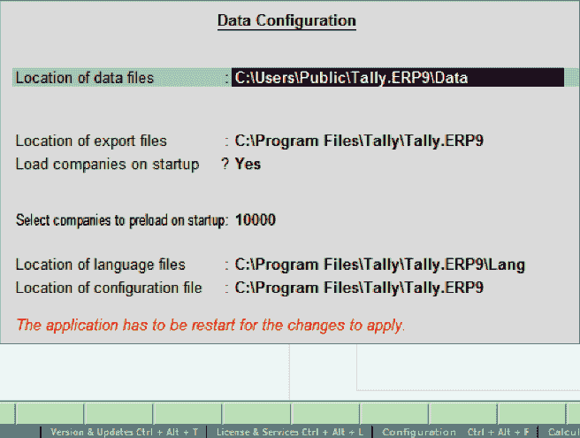

**高级配置:**该配置用于定义客户端或服务器配置，如:

*   企业资源规划 9 充当
*   启用 OBDC 服务器
*   通道数
*   连接配置
*   日志配置
*   服务器 9 配置
*   Net 服务器代理配置
*   网关代理配置

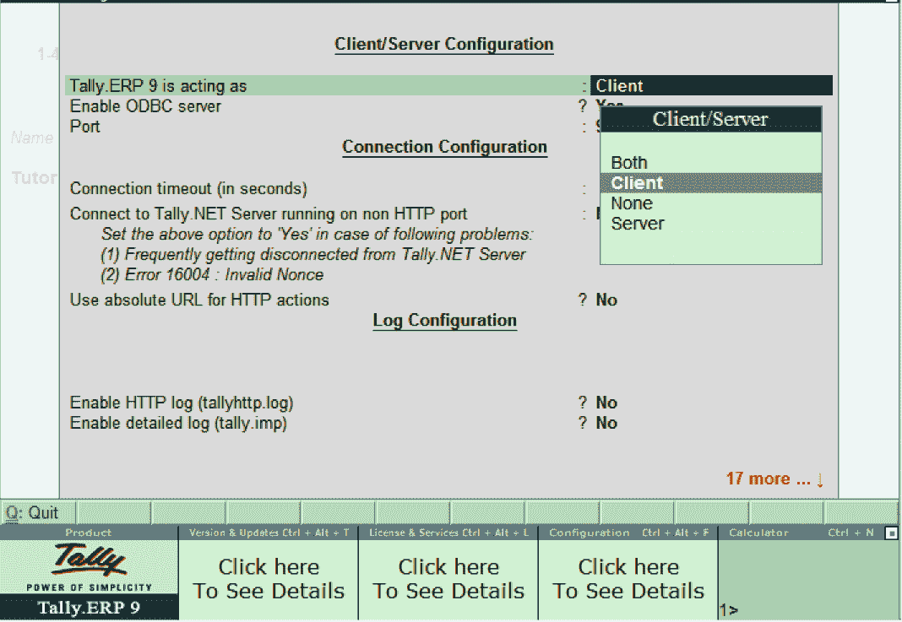

**许可:**许可配置用于更新 Tally 许可证:

*   激活许可证
*   重新激活许可证
*   配置现有许可证
*   获得租赁许可证

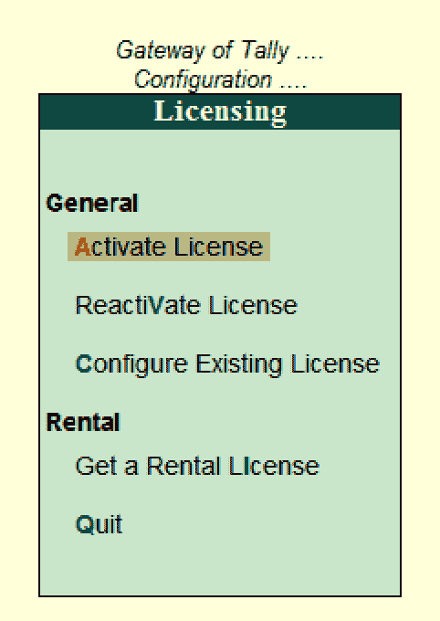

配置完所有需要的细节后，我们将重新启动 Tally ERP 9 应用，以反映基于更新配置的设置。

* * *