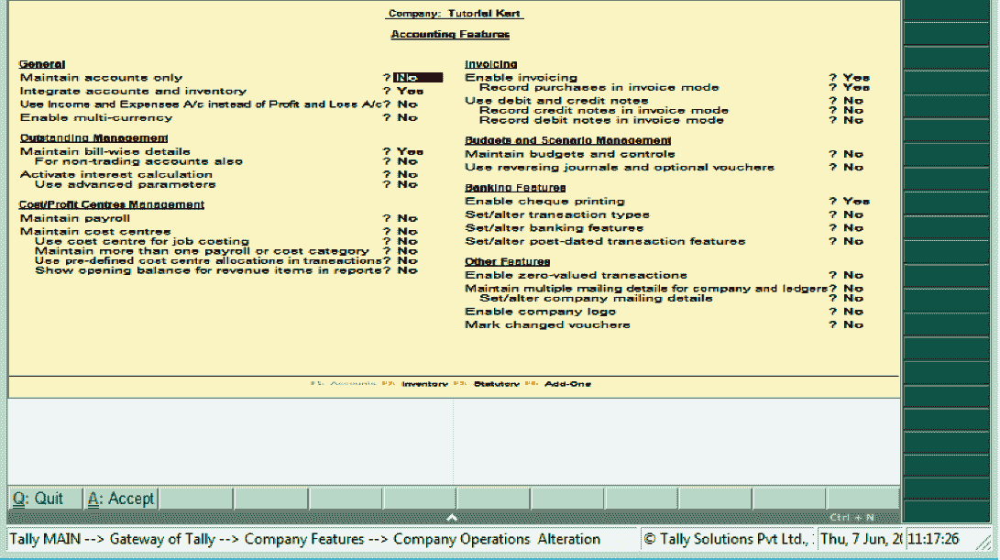

# Tally企业资源规划 9 的会计特征

> 原文：<https://www.javatpoint.com/accounting-features-in-tally-erp-9>

在Tally ERP 9 中，会计特征是公司特征的重要类别之一。它由用于会计交易和报告的几个配置和功能组成。点击选项 F11:功能或按功能键 F11 可打开会计功能。

会计特征分为以下 6 个部分:

1.  一般
2.  杰出的管理
3.  成本/利润中心管理
4.  货品计价
5.  预算/场景管理
6.  其他功能

## 如何打开会计功能

在 Tally ERP 9 中，我们可以使用以下方法之一来打开会计功能:

*   路径:Tally主>Tally网关> F11:功能>会计功能
*   功能键:F1:账户(从你的关键词按下功能键 F1)

执行记账功能后，将显示以下屏幕:

在公司运营变更屏幕上更新以下详细信息:

**通用**

*   **只维护账户:**如果我们要维护存货交易，那么选择这个选项。
*   **整合账户和库存:**如果我们想从库存记录中包含库存或库存余额，那么选择是选项。
*   **用收支账户代替利润&亏损账户:**如果我们想把收支账户显示为菜单而不是利润&亏损账户，那么我们会选择这个选项。
*   **启用多币种:**如果我们想使用多币种，那么选择这个选项。

**优秀管理**

*   维护账单明细:
*   激活利息计算:

**成本/利润中心管理**

*   维护工资单:
*   维护成本中心:
*   作业成本计算的用户成本中心:
*   使用多个成本类别:
*   在事务处理中使用预定义的成本中心分配:
*   在报表中显示收入项目的期初余额:

**开票**

*   启用开票:
*   以发票模式记录采购
*   使用贷方和借方票据
*   在发票模式下记录借方票据
*   在发票模式下记录贷方票据

**预算和场景管理**

*   保持预算和控制
*   使用可选凭证和冲销日记帐

**银行**

*   设置/更改交易类型
*   设置/更改银行类型
*   启用支票打印
*   设置/更改过帐日期交易功能。

**其他功能**

*   启用公司徽标
*   已启用零值事务
*   维护分类帐和公司的多个邮件详细信息
*   标记已更改的凭证

在Tally ERP 9 中，启用公司所需的所有会计功能后，按 ctrl+A 或回车保存配置的数据。

* * *