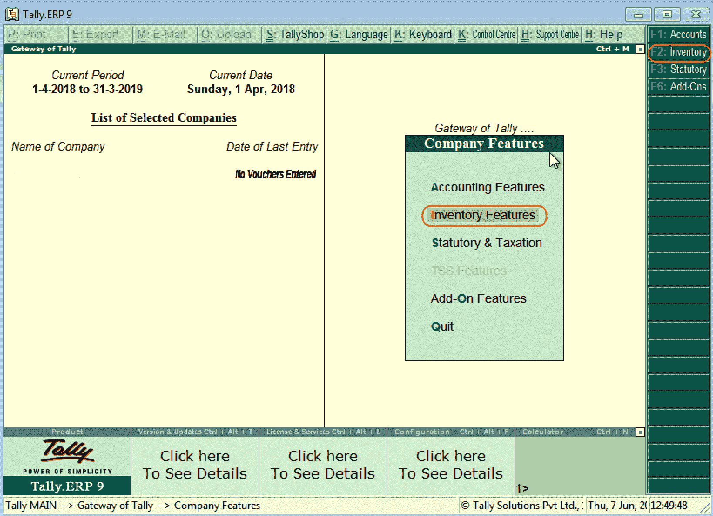
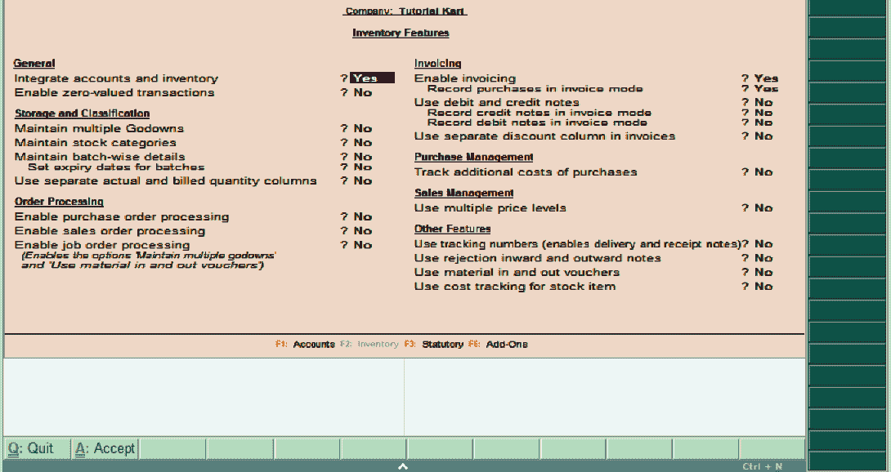

# 理货 ERP 9 中的库存特性

> 原文：<https://www.javatpoint.com/inventory-features-in-tally-erp-9>

在理货 ERP 9 中，库存功能包括与库存交易和报告相关的配置。

库存特性细分为 7 个功能，如下所示:

1.  一般
2.  存储和分类
3.  订单处理
4.  货品计价
5.  采购管理
6.  销售管理
7.  其他功能

## 如何启动库存功能

*   路径:理货主->理货网关-> F11:功能->公司功能->库存功能或点击 F2:库存。

## 如何启用库存功能

我们可以使用库存功能启用或禁用日常业务交易的选项。执行清单功能后，将显示以下屏幕:

在公司变更屏幕上更新以下详细信息:

**通用**

*   **整合账户和存货:**如果我们想在存货记录中包含存货或存货余额，那么选择这个选项为是。
*   **启用零价值交易:**如果我们想允许零价值交易，那么选择这个选项为是。

**储存和分类**

*   **维护多个货仓:**如果我们有多个存储位置和货仓来存储物料，则启用该选项。
*   **维护股票类别:**如果我们要定义或维护股票类别，那么启用该选项。
*   **维护批次明细:**如果要维护库存项目的批次明细，则启用该选项。
*   **设置批次的到期日:**如果我们想维护批次的到期日，那么选择这个选项。
*   使用单独的实际数量和开单数量列。

**订单处理**

*   **启用销售订单处理:**如果我们要定义销售订单，那么启用该选项。
*   **启用工单处理:**如果我们要定义工单，则启用该选项。
*   **启用采购订单处理:**如果要定义工单，则启用该选项。

**开票**

*   启用开票:
*   以发票模式记录采购
*   在发票中使用单独的折扣列
*   使用贷方或借方票据:
*   在发票模式下记录借方票据
*   在发票模式下记录贷方票据

**采购管理**

*   跟踪额外的采购成本

**销售管理**

*   使用多个价格水平

**其他功能**

*   使用材料进出凭证
*   使用向内和向外拒绝的注释
*   使用跟踪号码
*   对库存项目使用成本跟踪

启用或禁用功能后，按 **ctrl+A** 或选择 **A:接受**保存详情。

* * *