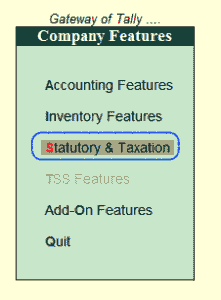
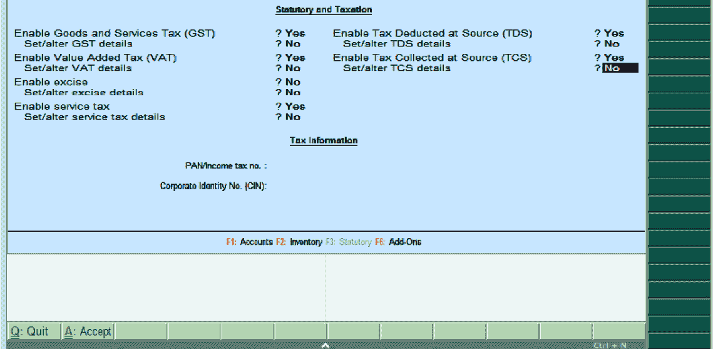

# Tally企业资源规划 9 中的法定税务

> 原文：<https://www.javatpoint.com/statutory-and-taxation-in-tally-erp-9>

在Tally中，法定和税收的特征包括与公司法定合规性相关的配置和功能。成文法的特点与具体国家有关，并取决于国家。

以下功能适用于法定和税收:

1.  商品及服务税
2.  切除
3.  增值税
4.  从源头扣除的税款
5.  源头征税

在印度，Tally支持各种税收，包括商品及服务税。

## 如何启用法定和税务功能

在Tally中，我们可以通过启用和禁用公司变更屏幕中的选项来使用法定和税务功能。

我们将采用以下路径并开放法定和税收:

**Tally之门- > F11:特色- >公司特色- >法定税收**

在公司运营变更屏幕上更新以下详细信息:

**启用商品及服务税(GST):** 如果我们想对公司使用 GST 税，请启用 GST 选项

设置/更改商品及服务税详细信息:如果我们想要更改商品及服务税详细信息，请启用此选项。

**启用增值税(Vat):** 现在印度正在征收商品及服务税，因此禁用此选项，因为商品及服务税由公司征收。

设置/更改增值税详细信息:如果我们要选择否，请选择此选项。

**启用消费税:**如果我们想要使用消费税，请启用此选项

设置/更改消费税详细信息:如果我们想要更改消费税详细信息，请启用此选项

**启用服务税:**如果我们要按公司使用服务税，请启用此选项

设置/更改服务税详细信息:如果我们想要更改服务税详细信息，请启用此选项

**在来源处启用扣税:**如果我们要使用 TDS，请启用此选项

设置/更改 TDA 详细信息

**启用来源征税:**如果我们要使用 TCS，请启用此选项

设置/更改 TCS 详细信息

**税务信息:**

**收入/PAN 税号:**在此字段更新公司永久所得税号或账号。

**公司识别号:**更新本栏位公司的 CIN 号。

在Tally ERP 9 中，更新法定和税务所需的所有详细信息后，选择 A:接受保存详细信息。

* * *