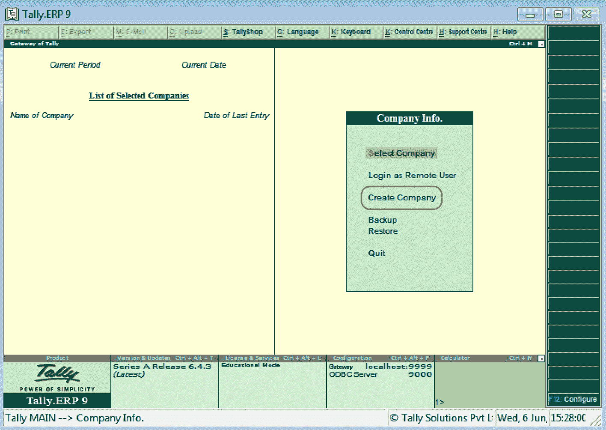
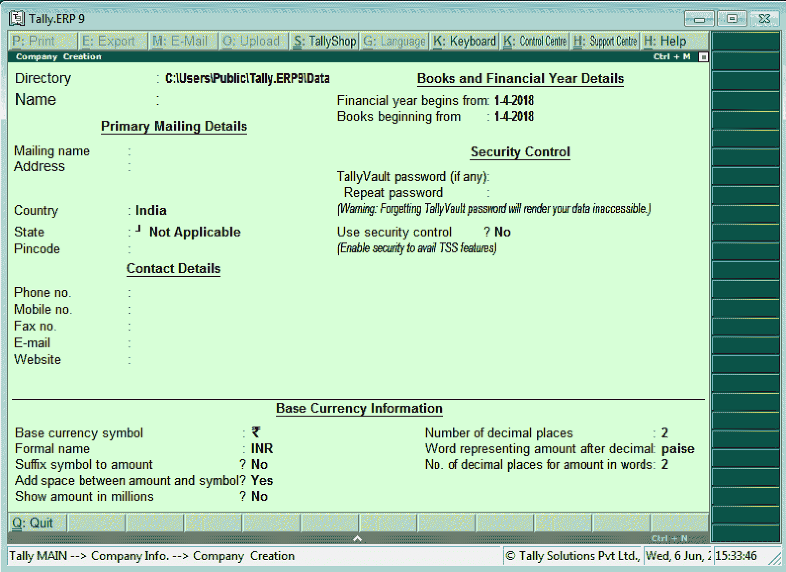

# 在Tally中创建公司

> 原文：<https://www.javatpoint.com/create-company-in-tally>

在本节中，我们将学习如何使用简单的分步方法创建公司。开始的第一步是创建一家公司。在Tally中，公司的创建涉及公司的基本信息、账簿和货币的详细信息。

## 如何在Tally创建公司

**第一步:**在Tally中，登录后双击公司信息下的创建公司选项。以下导航路径用于在 Tally 中创建公司:

**Tally门户** → **公司信息** → **创建公司**

**步骤 2:** 以下屏幕显示公司创建窗口:

#### 注意:使用箭头键、Tab 键、鼠标或回车键在Tally中的字段之间导航。

**第三步:**输入“公司邮寄名称”。这是一个重要的字段，因为它显示了所有的打印输出。

**第四步:**输入“公司完整地址”。这显示在所有打印输出上。因此它是一个重要的领域。

**第五步:**从给定的国家列表中选择“国名”为印度。

**步骤 6:** 从给定的状态列表中选择“状态”。

**第七步:**更新“公司 Pin 码”，所在位置。

**第八步:**更新公司的“电话号码”/座机。

**第九步:**更新公司的“电子邮件 id”和“网站”。

**第十步:**更新公司的财政年度开始日期。在印度，公司的财政年度从 4 月 1 日开始，到 3 月 31 日结束。

**第 11 步:**更新Tally中允许记账的起始日期。一般来说，这个日期和财政年度的开始日期是相同的。但是，如果公司是在一年中的任何其他日期成立的，那么将会提到那个日期。

**例如:**如果账簿已经设置为从 2019 年 12 月 1 日开始，Tally将不允许 2019 年 4 月 1 日至 2019 年 11 月 30 日的分录。

**步骤 12:** 如果我们想使用 TallyVault，请输入密码。这是一项加密数据的安全功能。

#### 注意:我们必须非常小心地使用这个特性。如果我们忘记了密码，可能无法恢复数据。我们可能会永久丢失数据。

**第 13 步:**重复 TallyVault 的密码。Tally ERP 将此密码与之前输入的密码进行匹配，以确保我们之前键入的密码是预期的密码，这意味着没有键入错误。

这里的横条表示密码强度。强密码用绿色条表示。强密码更好。

* * *