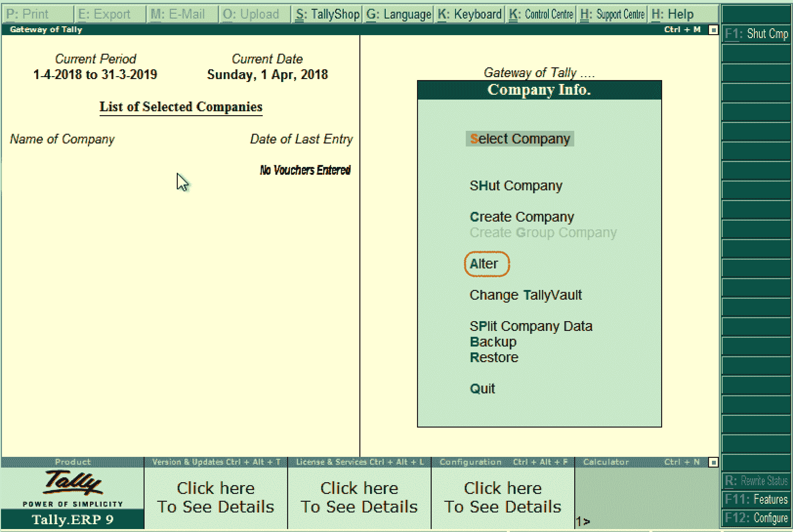
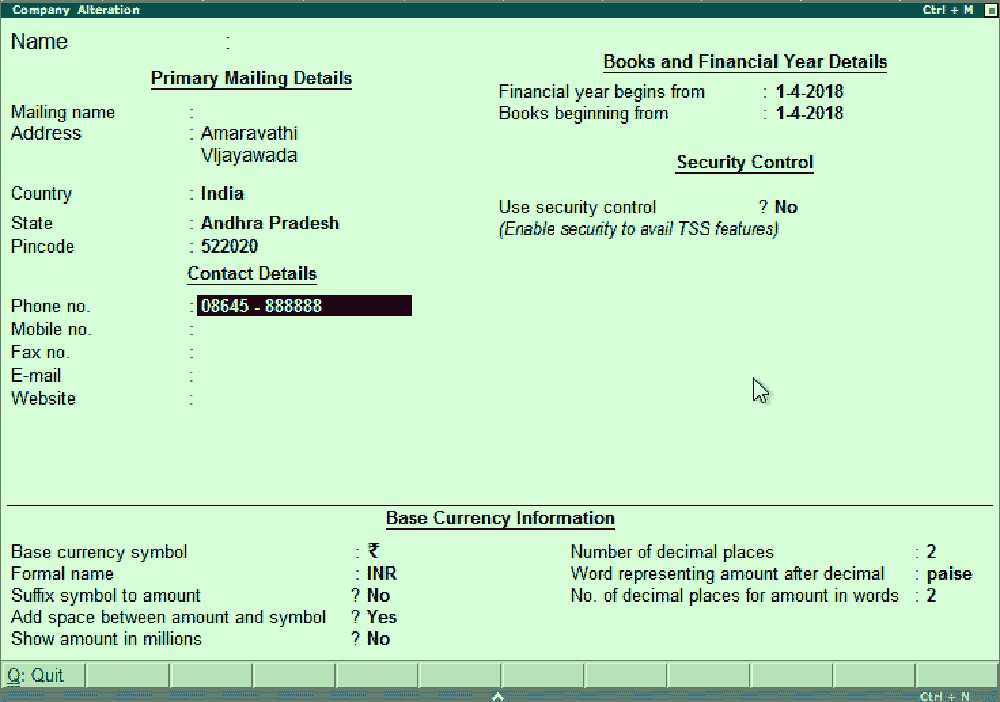
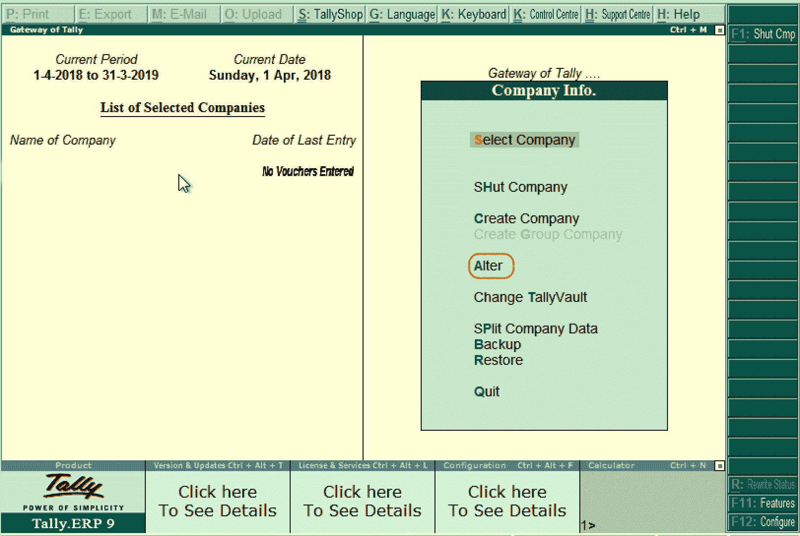
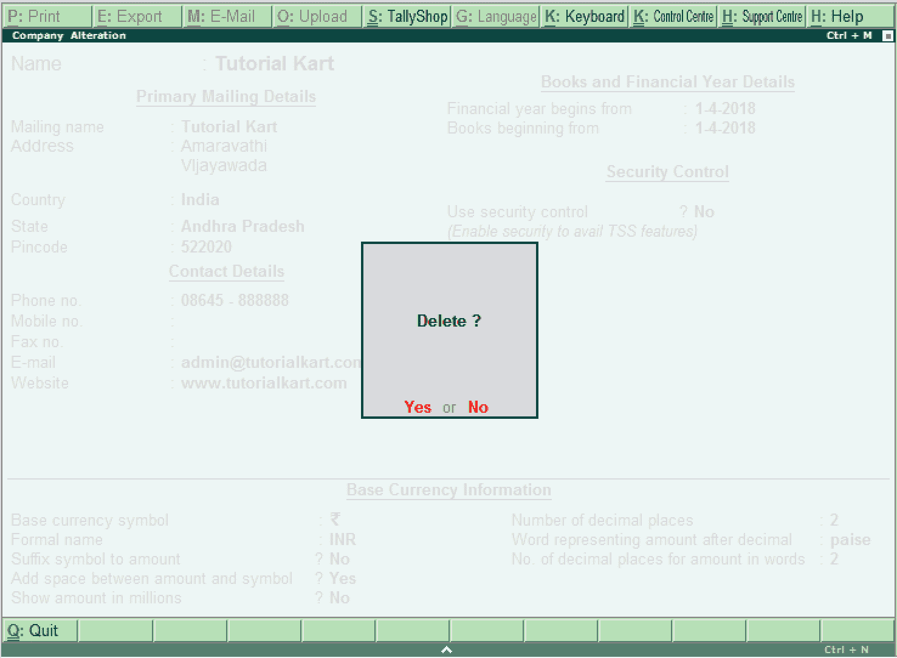

# 如何在Tally中修改/删除/关闭公司

> 原文：<https://www.javatpoint.com/how-to-alter-delete-shut-company-in-tally>

在这一部分，我们将学习如何在 Tally ERP 9 软件中更改、删除和关闭公司。

## 如何改变公司

在Tally中创建公司后，公司的给定信息可以根据需要进行更改/修改/变更。使用以下步骤更改Tally中的公司:

**第一步:** **Tally之门** → **按 Alt+F3** → **更改**

**第二步:**在“所选公司列表”下，选择公司名称，点击要更改的公司名称，如下图:

**第三步:**在公司变更界面，添加修改需要的详细信息。要保存详细信息，请使用 Ctrl+A 选项。这里我们要添加一个电话号码的联系方式。

## 如何删除公司

在Tally中，如果我们删除公司，它可以从硬盘上删除公司的完整信息。所有与公司相关的目录和文件将被永久删除。此信息不能保留。

在Tally ERP 9 中，使用以下路径删除公司:

**Tally之门** → **Alt+F3** → **涂改** → **Alt+D**

**第一步:**使用 Alt+F3 键后，公司信息会显示在屏幕上。在这里，删除选项将不可用。现在，点击 alter 选项。

**第二步:**现在点击选择公司，然后点击 Alt+D，之后点击是选项删除公司。

## Tally如何关公司

在Tally中，关闭一家公司并不意味着删除一家公司，它意味着关闭。与公司合作后，选择“退出”按钮关闭当前公司，如果我们选择了多家公司，请按 **Alt+F1** 。

* * *