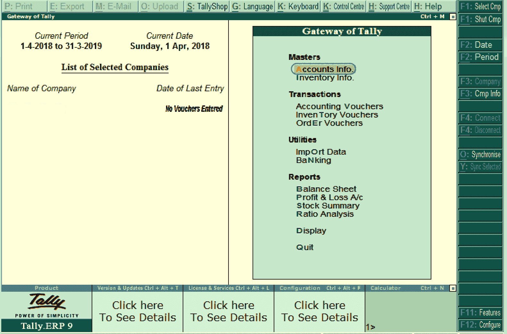
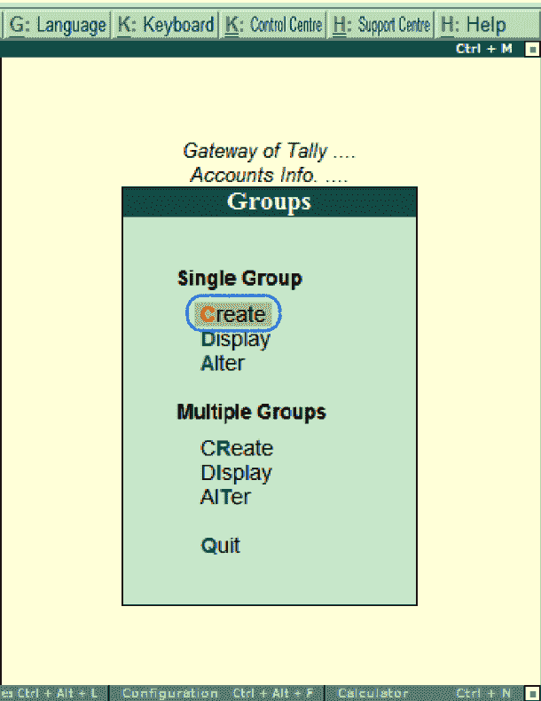
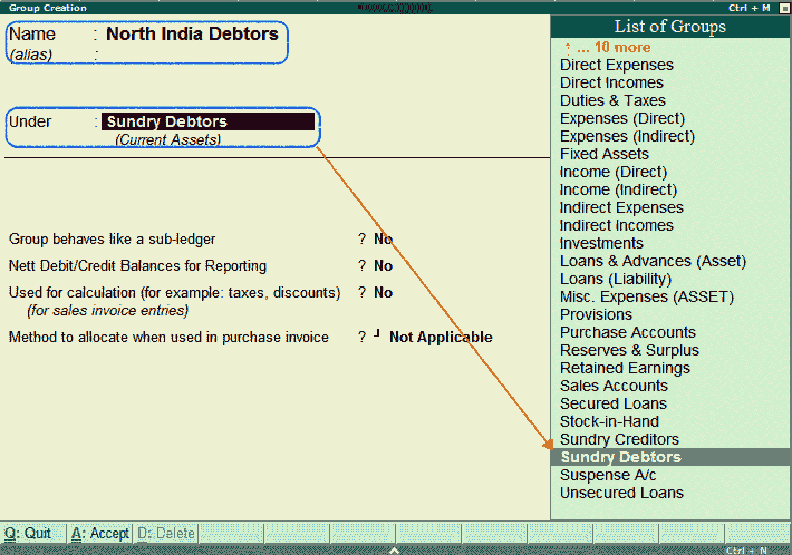
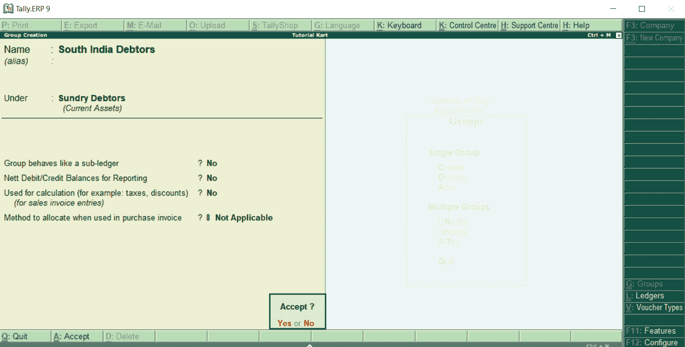
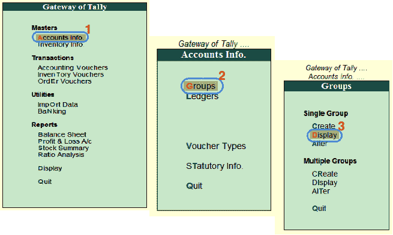
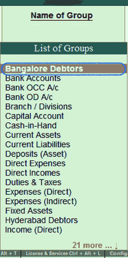
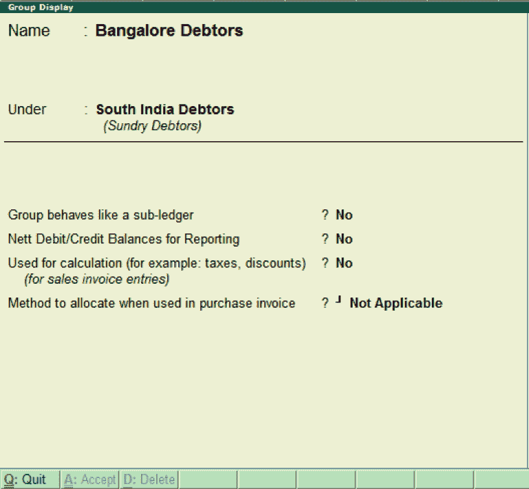
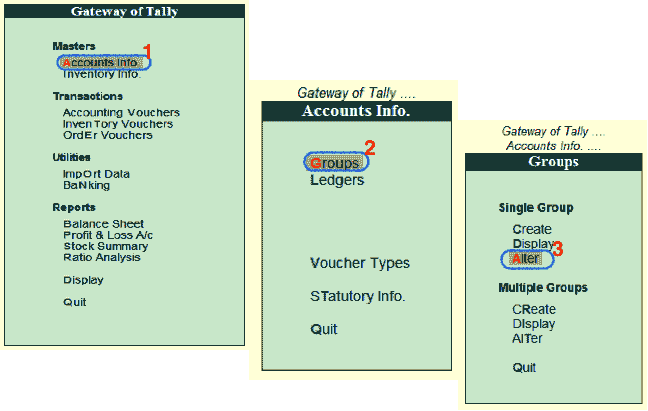
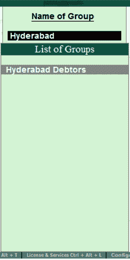
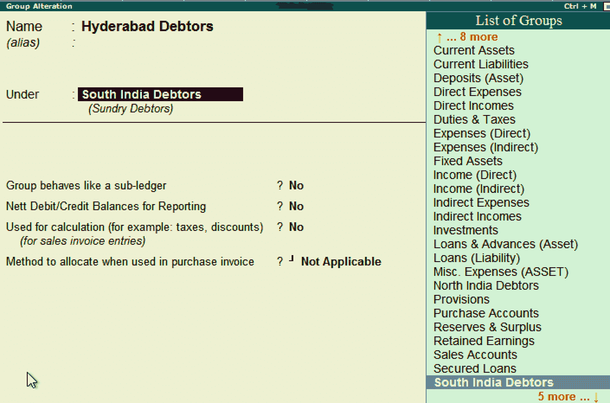

# 如何在 Tally ERP 9 中创建小组

> 原文：<https://www.javatpoint.com/how-to-create-group-in-tally-erp-9>

在这一节中，我们将学习如何在 Tally 中创建一个组。我们还将看到如何改变和显示创建的组。

如果我们是第一次在 Tally 中创建组，建议启用以下功能:

*   允许母版中的高级条目
*   在 masters 中提供高级信息

使用以下路径在 Tally 中创建组

**Tally 网关→ F12:配置→账户/库存信息→账户**

## 如何在 Tally 中创建组

在 Tally ERP 9 中，维护以下**杂项债务人分类账账户:**

**主要集团:**杂项债务人下的北印度债务人集团和南印度债务人集团

**子集团:**北印度债务人旗下的技术解决方案集团和中航有限公司。海得拉巴债务人，班加罗尔债务人，南印度债务人下的维贾亚瓦达债务人。

**第一步:**在这一步中，进入 Tally 的**入口，然后点击**账户信息**。**

**第二步:**选择**账户信息**下的**分组**选项。

**第三步:**在 Tally ERP 9 中，选择**单组**菜单下的**创建**选项，创建单组。

**步骤 4:** 在组创建屏幕上更新以下详细信息:

**名称:**指定组的名称，然后按回车键继续。

**在:**下的组列表下，选择组名为杂项债务人。

输入所需的详细信息后，按 **Ctrl+A:接受**或按**进入**保存详细信息。

此外，使用上述步骤创建其他组

*   杂项债务人下的南印度债务人
*   海得拉巴债务人、班加罗尔债务人和南印度债务人下的维贾亚瓦达债务人。
*   班加罗尔债务人下的技术解决方案或中航有限公司。

Tally 用于在所有默认组下创建任意数量的组。这里我们在杂项下创建了两个组，即北印度债务人和南印度债务人。在南印度债务人下，创建了三个子集团(**海德拉巴债务人、班加罗尔债务人、维贾亚瓦达债务人**)。

## 如何在 Tally 中显示分组

在 Tally ERP 9 中，创建组后，我们可以详细显示所有创建的组。但是，不允许用户在显示模式下编辑/更改数据。

**步骤 1:** 使用以下路径在 Tally 中显示组

**Tally 网关→账户信息→分组**

**第二步:**在单个组下，点击选项显示，在 Tally 中显示组。

**步骤 3:** 在**组列表**名称下选择所需的组名，然后点击该特定组，在屏幕上显示如下:

**步骤 4:** 现在分类账(班加罗尔债务人)在屏幕上显示为:

**第五步:**关闭屏幕，点击 **Q:退出**。

## 如何在 Tally ERP 9 中改变群体

在 Tally ERP 9 应用中，创建组后，我们可以根据需要修改细节。参考以下步骤修改/更改 Tally 中的组:

**第 1 步:**使用以下路径更改 Tally 中的组

**Tally 网关→账户信息→分组**

**第二步:**点击**单组**下的**修改**选项。

**步骤 3:** 从给定的搜索字段中，我们可以搜索该组，然后单击该组名称来修改详细信息。

**第四步:**在集团变更界面更新需要的详细信息，然后点击 **A:接受**保存详细信息。

* * *