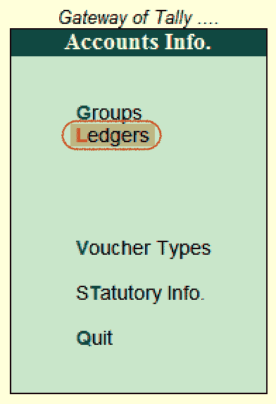
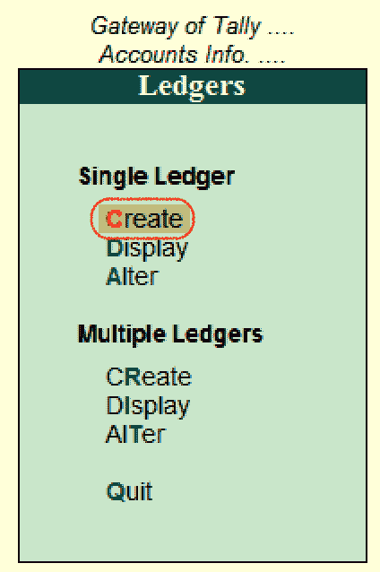
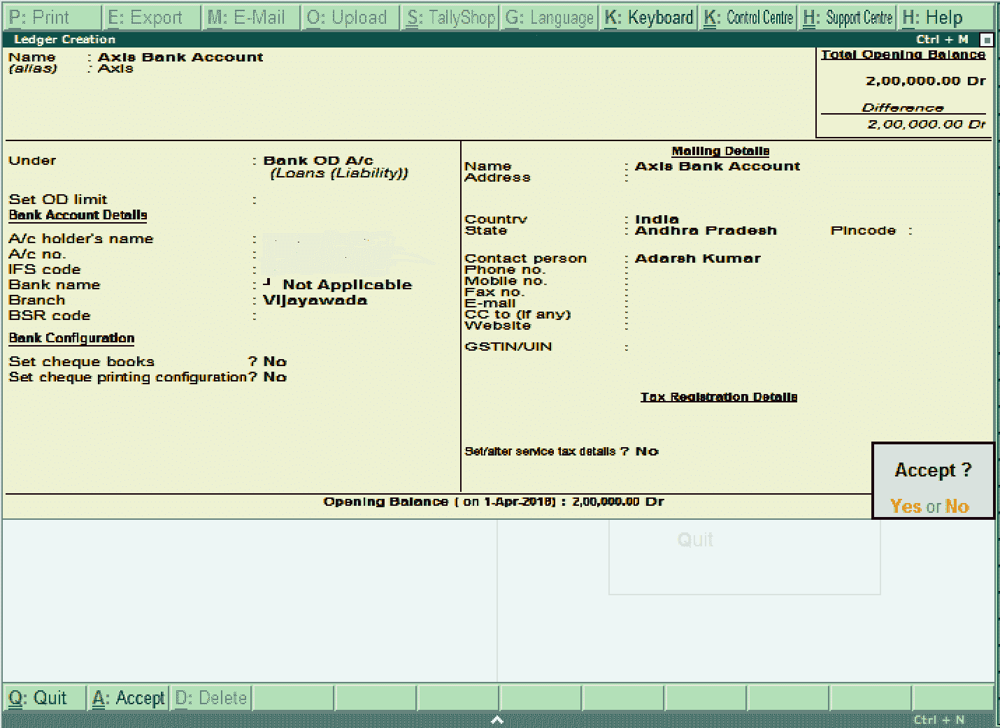
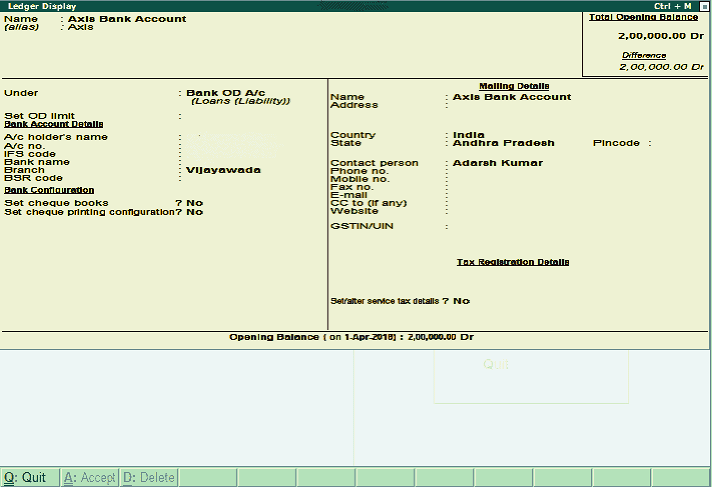
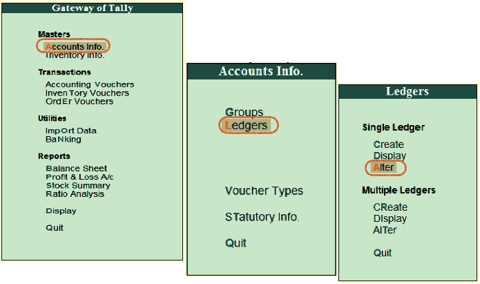
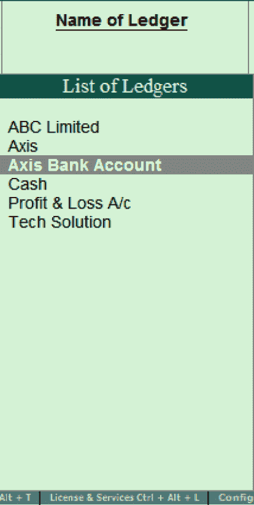
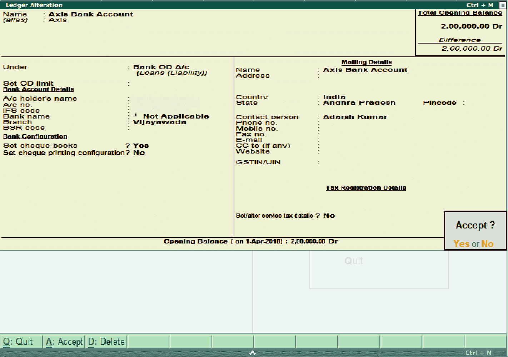

# 在 Tally ERP 9 中创建单一分类帐

> 原文：<https://www.javatpoint.com/create-single-ledger-in-tally-erp-9>

在本节中，我们将在 Tally 中创建一个单独的分类帐。这里我们将在银行帐户下创建分类帐轴银行帐户。

分类账所需的日期取决于我们选择的功能。如果公司会计特征(F11)的设置对所有选项都为“否”，分类帐屏幕将提供最少的信息。

Tally 会自动创建两个总帐科目，即损益科目和库存现金科目。根据组织的要求，我们可以创建总帐科目。在 Tally 中，我们无法创建另一个损益帐户。我们可以创建任意数量的不同名称的现金账户。

**如何在 Tally 中创建总帐科目**

**步骤 1:** 使用以下路径在 Tally 中创建总帐科目

**Tally 网关→账户信息→分类账→单分类账→选择创建**

**第二步:**点击 Tally 画面**入口下的**账户信息**。**

**第三步:**选择账户信息下的**台账**选项。

**第四步:**在**单台账**下，选择**创建**选项

**步骤 5:** 在分类帐创建屏幕上更新以下详细信息。

**名称:**指定总帐科目的唯一名称。

**在:**下的“组列表”下，选择与总帐科目相关的组名。

在 Tally 中，选择“接受”下的“是”选项以保存配置的详细信息。

## 如何在 Tally 中显示单个分类帐

在 Tally 中，创建单个总帐科目后，我们可以通过选择显示选项来查看总帐的详细信息。

请参考以下步骤来说明如何显示单一分类帐:

**第一步:**使用以下路径显示 Tally 单台账

**Tally 网关→账户信息→台账→单台账→选择显示**

**第二步:**在**台账列表**下，选择台账账户。

**第三步:**现在，下面的屏幕显示了总帐科目的完整详细信息。

## 如何在 Tally 中更改单个台账

**第一步:**使用以下路径更改 Tally 单台账

**Tally 网关→账户信息→台账→单台账→选择变更**

**第二步:**在**分类账列表下，**选择分类账账户选项。

在 Tally ERP 9 中，现在修改/变更分类账所需的详细信息。要保存更改的详细信息，请单击“接受”。

* * *