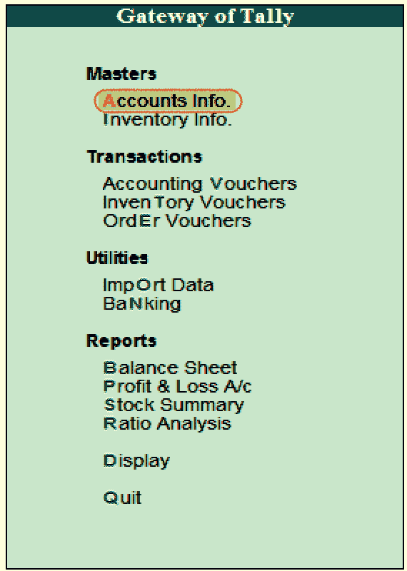
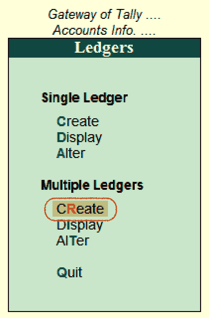
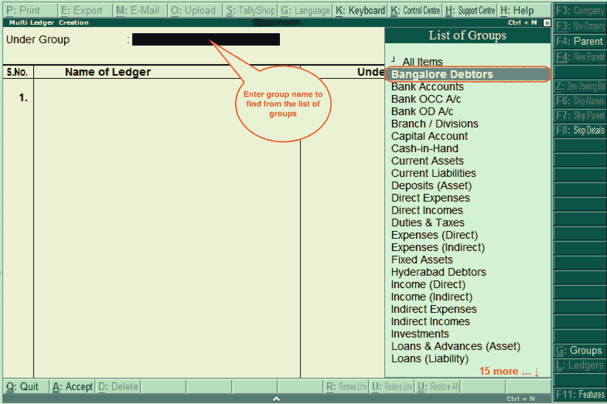
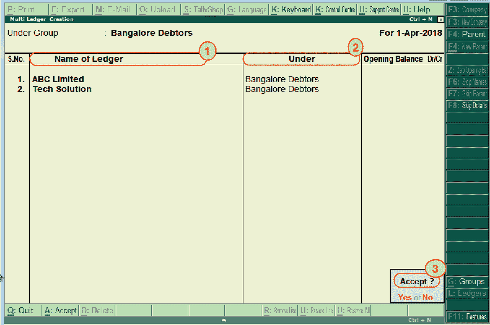
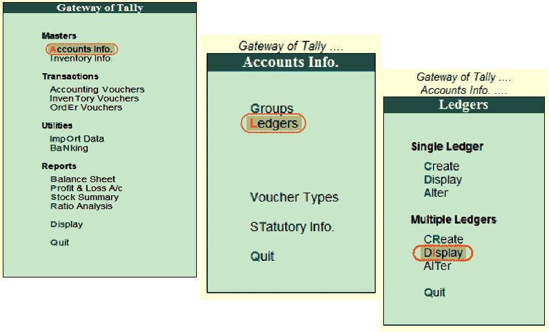
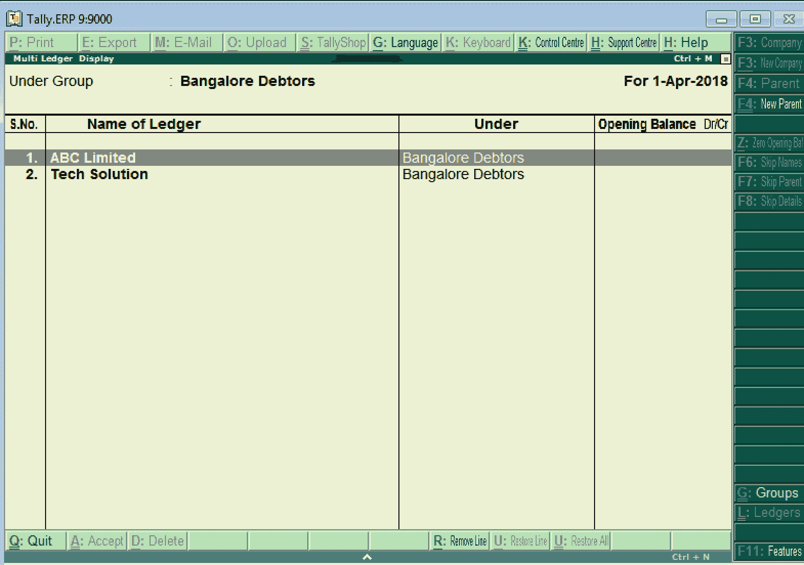
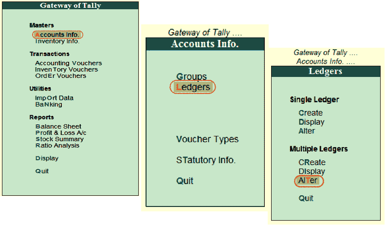
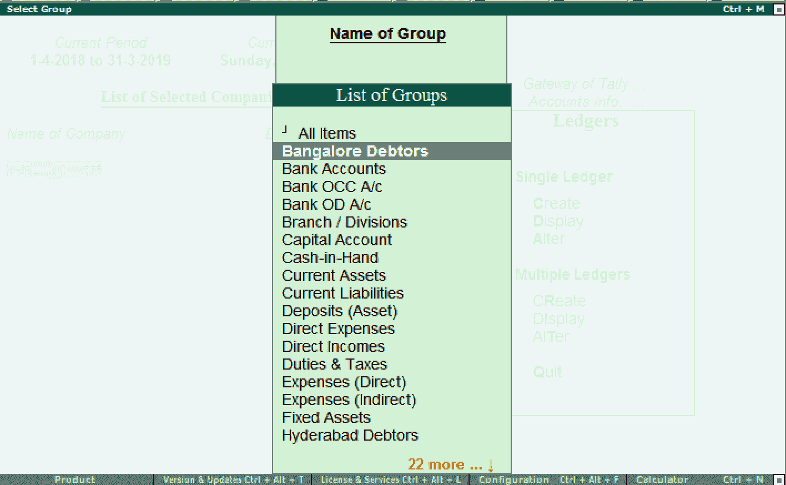
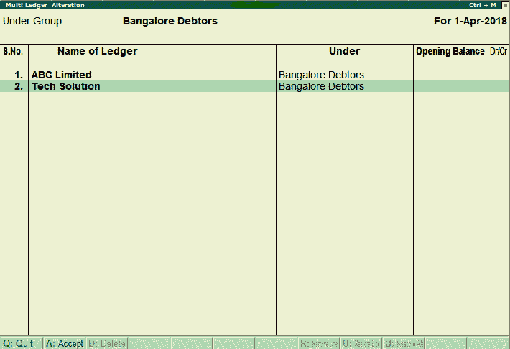

# 在Tally中创建多个分类帐

> 原文：<https://www.javatpoint.com/create-multiple-ledgers-in-tally>

在本节中，我们将看到如何在 Tally 中创建多个分类帐。

**第一步:**进入Tally网关，选择账户信息，如下:

**第二步:**选择账户信息下的分类账选项。

**步骤 3:** 在多分类账下，点击创建选项，在Tally中创建多分类账。

**步骤 4:** 在多分类账创建屏幕下输入以下详细信息。

**在组下:**在组列表下，选择班加罗尔债务人。但是，我们可以通过在组文本字段下输入组名来搜索组。

**步骤 5:** 更新班加罗尔集团债务人屏幕下的以下详细信息。

1.  **分类账名称:**输入我们喜欢在Tally中创建的分类账名称。
2.  **Under:**Under 组字段将由 Tally 自动填写为班加罗尔债务人。
3.  输入详细信息后，按回车键继续。我们将收到一条消息**接受:是或否**。要接受Tally中更新的详细信息，请选择“是”。

现在我们已经成功地在Tally ERP 9 中创建了多个分类账。

## 如何在Tally中显示多个分类帐

在Tally应用中，创建分类帐后，我们可以通过选择显示选项来检查多个分类帐。

**步骤 1:** 使用以下路径显示多个分类帐。

**Tally网关→账户信息→分类账→多分类账(显示)**

**第二步:**在集团列表下，选择集团名称为“班加罗尔债务人”。

**步骤 3:** 现在，显示多分类账屏幕，如下所示。

#### 注意:用户不允许在此显示模式下修改任何更改。为此，用户需要选择 alter 选项。

## 如何更改Tally中的多分类账

使用以下步骤更改Tally中的多分类帐。

**第一步:**使用以下路径，我们可以按照要求更改变更细节:

**Tally门户- >账户信息- >分类账- >多分类账- >选择修改**

**第二步:**在组列表下选择需要的组名。

**步骤 3:** 我们可以在多分类账变更屏幕上更新以下详细信息:

*   添加或删除分类帐
*   期初余额-贷项/贷项

在Tally中，要保存详细信息，请按回车键，然后按接受。

* * *