# 如何在Tally ERP 9 中创建成本中心

> 原文：<https://www.javatpoint.com/how-to-create-cost-centre-in-tally-erp-9>

在本节中，我们将学习如何在Tally中创建、显示和更改成本中心。

## 在Tally中启用成本中心

要在Tally ERP 9 中启用成本中心，请进行以下配置设置。通过在会计功能中启用成本中心，帮助我们在帐户信息下创建成本中心。使用以下步骤启用成本中心。

**步骤 1:** 使用以下路径启用Tally中的成本中心:

**Tally网关→ F11:功能→ F1:账户功能**

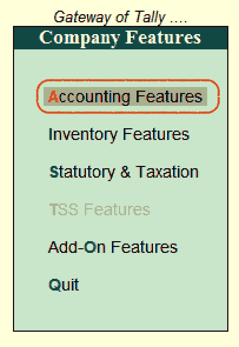

**步骤 2:** 启用“维护成本中心”选项为“是”。

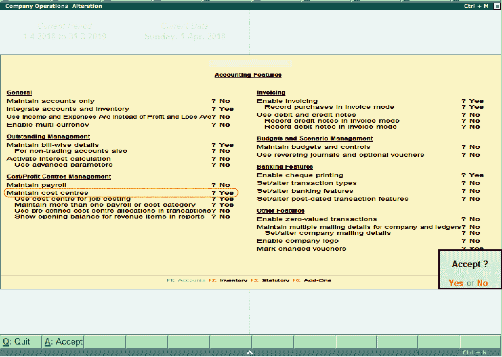

**第三步:**在Tally ERP 9 中，点击 **A:接受**保存修改后的明细。

## 如何创建成本中心

使用以下路径在Tally中创建成本中心:

**Tally网关→账户信息→成本中心**

**第一步:**点击Tally的**网关，然后点击**账户信息**。**

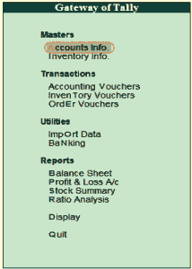

**第二步:**在**账户信息**下，点击**成本中心**选项。

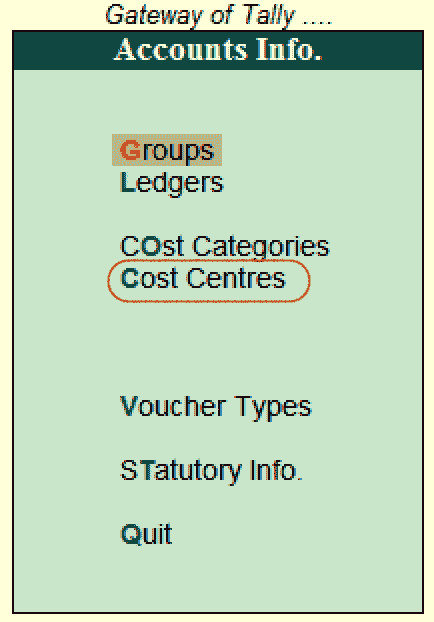

**第三步:**现在，点击**单成本中心**下的**创建**选项。

#### 注意:如果我们想在Tally中创建多个成本中心，请选择“创建”选项。

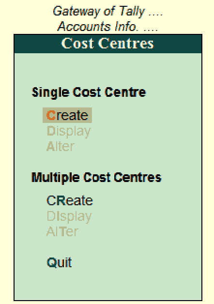

**步骤 4:** 在成本中心创建屏幕上更新以下详细信息:

**类别:**Tally可以自动创建主成本中心。在我们创建新成本中心之前，主要成本中心是默认成本中心。选择主要成本中心作为类别。

**名称:**指定成本中心的名称。

**别名:**我们可以用分行、总行等其他名称称呼成本中心。

**在:**下，从成本中心列表中，更新该成本中心的父成本中心。

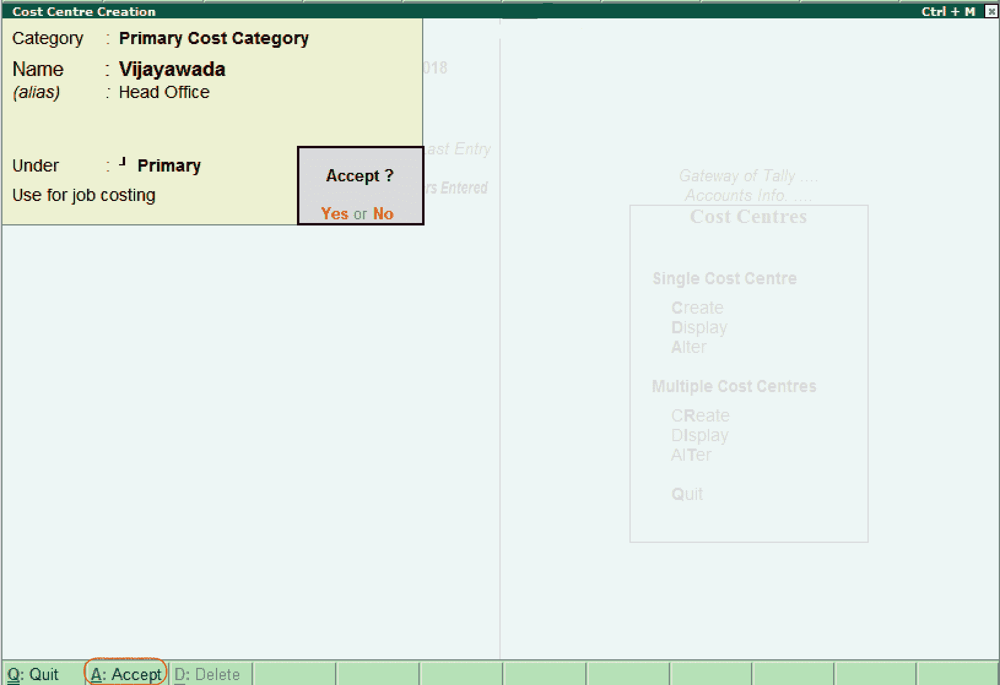

输入创建成本中心所需的详细信息后，选择选项 A:接受保存详细信息。

## 如何显示单一成本中心

使用以下路径在Tally中显示单个成本中心:

**Tally门户- >账户信息- >成本中心- >单一成本中心- >显示**

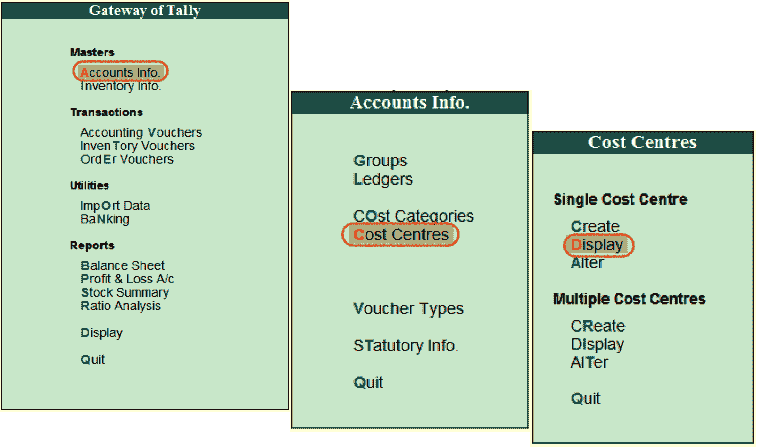

**第一步:**在成本中心的屏幕上，选择成本中心列表下的成本中心。

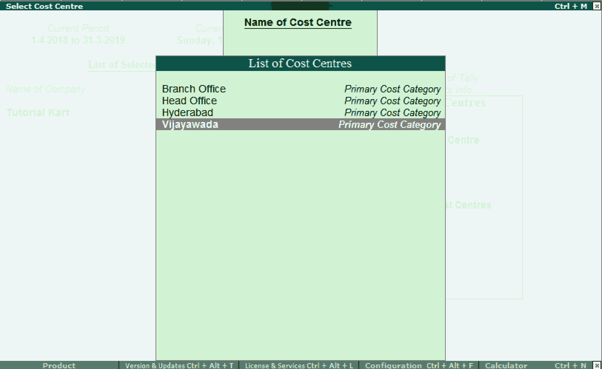

**步骤 2:** 现在，成本中心将显示详细信息。

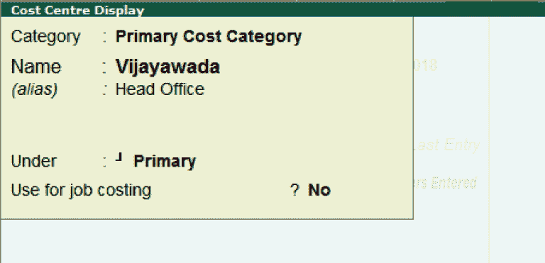

**第三步:**显示模式下不允许用户修改成本中心明细。

## 如何改变单一成本中心

使用以下路径更改Tally ERP 9 中的单一成本中心:

**Tally门户- >账户信息- >成本中心- >单一成本中心- >变更**

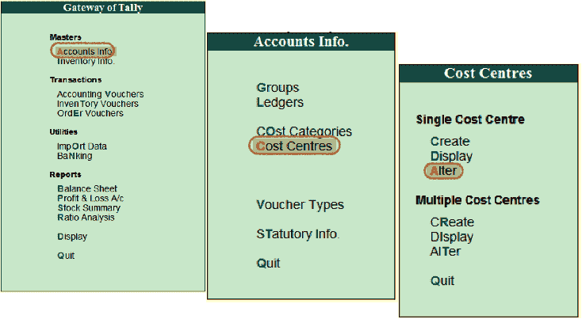

**第一步:**编辑明细选择成本中心列表下的成本中心。

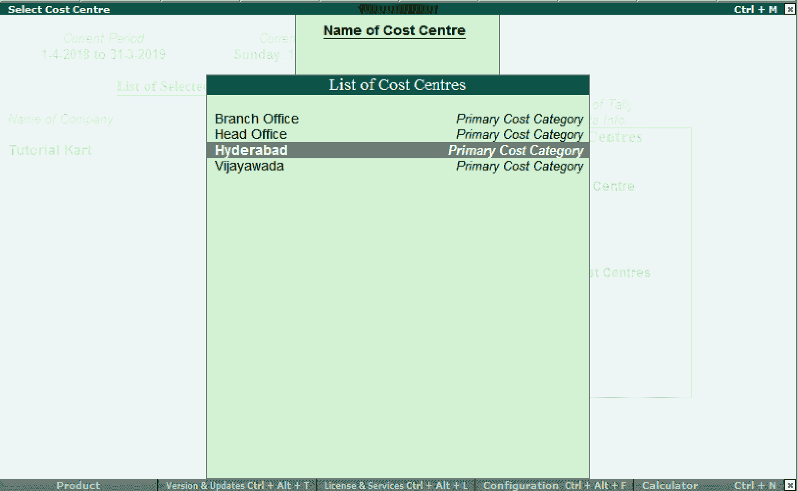

**第二步:**在成本中心变更界面，选择 A:接受保存更新后的明细。

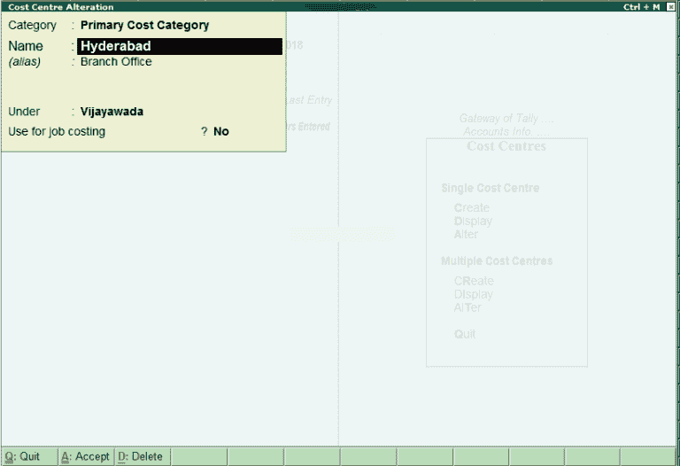

* * *