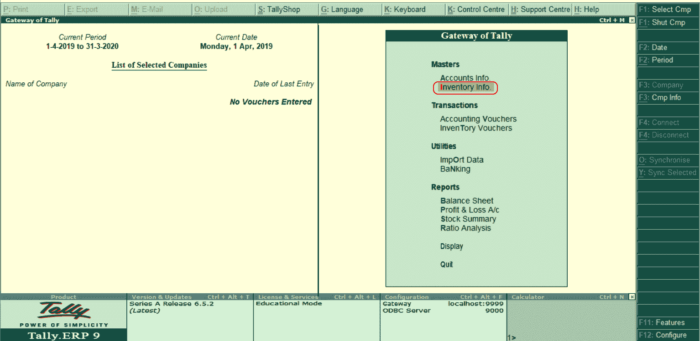
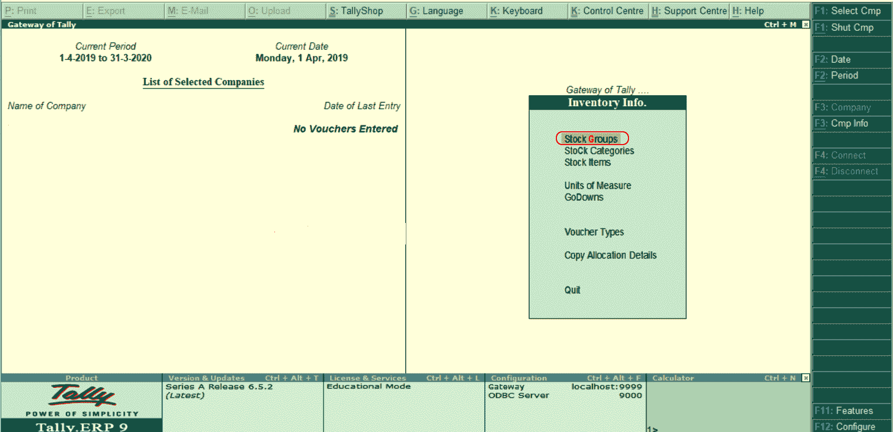
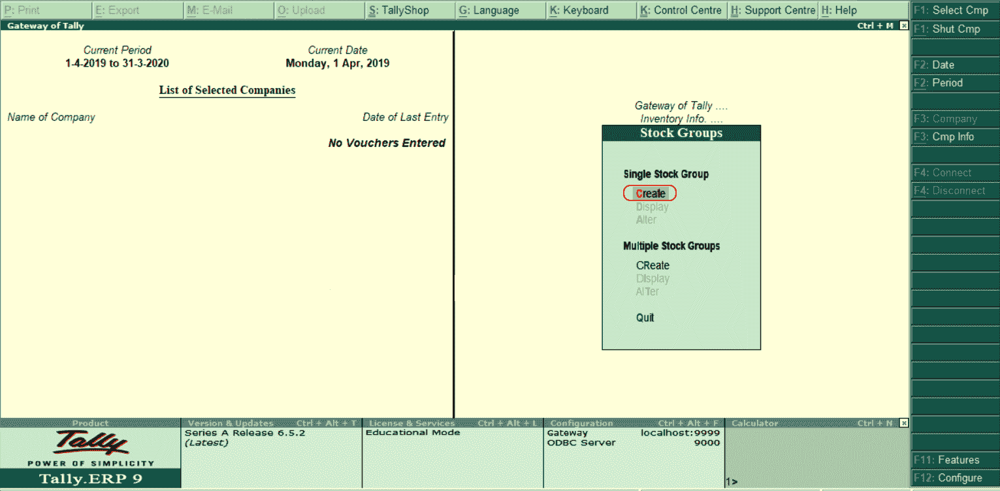
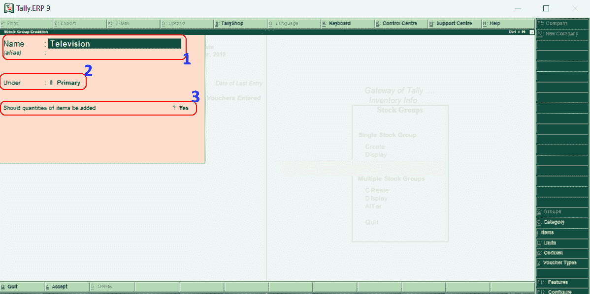

# 在理货中创建单一库存组

> 原文：<https://www.javatpoint.com/creating-single-stock-group-in-tally>

在理货中，股票组可以根据他们的共同行为对产品进行分类。使用以下导航路径在理货 ERP 9 中创建单个库存组:

**理货网关→库存信息→库存组→单个库存组→创建**

在理货 ERP 9 中，使用以下逐步过程创建单个股票组。

**第一步:**选择理货门户下的**库存信息**。

**第二步:**在下一节中，选择库存信息下的**库存组。**

**第三步:**在单个股票组下选择**【创建】**选项，按照公司要求创建单个股票组。

**第四步:**在下一屏**“单股组创建”**输入以下详细信息。

1.  **名称:**指定必须在理货中创建的股票组名称。在下图中，我们将电视作为一个新的单一股票组。
2.  **下:**在此，选择股票组为主。
3.  **应增加的项目数量:**在此，选择**是**选项。

选择 **A:输入所有需要的详细信息后接受**接受更新的详细信息。

在 Tally 中，我们已经成功创建了一个单一的股票组。

* * *