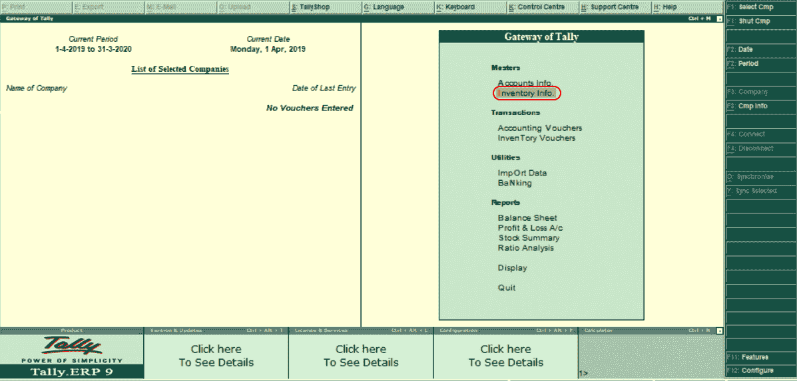
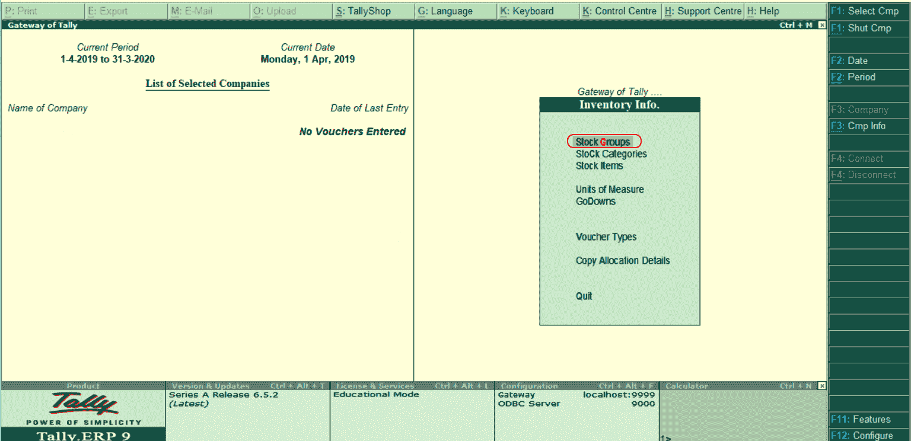
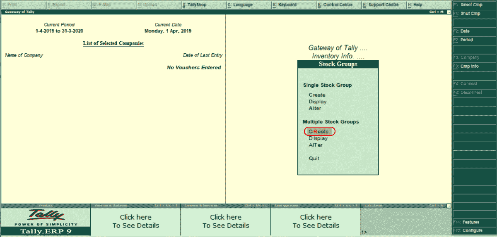
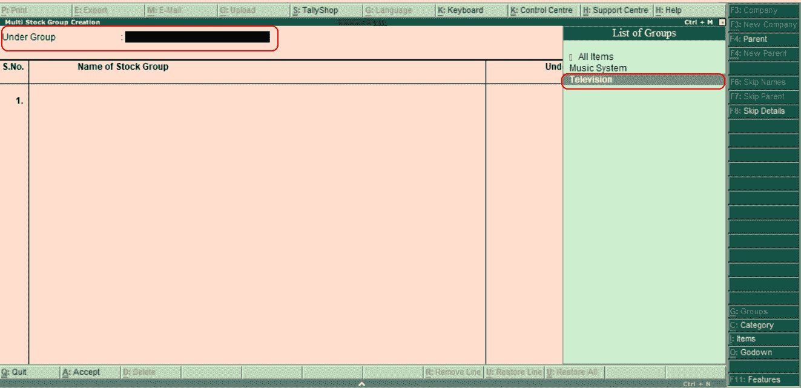
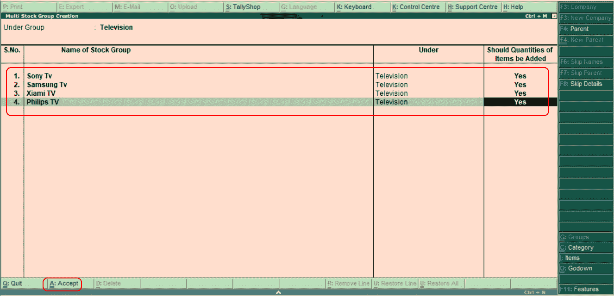

# 在Tally中创建多个股票组

> 原文：<https://www.javatpoint.com/creation-of-multiple-stock-groups-in-tally>

下一步是在 SAP 中创建多个股票组。在Tally中，使用以下导航路径创建多个股票组:

**Tally网关→库存信息→库存组→多库存组→创建**

在Tally ERP 9 中，按照以下步骤创建多个股票组。

**第一步:**选择Tally界面网关下的库存信息选项。

**第 2 步:**在库存信息下，选择库存组选项。

**第三步:**在【库存组】下显示两种类型的组。

1.  单一股票组
2.  多个股票组

在 Tally 中，我们已经创建了单个股票组。这里我们将创建多个股票组。现在，在多个股票组下，选择“创建”选项。

**第四步:**在组列表下，我们需要选择组。在这里，我们把电视归入小组。

**第五步:**现在我们来更新股票组，如下图。

| 股票组名称 | 下面的 | 是否应增加项目数量 |
| 索尼电视公司 | 电视机 | 是 |
| 三星电视 | 电视机 | 是 |
| 夏美电视公司 | 电视机 | 是 |
| 菲利普的电视 | 电视机 | 是 |

在Tally中，维护完创建多个库存组所需的明细后，选择 **A:接受**保存配置的明细。

* * *