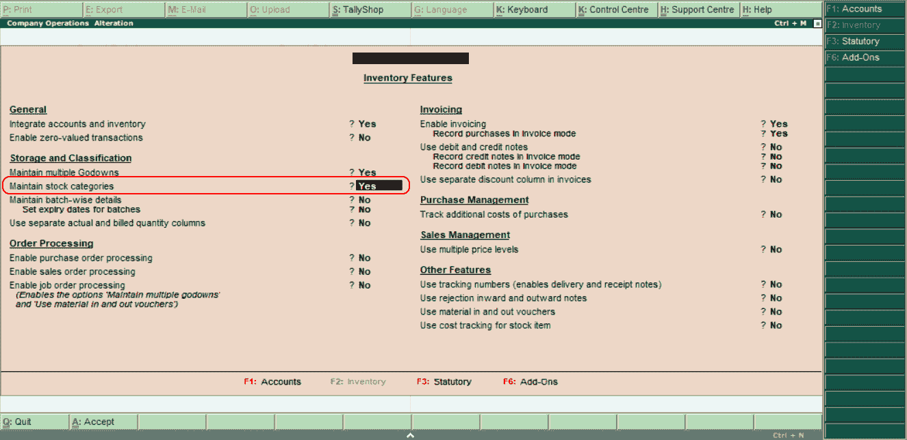
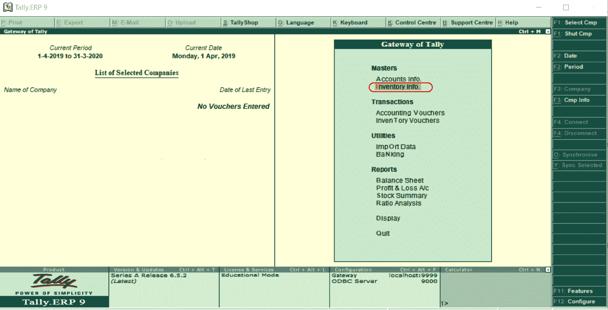
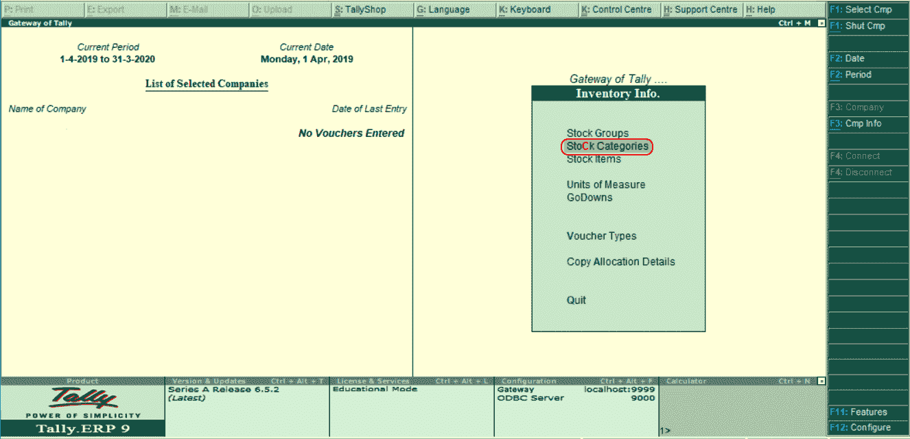
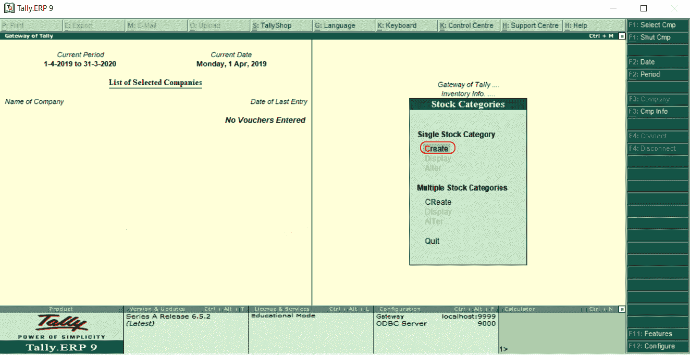
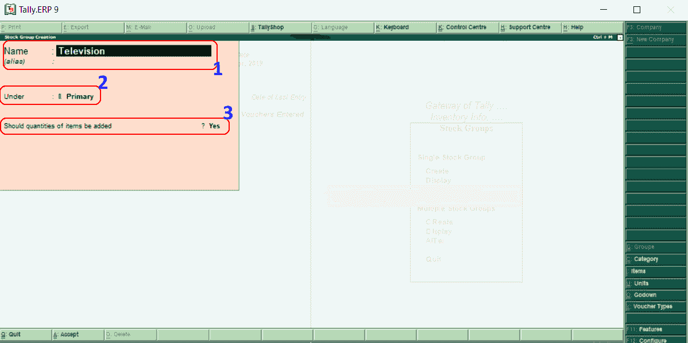

# 在理货中创建库存类别

> 原文：<https://www.javatpoint.com/create-stock-category-in-tally>

在 Tally 中，可以使用两种方法创建股票类别，如下所示:

1.  单一股票类别
2.  多种股票类别

我们需要在理货中创建股票类别之前设置“是”，以维护 F11:功能中的股票类别。使用以下路径创建股票类别:

**理货网关→ F11:功能→库存功能**

## 理货中单一存货类别的创建

**第一步:**进入理货网关，选择**库存信息**选项。

**第二步:**选择库存信息下的**库存类别**选项，在理货中创建一个库存类别。

**第三步:**选择“单一股票类别”下的“创建”选项，在理货中创建单一股票类别。

**第 4 步:**在下一个屏幕“辛托克创建”中更新以下详细信息。

1.  **名称:**输入需要在理货中创建的股票类别名称。在给定的截图中，我们给出了一个股票类别的名称“32 英寸电视”。
2.  **下:**在此，选择股票组为初级。
3.  **应添加的项目数量:**在这种情况下，选择是选项。

选择 **A:输入所有需要的详细信息后接受**接受更新的详细信息。

在 Tally 中，我们已经成功创建了一个单一的股票组。

* * *