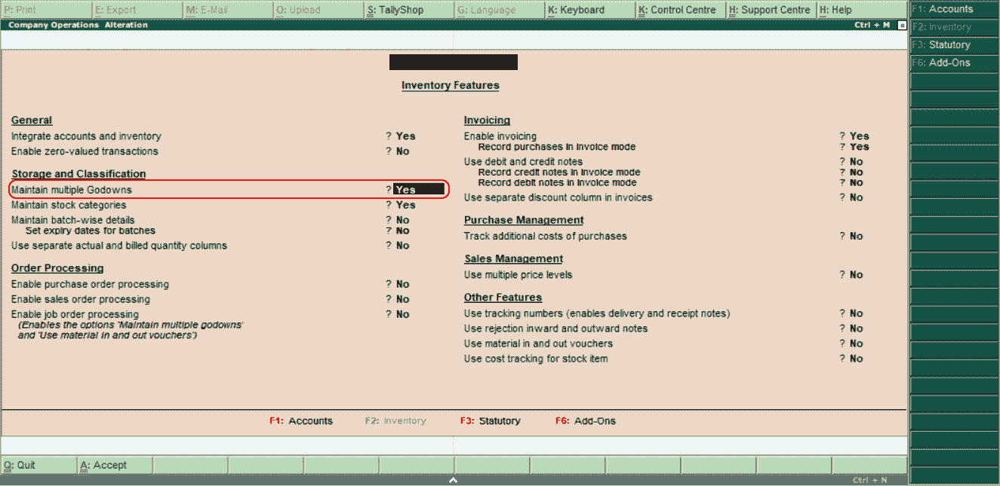
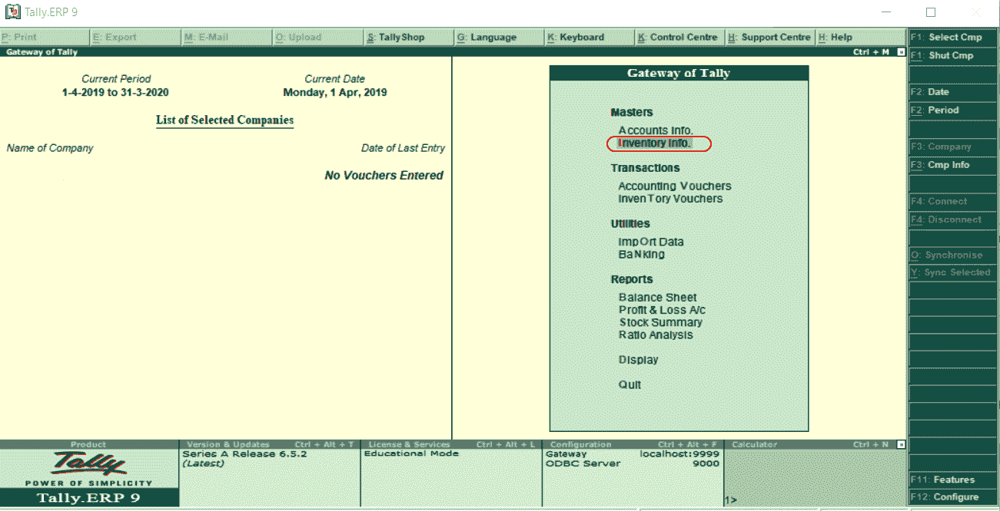
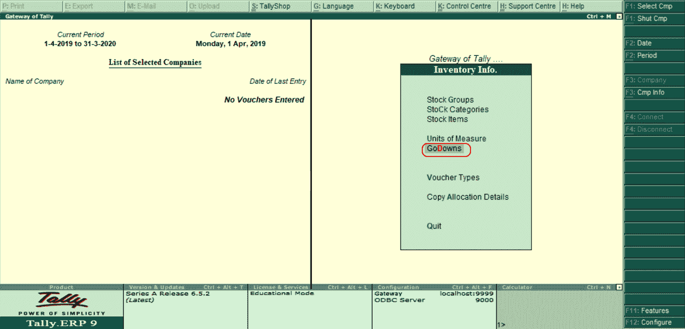
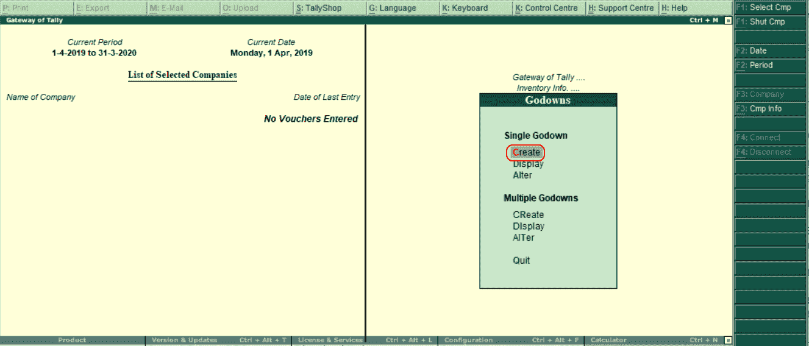
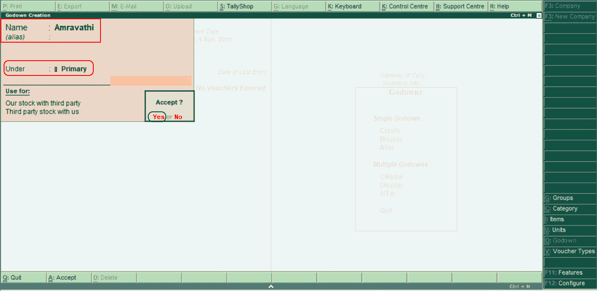
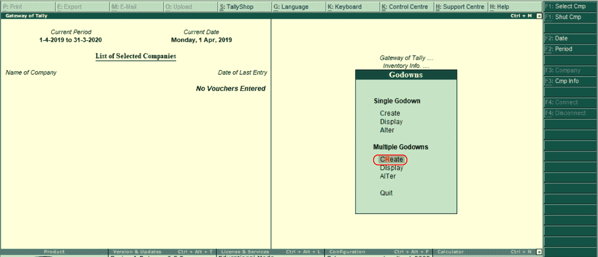
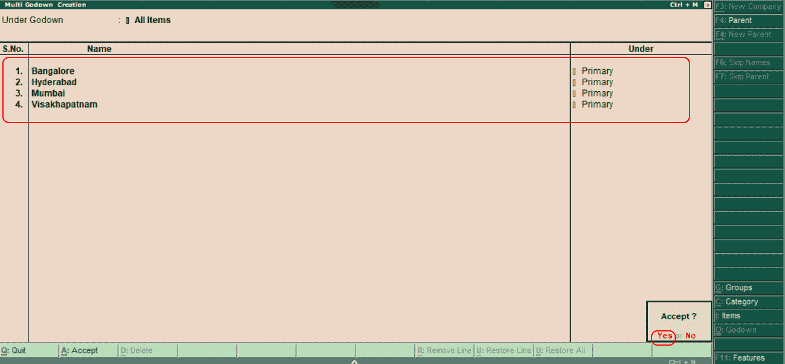

# 在Tally中创建仓库/位置

> 原文：<https://www.javatpoint.com/creation-of-godowns-location-in-tally>

仓库是一种安全存放库存物品的场所。根据仓库，库存项目的报告可以在Tally中准备。使用这两种方法，我们可以在Tally中创建仓库:

1.  单一仓库
2.  多个仓库

我们需要在Tally中创建多个货仓之前设置**“是”**，以在 F11:特性中维护多个货仓。使用以下路径在Tally中创建货仓/货位:

**Tally网关→ F11:功能→库存功能**

## 如何创建单一仓库

**第一步:**选择主菜单下的**库存信息**选项。

**第二步:**选择【库存信息】下的**货仓**选项，根据公司要求在Tally中创建货仓。

**第三步:**选择**【创建】**选项，在Tally中创建货仓。

**第四步:**在下一个画面 GoDown 创建中输入以下细节。

*   **名称:**指定货仓名称。我们可以输入货仓名称作为它所在位置的名称。
*   **在:**下指定货仓在哪个货仓下。
*   我们将在输入详细信息后按回车键，要在Tally中接受已配置的货仓，请按“是”或回车键。

在上面的图像中，我们在 Primary 下创建了一个名为“Amravathi”的新 Godown。

## 如何在Tally中创建多个货仓

现在我们将逐步学习如何在Tally中创建多个仓库。

**步骤 1:** 使用以下导航路径创建多个货仓:

**Tally网关→库存信息→货仓，点击多个货仓下的创建。**

**第二步:**在下一屏多神格创建中输入以下细节。

*   **名称:**指定货仓名称/地点名称
*   **下:**在此，选择初级。

在Tally中，更新完所有货仓/货位后，选择**是**接受数据。

* * *