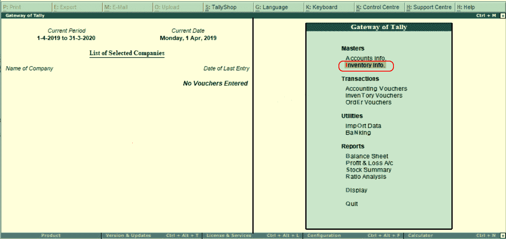
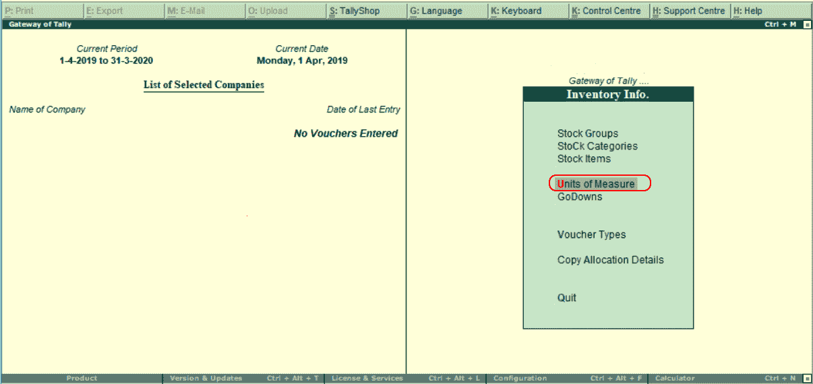
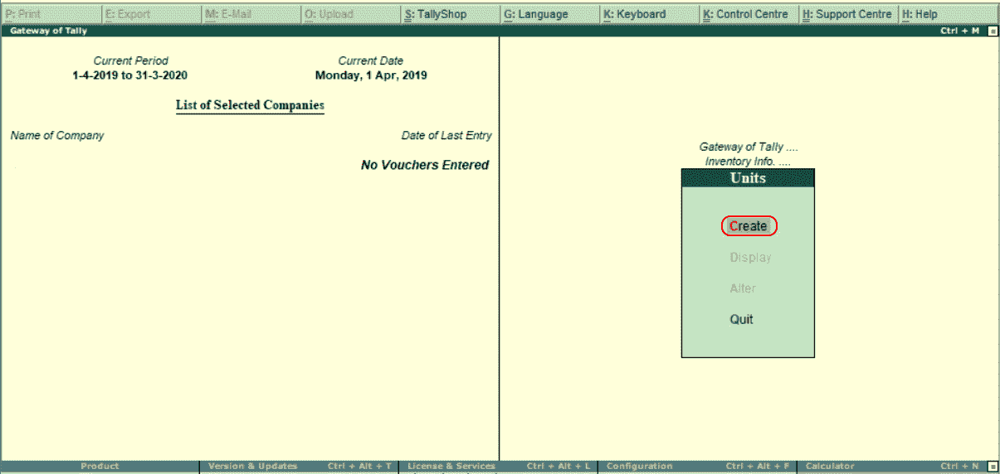
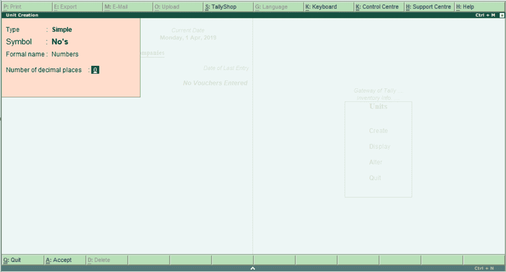

# 在Tally ERP 9 中创建库存单位

> 原文：<https://www.javatpoint.com/create-stock-units-in-tally-erp-9>

我们可以创建单位和复合单位(例如，盒子，没有的电脑，等等。)来衡量Tally里的股票。复合单位是两种度量单位的组合。例如，一盒 10 件是复合计量单位。

使用以下路径在Tally中创建库存单位:

**Tally网关→库存信息→计量单位→创建**

**第一步:**首先登录Tally，然后进入Tally网关，选择库存信息。

**第二步:**在库存信息下，选择“计量单位”。

**步骤 3:** 选择“单位”下的“创建”选项，在Tally中创建计量单位。

**步骤 4:** 在下一个屏幕“单元创建”中更新以下详细信息。

**符号:**指定识别库存项目的单位符号。例如，“否”表示数字。

**正式名称:**指单位的另一个名称。它用于将符号与其各自的名称相匹配。

**小数位数:**小数可以用来检测单位。例如，5.20 公斤指的是 5 公斤和 200 克。

输入所有需要的详细信息后，按 **A:接受**，将详细信息保存在Tally中。

* * *