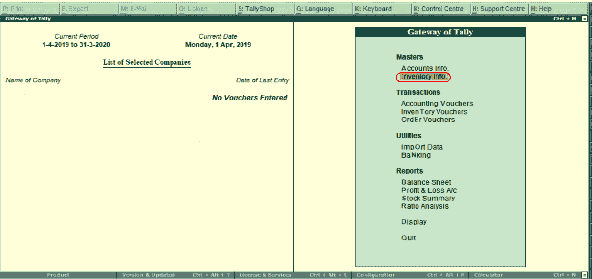
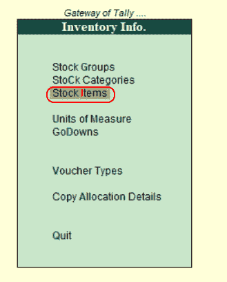
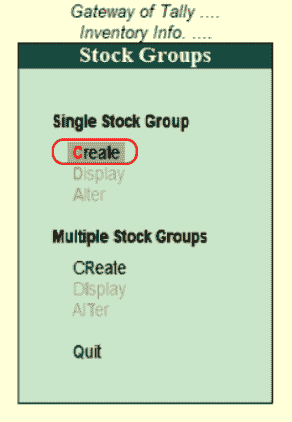
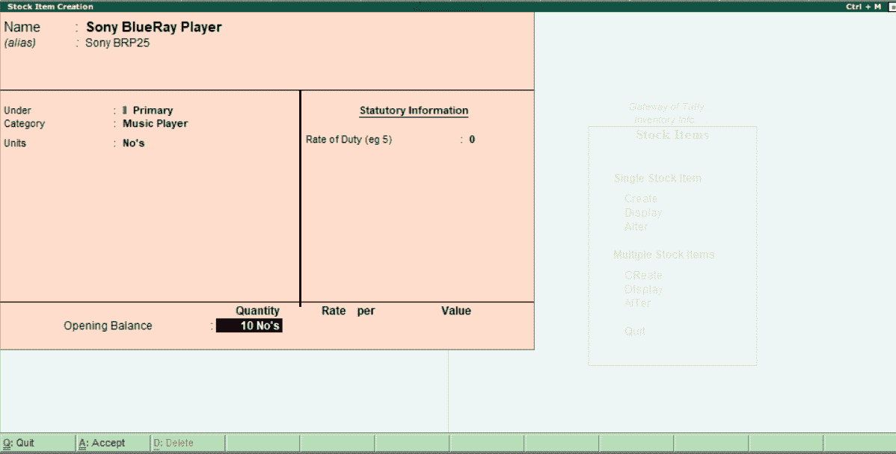
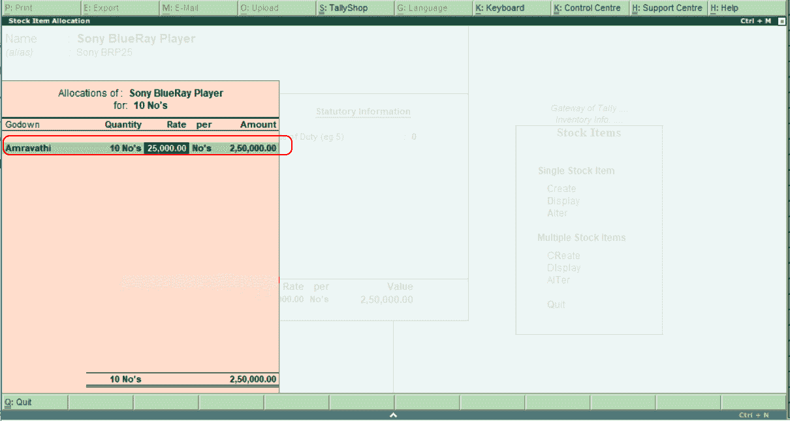
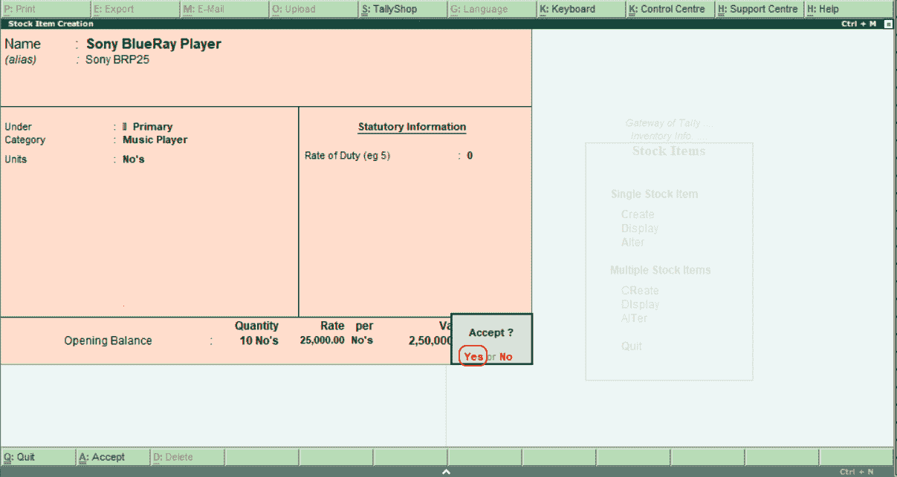
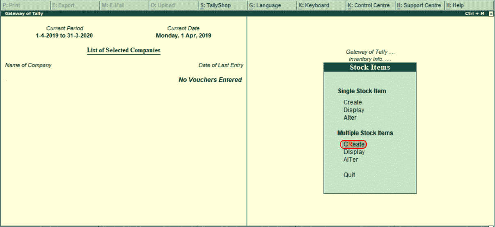
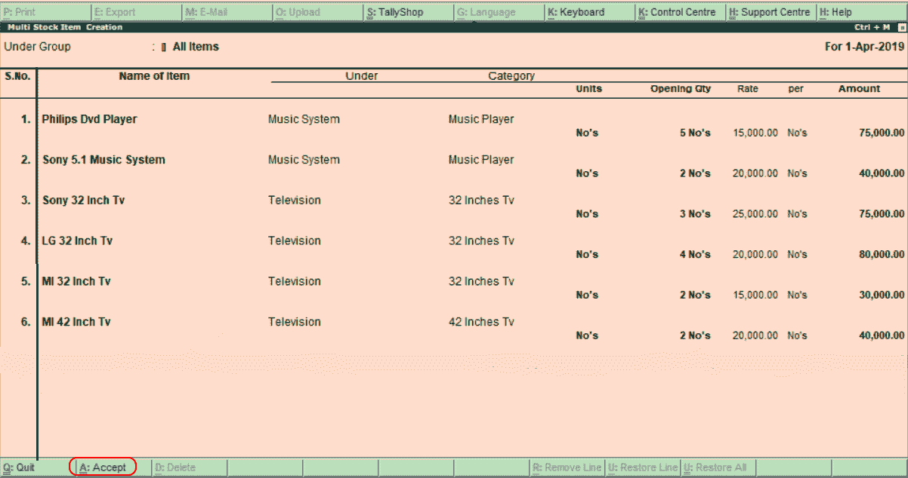

# 如何在理货 ERP 9 中创建库存项目

> 原文：<https://www.javatpoint.com/how-to-create-stock-items-in-tally-erp-9>

库存商品是指公司在理货市场生产的商品。在理货中，可以使用以下两种方法创建库存项目:

1.  单一库存项目
2.  多个库存项目

| 组 | 项目名称 | 单位 | 期初数量 | 速度 | 数量 |
| 电视机 | MI 32 英寸电视 | 否 | Two | Fifteen thousand | Thirty thousand |
|  | MI 42 英寸电视 | 否 | Two | Twenty thousand | Seventy-five thousand |
|  | 索尼 32 英寸电视 | 否 | three | Twenty-five thousand | Seventy-five thousand |
|  | LG 32 英寸电视 | 否 | four | Twenty thousand | Eighty thousand |
| 音乐系统 | 索尼 5.1 音乐系统 | 否 | Two | Twenty thousand | Forty thousand |
|  | 菲利普斯影碟机 | 否 | five | Fifteen thousand | Seventy-five thousand |
|  | 索尼蓝光播放器 | 否 | Ten | Twenty-five thousand | Two hundred and fifty thousand |

## 单一库存项目的创建

使用以下路径在理货中创建单一库存项目。

**理货网关→库存信息→库存项目→单个库存项目→创建**

**第一步:**进入理货网关，选择库存信息。

**第二步:**选择库存信息下的库存项目。

**第三步:**选择单个库存项目下的“创建”。

**第 4 步:**在下一屏“单个股票组创建”中输入以下详细信息。

**名称:**指定库存项目的名称。

**别名:**可以是存货项目或产品 id 的简称，也可以是其他名称。

**在:**下，指定要指定该库存项目的库存组。

**类别:**指定库存项目的库存类别。

**单位:**指定盘点存货项目的计量单位。

**期初余额:**指定存货项目的期初余额。

**数量:**指定库存项目的数量。

**费率:**当我们输入库存项目的费率值时，会打开一个新窗口。更新以下详细信息，如下所示:

**货仓:**在货仓列表下，选择货仓。

**费率:**指定库存项目的费率。

根据数量和费率金额，将自动计算每和金额值。

指定所有必需的详细信息后，按 enter 键继续。在理货 ERP 9 中，选择“是”保存详细信息。

## 创建多个库存项目

使用以下路径创建多个库存项目:

**理货之门。ERP 9 >库存信息>库存项目>多个库存项目>创建**

**第一步:**选择多个股票项目下的“创建”选项，如下图。

**第二步:**在下一屏“多库存项目创建”中输入以下详细信息。

**组下:**选择组下为**所有物品**用不同的类别组更新不同类型的库存物品。

现在更新所有必需的详细信息:指定项目名称、库存组、库存类别、库存单位、库存期初数量和比率。

在理货 ERP 9 系统中，点击 A:接受保存输入的详细信息。

* * *