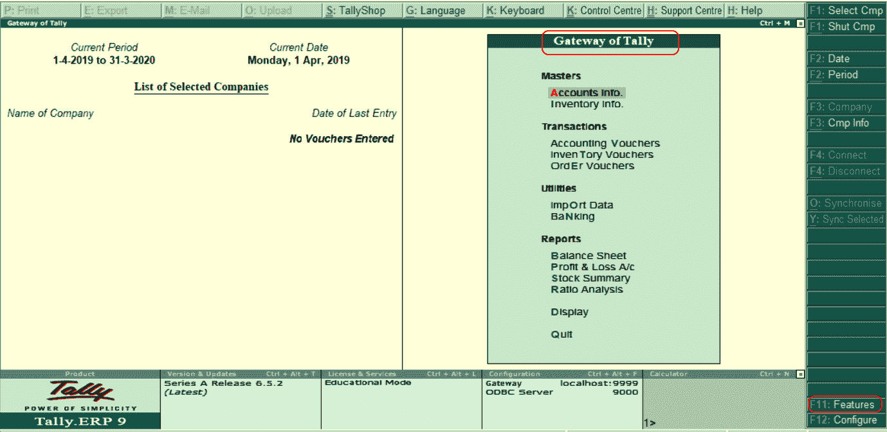
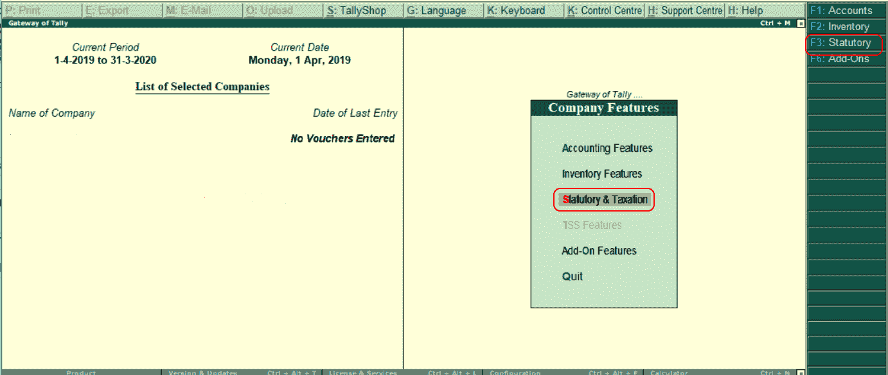
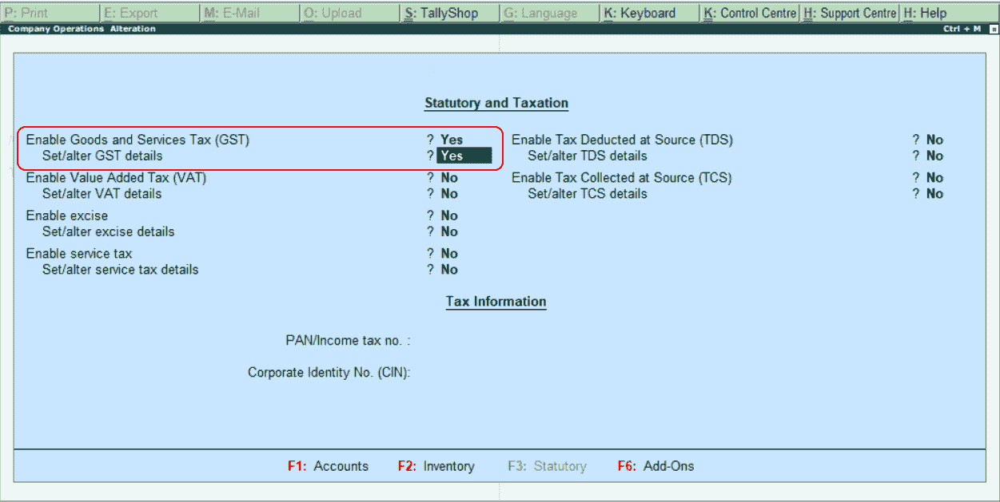
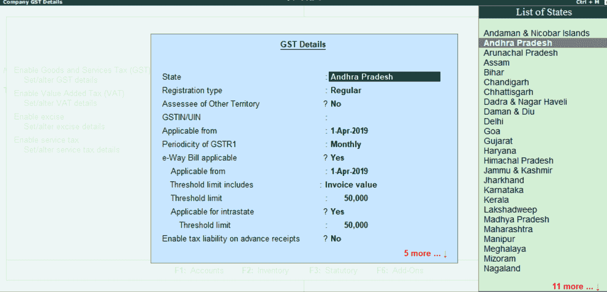

# 如何在Tally中激活商品及服务税

> 原文：<https://www.javatpoint.com/how-to-activate-gst-in-tally>

在Tally中，要使用商品及服务税功能，必须激活或启用商品及服务税。在Tally ERP 9 中，在功能中激活商品及服务税后，所有与商品及服务税相关的功能都可用于所有总账、库存项目和交易。

要激活Tally中的商品及服务税，请参考以下步骤:

**第一步:**点击 F11:功能或按下Tally网关下的功能键 F11。

**第二步:**选择法定&税务或按公司功能选项下的功能键 F3。

**第三步:**在下一屏“公司运营变更”输入以下详细信息。

启用商品和服务税:指定“是”。

设置/更改商品及服务税详细信息:指定“是”。

**步骤 4:** 当我们为设置/更改商品及服务税详细信息启用“是”时，将出现以下屏幕。

**第五步:**更新商品及服务税所有需要的详细信息，如下图:

**状态:**会根据我们在公司更新的状态自动显示状态名称。

**注册类型:**在此，选择商品及服务税注册类型为“常规”或“组合”。

**商品及服务税印度/UIN:** 指定商品及服务税印度编号。该商品及服务税可以打印在发票上。

**适用起始日期:**指定商品及服务税适用于交易的日期。

**商品及服务税的周期:**根据公司要求，将商品及服务税的周期指定为季度或月度。

**电子方式票据适用:**在此，选择是选项。

**适用起始日期:**指定电子客票适用起始日期。

**阈值限制包括:**这将基于应税/发票价值和应税货物价值/免税货物

**阈值限制:**指定允许的阈值限制量的值。

**适用于州内:**如果适用于我州，选择“是”选项。

**阈值限制:**指定阈值限制

**启用预收款的纳税义务:**要启用预收款的纳税义务，请选择“是”选项。

**设置/更改商品及服务税税率详情:**要在公司级别设置或更改商品及服务税税率详情，请选择“是”选项。

**启用商品及服务税分类:**要激活商品及服务税分类，请选择“是”选项。

在Tally中，选择“是”选项，输入激活商品及服务税所需的所有详细信息，以接受数据并保存详细信息。

* * *