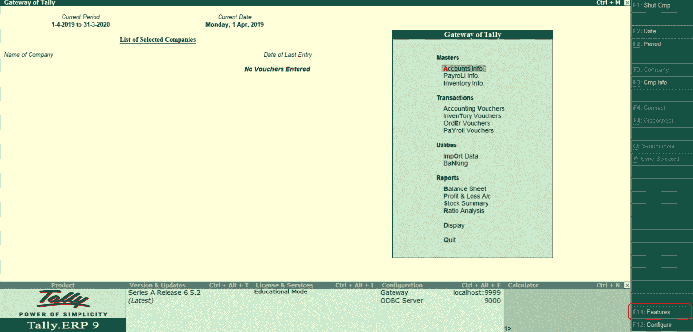
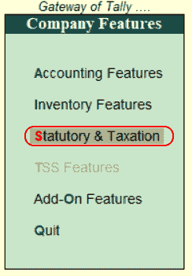
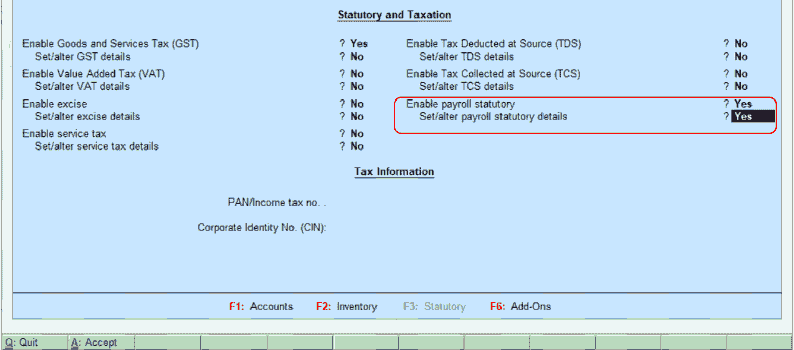
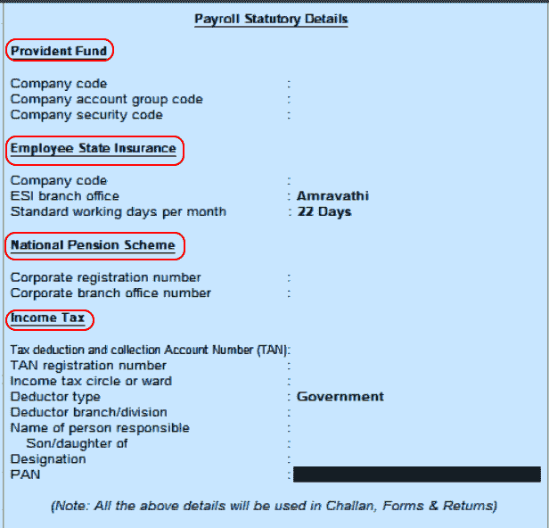

# 在理货中启用工资单法定功能

> 原文：<https://www.javatpoint.com/enable-payroll-statutory-features-in-tally>

在本节中，我们将讨论在理货 ERP 9 中启用工资单法定功能的逐步过程。当我们在理货中启用工资单时，启用法定工资单的选项将在法定&税务中启用。

**步骤 1:** 使用以下路径在理货中启用工资单法定功能。

**理货门户→ F11:特色→ F3:法定和税务**

**第二步:**选择理货网关下的 F11:功能选项。

**第三步:**选择公司特征下的法定&征税选项。

**第四步:**在法定和税务下激活以下详细信息。

启用法定薪资:设置“是”选项。

设置/更改工资单法定详细信息:设置“是”选项。

启用法定工资单后，按回车键。

**第五步:**在 Payroll 法定明细下指定公积金、员工国家保险、国家养老金计划、公司所得税的明细。

输入详细信息后，按回车键接受屏幕并返回法定和税务屏幕。在理货中，按 Ctrl+A 保存详细信息。

* * *