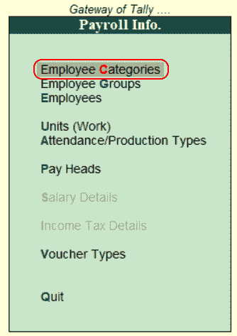
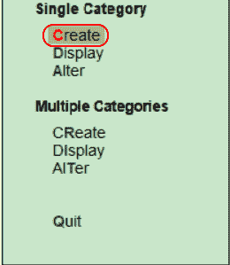
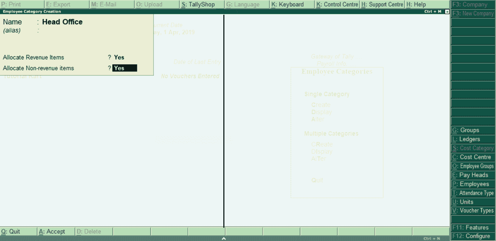
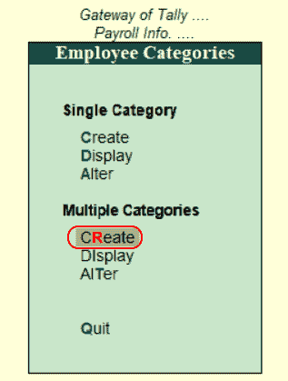
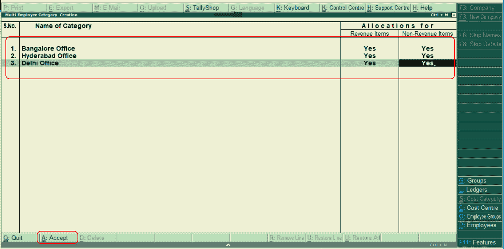

# 在Tally中定义员工类别

> 原文：<https://www.javatpoint.com/define-employee-category-in-tally>

在Tally中，员工类别根据项目或其位置对公司员工进行分类。

## 创建单一员工类别

使用以下分步流程创建单个员工类别。

**Tally网关→薪资信息→员工类别→单一类别→创建**

**第二步:**选择Tally网关下的**工资条**选项。

**第三步:**在薪资信息功能下选择**员工类别**，如下图。

**第 4 步:**选择单个类别下的“创建”选项，在Tally中创建单个员工。

**步骤 5:** 定义员工类别创建的以下详细信息。

**名称:**定义员工姓名类别，在Tally ERP 9 中创建。

**分配收入项目:**要为员工分配与收入相关的事务值，请选择“是”选项。

**分配非收入项目:**要为员工分配非收入相关事务值，请选择“是”选项。

要在Tally中保存详细信息，请选择 A:接受。

## 创建多个员工类别

**步骤 1:** 使用以下路径创建多个员工类别。

**Tally网关→薪资信息→员工类别→多类别→创建**

**第二步:**选择多个类别下的“创建”选项。

**第三步:**在多员工创建界面更新以下详细信息，如下图:

要在Tally中保存详细信息，请选择 A:接受。

* * *