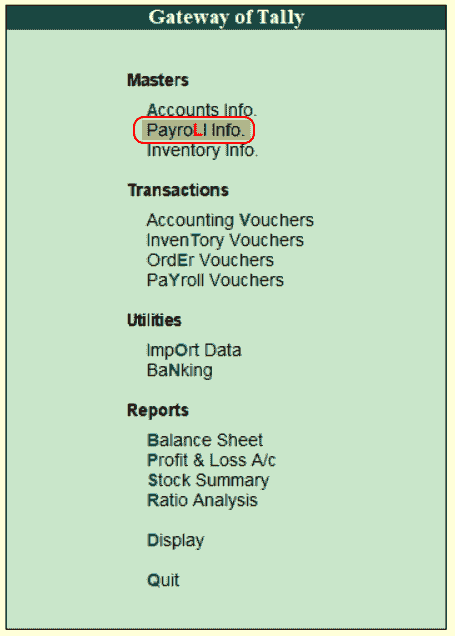
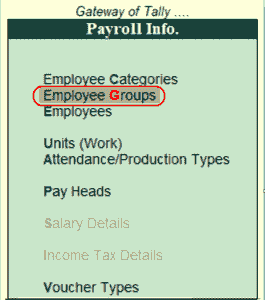
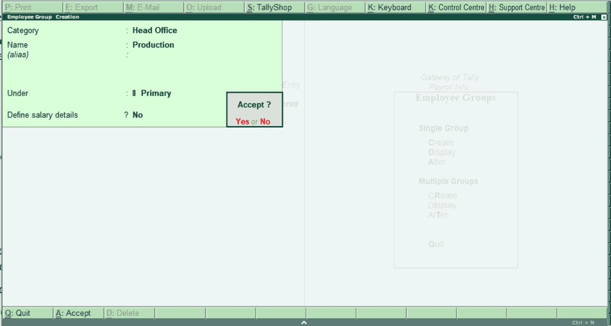
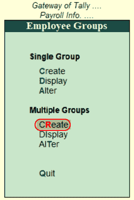
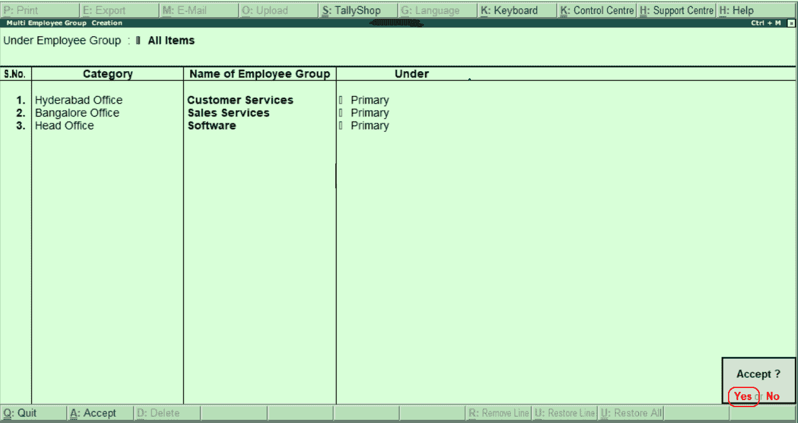

# 在Tally中创建员工组

> 原文：<https://www.javatpoint.com/create-employee-groups-in-tally>

在本节中，我们将讨论如何在 Tally 中创建、修改和显示员工组。在 Tally 中，使用单个创建方法和多个创建方法，可以创建一个员工组。使用逐步流程在Tally中创建员工组。

**步骤 1:** 使用以下路径创建员工组。

```

Gateway of Tally → Payroll Info → Employee groups → Single Group → Create

```

**第二步:**点击Tally界面网关下的薪资信息。



**第三步:**点击薪资信息下的员工组选项。



**第 4 步:**点击员工组屏幕上“单组”下的“创建”选项。


**第五步:**在员工组创建界面下输入以下详细信息。

**类别:**选择列表下的员工类别。

**名称:**指定员工组的名称。

**下:**将该组指定为主组。



在Tally ERP 9 中，维护完员工组创建所需的所有数据后，按回车键并点击“是”保存数据。

## 如何创建多个员工组

**步骤 1:** 使用以下路径创建多个员工组。

```

Gateway of Tally → Payroll Info → Employee groups → Multiple Groups → Create

```

**第二步:**点击多组选项下的“创建”选项，在Tally中创建多个员工组。



**第三步:**在多员工组创建界面下输入以下详细信息。

*   在员工组下:要为员工组分配不同的员工类别，请将此选项选择为“所有项目”。我们只能将一个员工组分配给一个员工类别。
*   指定员工类别、员工组名称和组下的所有详细信息。



维护完多员工组的所有详细信息后，按回车键并选择“是”，将详细信息保存在Tally中。

* * *