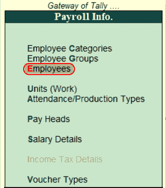
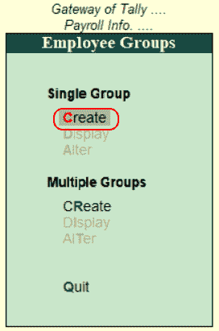
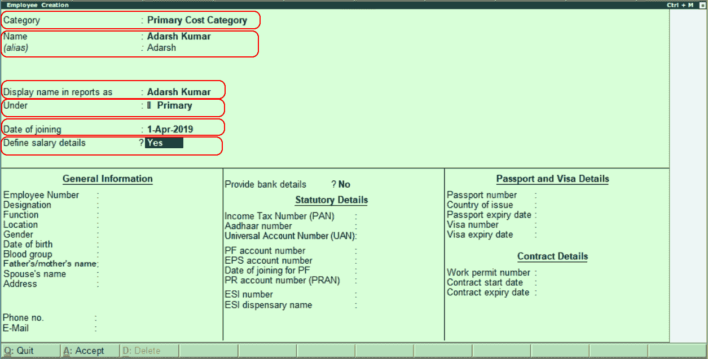
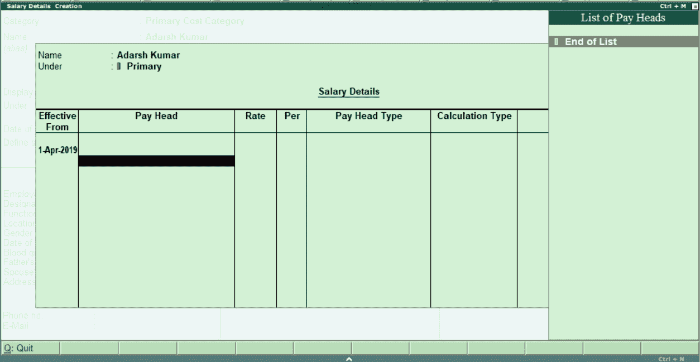
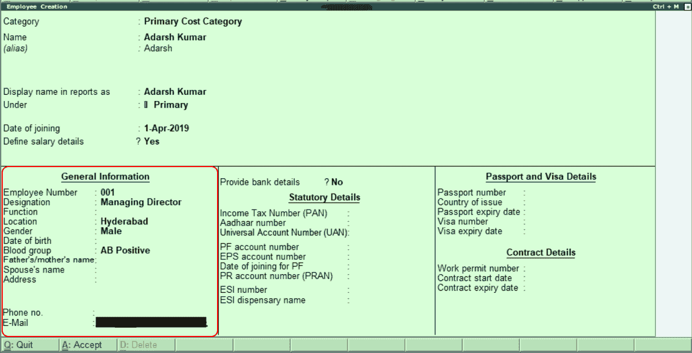
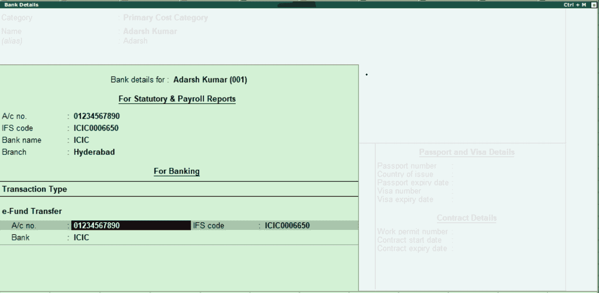
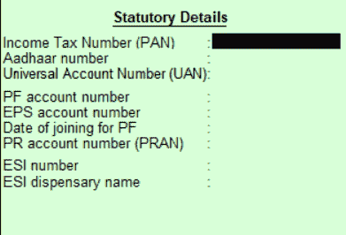

# 在 Tally 中创建员工主数据

> 原文：<https://www.javatpoint.com/create-employees-master-data-in-tally>

在 Tally 中，成功创建员工组后，我们可以创建有组或无组的单个员工主数据。

在员工主数据中，可以维护人力资源管理员工明细的所有活动。

## 如何创建单个员工

**步骤 1:** 使用以下路径创建单个员工。

**Tally 网关→薪资信息→员工→单个员工→创建**

**第二步:**点击 Tally 网关下的薪资信息选项，如下图。

**第三步:**点击薪资信息功能下的“员工”选项，在 Tally 中创建新员工。

**第 4 步:**点击单员工选项下的创建选项。

**第五步:**在下一屏“员工创建”中输入以下详细信息。

**姓名:**指定员工姓名，该姓名将显示在报表中。

**在报告中显示名称为:**在此输入，在报告中显示名称，而不是在名称字段中给出的名称。

**下:**选择字段下的员工组。

**入职日期:**指定员工的入职数据。

**定义薪资明细:**选择该选项为“是”，输入员工的薪资明细，薪资明细创建界面打开。我们将输入员工工资的所有细节，如 PF、基本工资、津贴、税收等。在薪资详细信息屏幕下。

输入员工薪资明细后，按回车键继续。

**第 6 步:**在“一般信息”下指定员工所需的详细信息，如员工编号、名称、职能、地点、性别、出生日期、血型、父亲/母亲的姓名、地址和联系方式。

**第 7 步:**选择“是”选项，输入员工的银行详细信息。现在将打开银行详细信息屏幕。指定所需的银行详细信息，如账号、IFSC 代码、银行名称、分行和交易类型。

**第 8 步:**指定员工的法定详细信息，如所得税号、Aadhaar 号、通用账号、PF 账号、EPS 账号、PF 加入日期、ESI 号、ESI 药房名称。

**第 9 步:**指定员工密码的所有必需细节，即护照号、签发国家、护照到期日、签证号和签证到期日。

**步骤 10:** 指定员工的联系方式，如工作许可证号、合同开始日期和结束日期。

**第 11 步:**输入所有需要的详细信息后，按回车键选择“是”，接受 Tally ERP 9 中输入的员工数据。

* * *